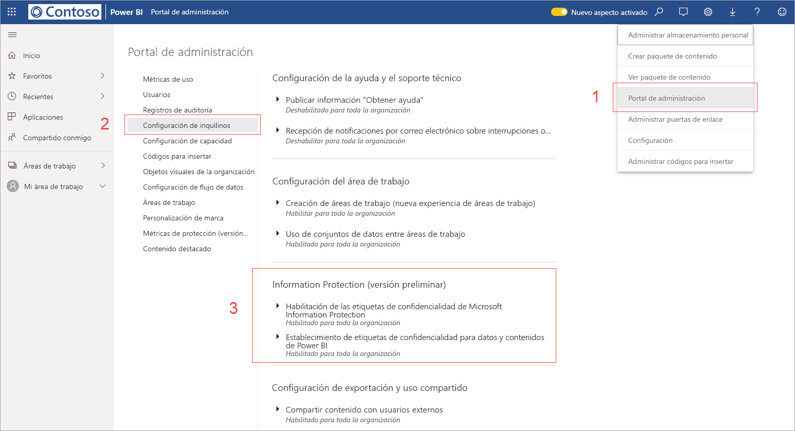
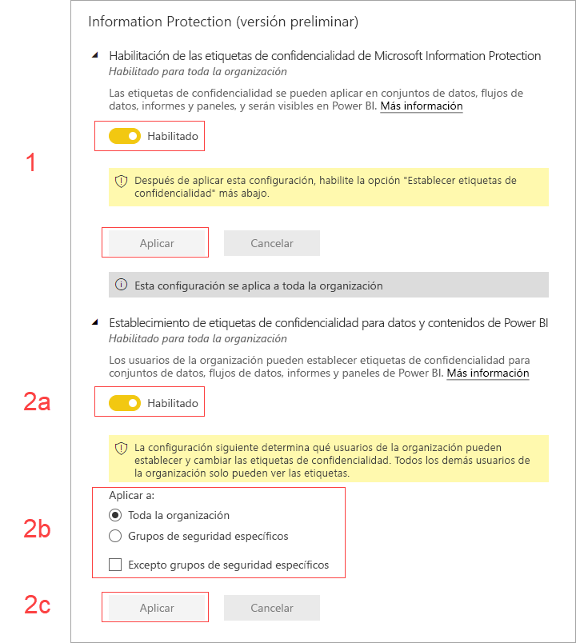

# Habilitación de las etiquetas de confidencialidad de datos en Power BI (versión preliminar)

Cuando las [etiquetas de confidencialidad de datos de Microsoft Information Protection](https://docs.microsoft.com/microsoft-365/compliance/sensitivity-labels) están habilitadas en Power BI, se aplica lo siguiente:

* Algunos usuarios y grupos de seguridad de una organización pueden clasificar y [aplicar etiquetas de confidencialidad](../designer/service-security-apply-data-sensitivity-labels.md) a sus paneles, informes, conjuntos de datos y flujos de datos de Power BI (en adelante denominados *recursos*).
* Todos los miembros de la organización pueden ver esas etiquetas.

Las etiquetas de confidencialidad de datos fomentan la protección de datos, ya que los autores y consumidores de Power BI son conscientes de la confidencialidad de los datos, a la vez que proporcionan información sobre lo que significa la clasificación y cómo se deben controlar los datos que tienen esa clasificación.

Cuando los datos de Power BI que tienen una etiqueta de confidencialidad de datos se exportan a un archivo de Excel, PowerPoint o PDF, su etiqueta de confidencialidad de datos va con ellos. Esto significa que un usuario que no tenga permiso de acceso a los datos etiquetados, debido a las directivas de etiquetas de confidencialidad, no podrá abrir los archivos *fuera* de Power BI (en aplicaciones de Excel, PowerPoint o PDF).

La habilitación de las etiquetas de confidencialidad de datos requiere una licencia de Azure Information Protection. Consulte [Licencias](#licensing) para más detalles.

## Habilitación de las etiquetas de confidencialidad de datos

Para habilitar el uso de las etiquetas de confidencialidad de datos de Microsoft Information Protection en Power BI, vaya al portal de administración de Power BI, abra el panel Configuración de inquilino y busque la sección Information Protection.

En la sección **Information Protection**, realice los pasos siguientes:
1.  Habilite la casilla **Habilitar las etiquetas de confidencialidad de Microsoft Information Protection** y presione **Aplicar**. Este paso *solo* hace que las etiquetas de confidencialidad sean visibles para toda la organización; no aplica ninguna etiqueta. Para definir quién puede aplicar esas etiquetas en Power BI, debe completar el paso 2.
2.  Defina quién puede aplicar y cambiar las etiquetas de confidencialidad en los recursos de Power BI. Este paso implica tres acciones:
    1.  Habilite la casilla **Establecer etiquetas de confidencialidad para datos y contenidos de Power BI**.
    2.  Seleccione los grupos de seguridad correspondientes. De forma predeterminada, todos los usuarios de su organización podrán aplicar etiquetas de confidencialidad. Sin embargo, puede optar por habilitar la configuración de las etiquetas de confidencialidad solo para usuarios o grupos de seguridad específicos. Con toda la organización o bien con grupos de seguridad específicos seleccionados, puede excluir subconjuntos específicos de usuarios o grupos de seguridad.
    * Cuando las etiquetas de confidencialidad están habilitadas para toda la organización, las excepciones suelen ser grupos de seguridad.
    * Cuando las etiquetas de confidencialidad están habilitadas solo para usuarios o grupos de seguridad específicos, las excepciones suelen ser usuarios específicos.  
    Este enfoque permite impedir que determinados usuarios apliquen etiquetas de confidencialidad en Power BI, aunque pertenezcan a un grupo que tenga permisos para hacerlo.
    
    3. Presione **Aplicar**.

> [!IMPORTANT]
> Solo los usuarios de Power BI Pro que tengan permisos para *crear* y *editar* en el recurso y que formen parte del grupo de seguridad pertinente que se estableció en esta sección, podrán establecer y editar las etiquetas de confidencialidad. Los usuarios que no forman parte de este grupo no podrán establecer ni editar las etiquetas. 

## Consideraciones y limitaciones

Power BI usa las etiquetas de confidencialidad de Microsoft Information Protection. Por lo tanto, si encuentra un mensaje de error al intentar habilitar las etiquetas de confidencialidad, puede deberse a uno de los siguientes motivos:

* No tiene una [licencia](#licensing) de Azure Information Protection.
* Las etiquetas de confidencialidad no se han migrado a la versión de Microsoft Information Protection compatible con Power BI. Más información sobre la [migración de etiquetas de confidencialidad](https://docs.microsoft.com/azure/information-protection/configure-policy-migrate-labels).
* No se ha definido ninguna etiqueta de confidencialidad de Microsoft Information Protection en la organización. Además, para que se pueda usar, una etiqueta debe formar parte de una directiva publicada. [Más información sobre las etiquetas de confidencialidad](https://docs.microsoft.com/Office365/SecurityCompliance/sensitivity-labels) o visite el [Centro de seguridad y cumplimiento de Microsoft](https://sip.protection.office.com/sensitivity?flight=EnableMIPLabels) para obtener información sobre cómo definir etiquetas y publicar directivas para su organización.

## Licencias

* Para ver o aplicar las etiquetas de Microsoft Information Protection en Power BI, los usuarios deben tener una licencia de Azure Information Protection Premium P1 o Premium P2. Microsoft Azure Information Protection se puede adquirir de forma independiente o mediante uno de los conjuntos de licencias de Microsoft. Consulte [Precios de Azure Information Protection](https://azure.microsoft.com/pricing/details/information-protection/) para más detalles.
* Los usuarios que necesiten aplicar etiquetas en recursos de Power BI deben tener una licencia de Power BI Pro.

## Pasos siguientes

En este artículo se describe cómo habilitar las etiquetas de confidencialidad de datos en Power BI. En los artículos siguientes se proporcionan más detalles acerca de la protección de datos en Power BI. 

* [Introducción a la protección de datos en Power BI](service-security-data-protection-overview.md)
* [Aplicación de etiquetas de confidencialidad de datos en Power BI](../designer/service-security-apply-data-sensitivity-labels.md)
* [Uso de controles de Microsoft Cloud App Security en Power BI](service-security-using-microsoft-cloud-app-security-controls.md)