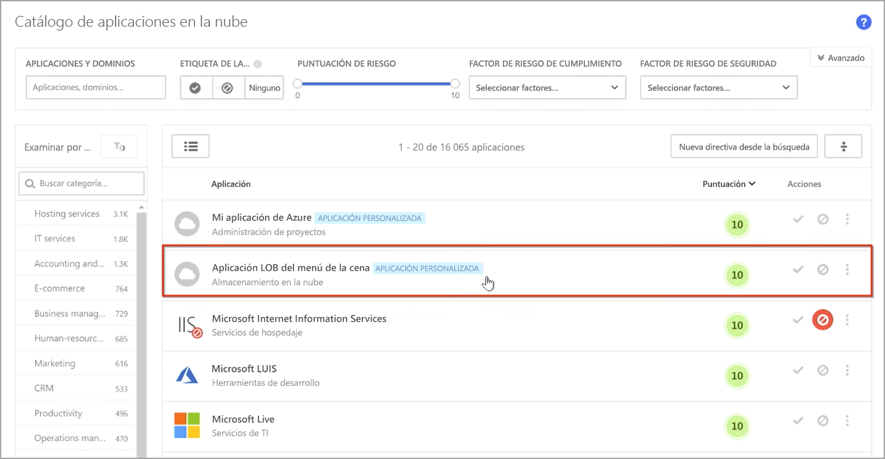
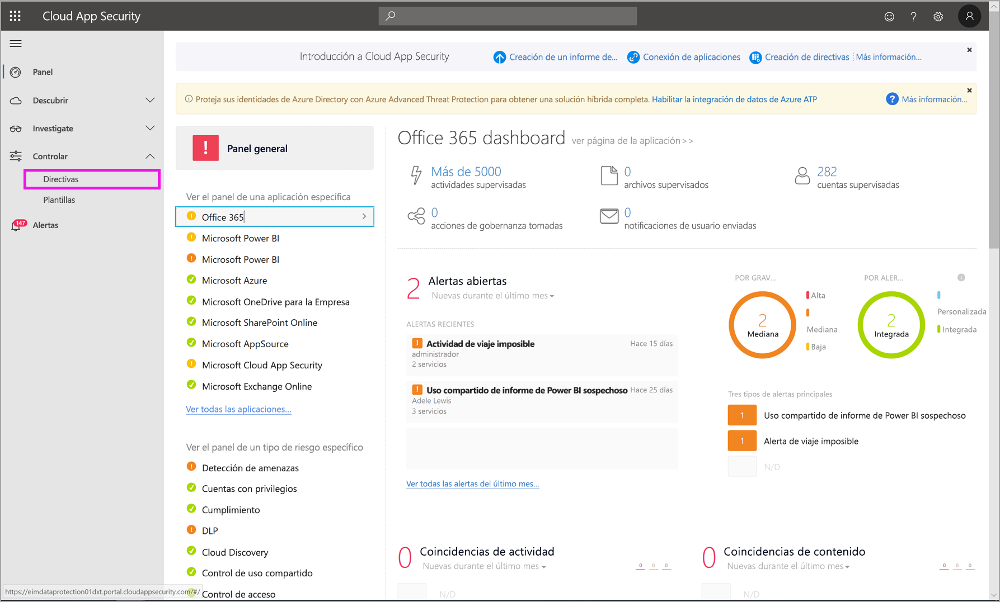
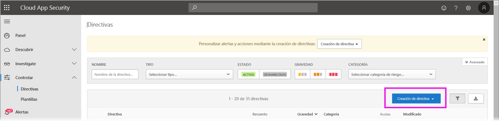
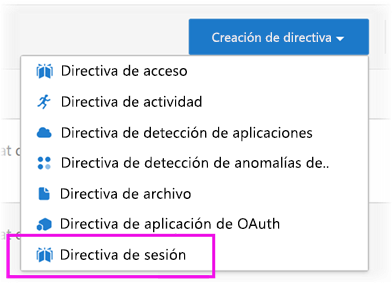
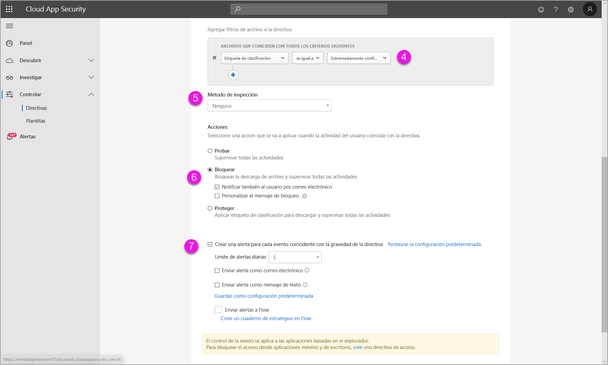
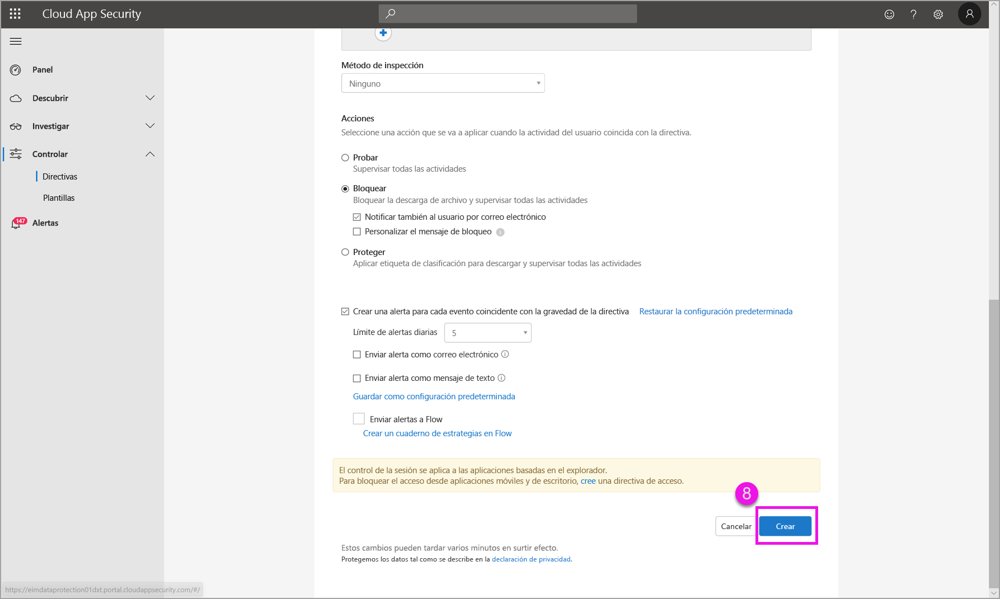

# Uso de controles de Microsoft Cloud App Security en Power BI (versión preliminar)

Mediante el uso de Microsoft Cloud App Security con Power BI, puede ayudar a proteger los informes, datos y servicios de Power BI de fugas o infracciones imprevistas. Con Cloud App Security, puede crear directivas de acceso condicional para los datos de la organización, mediante controles de sesión en tiempo real en Azure Active Directory (Azure AD), que le ayudarán a garantizar que los análisis de Power BI sean seguros. Una vez que se han establecido estas directivas, los administradores pueden supervisar el acceso y la actividad de los usuarios, realizar análisis de riesgos en tiempo real y establecer controles específicos de la etiqueta. 

Puede configurar Microsoft Cloud App Security para todo tipo de aplicaciones y servicios, no solo Power BI. Cloud App Security es un servicio de Microsoft que protege las aplicaciones y los dispositivos y se administra mediante su propio panel. Tendrá que configurar Cloud App Security para trabajar con Power BI para beneficiarse de las protecciones de Cloud App Security para los datos y análisis de Power BI. Para más información sobre Cloud App Security, incluida una introducción a su funcionamiento, el panel y las puntuaciones de riesgo de la aplicación, consulte la documentación de [Microsoft Cloud App Security](https://docs.microsoft.com/cloud-app-security/).

## Uso de Microsoft Cloud App Security con Power BI

Para usar Microsoft Cloud App Security con Power BI, debe usar y configurar los servicios de seguridad de Microsoft pertinentes, algunos de los cuales se establecen fuera de Power BI.

### Licencias de Microsoft Cloud App Security

Para tener Microsoft Cloud App Security en el inquilino, debe tener una de las licencias siguientes:
* MCAS: proporciona funcionalidades de OCAS para todas las aplicaciones admitidas, parte de los conjuntos de aplicaciones EMS E5 y M365 E5.
* CAS-D: proporciona solo la detección de MCAS.
* OCAS: proporciona funcionalidades de MCAS solo para Office 365, parte del conjunto de aplicaciones Office E5.
* Opcional: AAD P1 y AIP P1 con el fin de beneficiarse de las principales funcionalidades de Microsoft Cloud App Security.

En las secciones siguientes se describen los pasos para usar Microsoft Cloud App Security en Power BI.

### Establecimiento de directivas de sesión en Azure Active Directory (obligatorio)
Los pasos necesarios para establecer los controles de sesión se completan en los portales de Azure AD y Microsoft Cloud App Security. En el portal de Azure AD, cree una directiva de acceso condicional para Power BI y enrute las sesiones usadas en Power BI a través del servicio Microsoft Cloud App Security. 

Microsoft Cloud App Security funciona mediante una arquitectura de proxy inverso y se integra con el acceso condicional de Azure AD para supervisar la actividad del usuario de Power BI en tiempo real. Los siguientes pasos se proporcionan aquí para ayudarle a entender el proceso y se proporcionan instrucciones paso a paso detalladas en el contenido vinculado en cada uno de los pasos siguientes. También puede consultar este artículo de [Cloud App Security](https://docs.microsoft.com/cloud-app-security/proxy-deployment-aad) que describe el proceso en su totalidad.

1.  [Cree una directiva de prueba del acceso condicional de Azure AD](https://docs.microsoft.com/cloud-app-security/proxy-deployment-aad#add-azure-ad)
2.  [Inicie sesión en cada aplicación con un usuario en el ámbito de la directiva](https://docs.microsoft.com/cloud-app-security/proxy-deployment-aad#sign-in-scoped)
3.  [Compruebe que las aplicaciones están configuradas para usar controles de acceso y de sesión](https://docs.microsoft.com/cloud-app-security/proxy-deployment-aad#portal)
4.  [Pruebe la implementación](https://docs.microsoft.com/cloud-app-security/proxy-deployment-aad#step-4-test-the-deployment)

El proceso para establecer directivas de sesión se describe en detalle en el artículo [Directivas de sesión](https://docs.microsoft.com/cloud-app-security/session-policy-aad). 

### Establecimiento de directivas de detección de anomalías para supervisar las actividades de PBI (recomendado)
Puede definir directivas de detección de anomalías de Power BI que pueden tener un ámbito independiente, de modo que solo se apliquen a los usuarios y grupos que desee incluir y excluir en la directiva. [Más información](https://docs.microsoft.com/cloud-app-security/anomaly-detection-policy#scope-anomaly-detection-policies).

Cloud App Security también tiene dos detecciones integradas dedicadas para Power BI. [Consulte la sección más adelante en este documento para más información](#built-in-microsoft-cloud-app-security-detections-for-power-bi).

### Uso de las etiquetas de confidencialidad de Microsoft Information Protection (recomendado)

Las etiquetas de confidencialidad le permiten clasificar y ayudar a proteger el contenido confidencial, de modo que los usuarios de la organización puedan colaborar con asociados ajenos a la organización y seguir siendo cuidadosos y conscientes del contenido y los datos confidenciales. 

Puede leer el artículo sobre [etiquetas de confidencialidad en Power BI](../designer/service-security-apply-data-sensitivity-labels.md), que detalla el proceso de uso de etiquetas de confidencialidad para Power BI. A continuación se muestra un [ejemplo de una directiva de Power BI basada en etiquetas de confidencialidad](#example).

## Detecciones integradas de Microsoft Cloud App Security para Power BI

Las detecciones de Microsoft Cloud App Security permiten a los administradores supervisar actividades específicas de una aplicación supervisada. Para Power BI, actualmente hay dos detecciones integradas dedicadas de Cloud App Security: 

* **Recurso compartido sospechoso**: detecta cuándo un usuario comparte un informe confidencial con un correo electrónico desconocido (externo a la organización). Un informe confidencial es un informe cuya etiqueta de confidencialidad se establece en **INTERNAL-ONLY** (solo interno) o superior. 

* **Compartición masiva de informes**: detecta cuándo un usuario comparte muchos informes diferentes en una sola sesión.

La configuración de estas detecciones se realiza en el portal de Cloud App Security. [Más información](https://docs.microsoft.com/cloud-app-security/anomaly-detection-policy#unusual-activities-by-user). 

## Rol de administrador de Power BI en Microsoft Cloud App Security

Cuando se usa Microsoft Cloud App Security con Power BI, se crea un nuevo rol para los administradores de Power BI. Al iniciar sesión como administrador de Power BI en el [portal de Cloud App Security](https://portal.cloudappsecurity.com/), tiene acceso limitado a los datos pertinentes de Power BI, las alertas, los usuarios en riesgo, los registros de actividad y otra información.

## Consideraciones y limitaciones 
El uso de Cloud App Security con Power BI se ha diseñado para ayudar a proteger el contenido y los datos de la organización, con detecciones que supervisan las sesiones de usuario y sus actividades. Al usar Cloud App Security con Power BI, hay algunas limitaciones que debe tener en cuenta:

* Microsoft Cloud App Security solo puede operar con archivos de Excel, PowerPoint y PDF.
* Si desea utilizar las funcionalidades de las etiquetas de confidencialidad en las directivas de sesión para Power BI, debe tener una licencia de Azure Information Protection Premium P1 o Premium P2. Microsoft Azure Information Protection se puede adquirir de forma independiente o mediante uno de los conjuntos de licencias de Microsoft. Consulte [Precios de Azure Information Protection](https://azure.microsoft.com/pricing/details/information-protection/) para más detalles. Además, se deben haber aplicado las etiquetas de confidencialidad en los recursos de Power BI.

> [!CAUTION]
> * La directiva de *inspección de contenido* de Microsoft Cloud App Security no está disponible actualmente en Power BI al aplicar una directiva de archivo de Excel, por lo que no debe establecer esta directiva para Power BI.
> * En la directiva de sesión, en la parte "Acción", la funcionalidad "proteger" solo funcionará si no existe ninguna etiqueta en el elemento. Si ya existe una etiqueta, no se aplicará la acción "proteger"; no se puede invalidar una etiqueta existente que ya se haya aplicado a un elemento de Power BI.

## Ejemplo

En el ejemplo siguiente se muestra cómo crear una nueva directiva de sesión mediante Microsoft Cloud App Security con Power BI.

En primer lugar, cree una nueva directiva de sesión. Seleccione **Directivas** en el menú de la izquierda en el portal de **Cloud App Security**.

En la ventana que aparece, seleccione la lista desplegable **Crear directiva**.

En la lista de opciones del menú desplegable, seleccione **Directiva de sesión**.

En la ventana que aparece, cree la directiva de sesión. En los pasos numerados se describe la configuración de la siguiente imagen.

  1. En la lista desplegable **Plantilla de directiva**, elija *Sin plantilla*.
  2. En el cuadro **Nombre de la directiva**, proporcione un nombre adecuado para la directiva de sesión.
  3. En **Tipo de control de sesión**, seleccione *Control de archivos descargados (con DLP)* .

      Para la sección **Origen de la actividad**, elija las directivas de bloqueo oportunas. Se recomienda bloquear los dispositivos no administrados y no compatibles. Elija bloquear las descargas cuando la sesión es de Power BI.

        

        Al desplazarse hacia abajo verá más opciones. En la imagen siguiente se muestran esas opciones, con ejemplos adicionales. 

  4. Para *Etiqueta de confidencialidad*, elija *Extremadamente confidencial* o lo que mejor se adapte a su organización.
  5. Cambie **Método de inspección** a *ninguno*.
  6. Elija la opción **Bloquear** que se ajuste a sus necesidades.
  7. Asegúrese de crear una alerta para dicha acción.

        

        

  8. Por último, asegúrese de seleccionar el botón **Crear** para crear la directiva de sesión.

        

> [!CAUTION]
> Asegúrese de no crear una directiva de **Inspección de contenido** en los archivos de Excel de Power BI. Se trata de una limitación conocida de esta *versión preliminar*.

## Pasos siguientes
En este artículo se describe cómo puede proporcionar Microsoft Cloud App Security la protección de datos y contenido para Power BI. También podrían interesarle los siguientes artículos, que describen la protección de datos para Power BI y el contenido de soporte técnico para los servicios de Azure que lo habilitan.

* [Introducción a la protección de datos en Power BI](service-security-data-protection-overview.md)
* [Habilitación de etiquetas de confidencialidad de datos en Power BI](service-security-enable-data-sensitivity-labels.md)
* [Aplicación de etiquetas de confidencialidad de datos en Power BI](../designer/service-security-apply-data-sensitivity-labels.md)

También podrían interesarle los siguientes artículos de Azure y la seguridad:

* [Proteger aplicaciones con el Control de aplicaciones de acceso condicional de Microsoft Cloud App Security](https://docs.microsoft.com/cloud-app-security/proxy-intro-aad)
* [Implementación de Control de aplicaciones de acceso condicional para aplicaciones destacadas](https://docs.microsoft.com/cloud-app-security/proxy-deployment-aad)
* [Directivas de sesión](https://docs.microsoft.com/cloud-app-security/session-policy-aad)
* [Introducción a las etiquetas de confidencialidad](https://docs.microsoft.com/microsoft-365/compliance/sensitivity-labels)