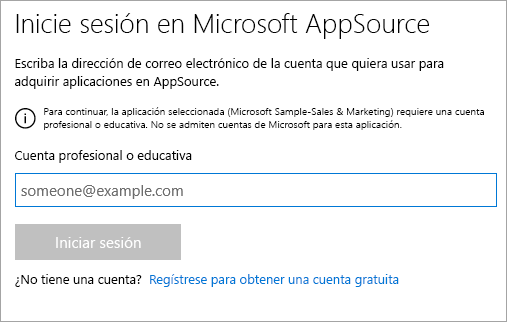
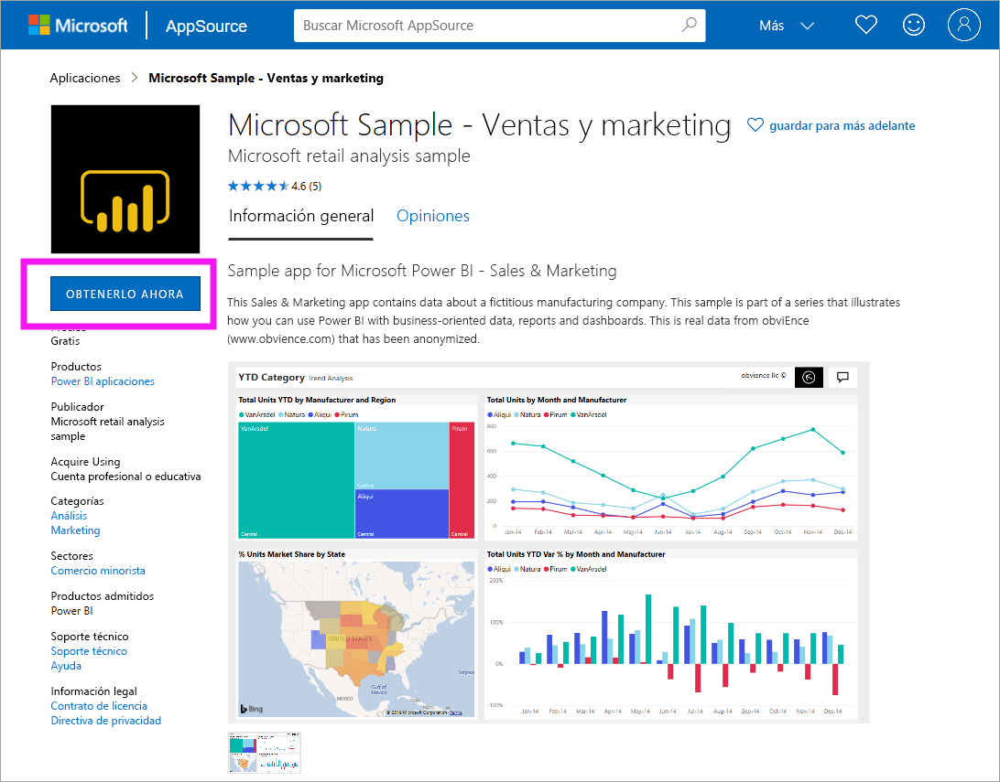
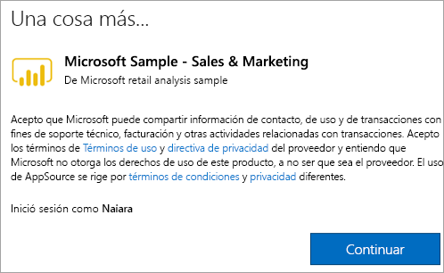

# Instalación y uso de la aplicación de ejemplo de marketing y ventas en el servicio Power BI
Ahora que tiene un [conocimiento básico sobre cómo obtener contenido de Power BI](end-user-app-view.md), obtendrá la aplicación de marketing y ventas de Microsoft AppSource (appsource.com). 

## Microsoft AppSource (appsource.com)
Este es el vínculo a la aplicación: [Aplicación de marketing y ventas](https://appsource.microsoft.com/product/power-bi/microsoft-retail-analysis-sample.salesandmarketingsample?tab=Overview). Al seleccionar este vínculo, se abre la página de descarga de esta aplicación en Microsoft AppSource. 

1. Es posible que se le pida que inicie sesión para poder obtener la aplicación. Inicie sesión con la misma dirección de correo electrónico que usa para Power BI. 

    

2. Seleccione **Obtenerlo ahora**. 

    

3. Si es la primera vez que inicia sesión en AppSource, tendrá que aceptar los términos de uso. 

    

4. Se abre el servicio Power BI. Confirme que quiere instalar la aplicación.

    

5. El servicio Power BI mostrará un mensaje de operación correcta cuando se instale la aplicación. Seleccione **Ir a la aplicación** para abrir la aplicación. En función de cómo el diseñador haya creado la aplicación, se mostrará el panel de la aplicación o el informe de la aplicación.

    

    También puede abrir la aplicación directamente desde la lista de contenido de la aplicación; para ello, seleccione **Aplicaciones** y elija **Sales & Marketing**.

    

6. Decida si quiere explorar o personalizar y compartir la nueva aplicación. Como hemos seleccionado una aplicación de ejemplo de Microsoft, vamos a empezar explorándola. 

    

7.  La nueva aplicación se abre con un panel. El *diseñador* de la aplicación podría haberla configurado para que, en su lugar, se abra en un informe.  

    

## Interacción con los paneles e informes en la aplicación
Dedique algún tiempo a explorar los datos de los paneles y los informes que componen la aplicación. Puede acceder a todas las interacciones estándar de Power BI, como filtrar, resaltar, ordenar y explorar en profundidad.  ¿Aún no tiene clara la diferencia entre paneles e informes?  Lea el [artículo sobre paneles](end-user-dashboards.md) y el [artículo sobre informes](end-user-reports.md).  

## Pasos siguientes
* [Volver a la información general de las aplicaciones](end-user-apps.md)
* [Ver un informe de Power BI](end-user-report-open.md)
* [Otras formas de compartir contenido con usted](end-user-shared-with-me.md)
