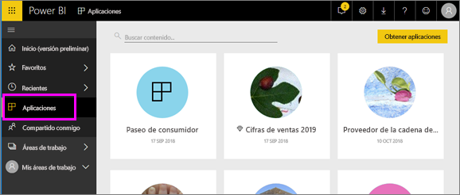

# Aplicaciones de Power BI
## ¿Qué es una aplicación de Power BI?
Una *aplicación* es un tipo de contenido de Power BI que combina paneles e informes relacionados en un mismo lugar. Una aplicación puede tener uno o más paneles e informes, todos ellos agrupados. Las aplicaciones las crean *diseñadores* de Power BI que distribuyen y comparten las aplicaciones con otros *consumidores*. 

Las aplicaciones se organizan en la lista de contenido **Aplicaciones**.

> [!NOTE]
> Para usar la característica de aplicaciones, hace falta una licencia de Power BI Pro. <!-- add link to how to figure out your license -->

## ***Diseñadores*** de aplicaciones y ***consumidores*** de aplicaciones
En función de su rol, es posible que sea alguien que crea aplicaciones (diseñador) para su propio uso o para compartir con otros compañeros. O puede que sea alguien que recibe y descarga aplicaciones (consumidor) creadas por otros. Este artículo es para *consumidores de aplicaciones*.

## Ventajas de aplicaciones
Es muy fácil buscar e instalar aplicaciones en el servicio Power BI ([https://powerbi.com](https://powerbi.com)) y en el dispositivo móvil. Después de instalar una aplicación, no tendrá que recordar los nombres de muchos paneles diferentes ya que se encontrarán todos juntos en una aplicación, en el explorador o en su dispositivo móvil.

En el caso de las aplicaciones, siempre que el autor de la aplicación publique actualizaciones, verá los cambios automáticamente. El autor controla la frecuencia de actualización de los datos, por lo que no tiene que preocuparse de mantenerlos actualizados. 

<!-- add conceptual art -->
## Obtener una nueva aplicación
Puede obtener aplicaciones de varias maneras diferentes. 
- El autor de la aplicación puede instalar la aplicación automáticamente en su cuenta de Power BI y, la próxima vez que abra Power BI, verá la nueva aplicación en la lista de contenido **Aplicaciones**. 
- El autor de la aplicación puede enviarle por correo electrónico un vínculo directo a una aplicación. Al seleccionar el vínculo se abre la aplicación en Power BI.
- Puede buscar aplicaciones en AppSource, donde verá todas las aplicaciones a las que tiene acceso. AppSource contiene aplicaciones publicadas por diseñadores de informes, tanto de dentro como fuera de la empresa. Por ejemplo, en AppSource podría encontrar una aplicación para un servicio que ya usa, como Google Analytics, GitHub o Microsoft Dynamics. 
- En Power BI desde su dispositivo móvil, solo puede instalar una aplicación desde un vínculo directo y no desde AppSource. Si el autor de la aplicación la instala automáticamente, podrá verla en la lista de aplicaciones.

## Paso siguiente
* [Abrir una aplicación e interactuar con ella](end-user-app-view.md)

