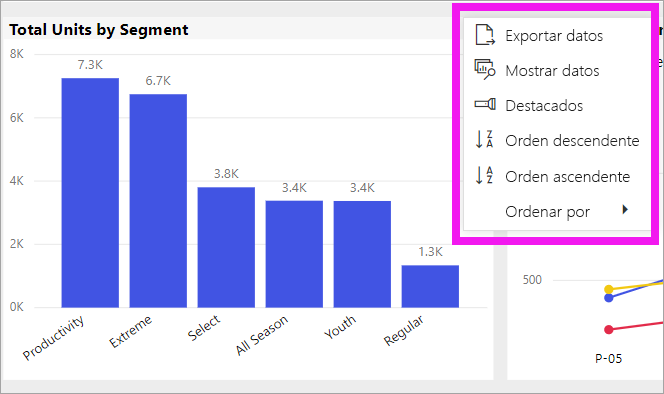
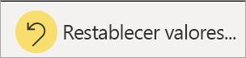
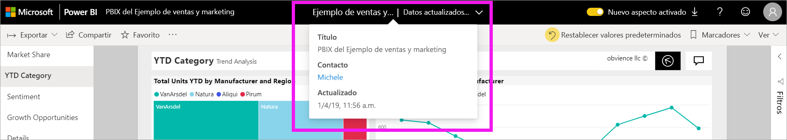

# Cambio del modo de ordenar un gráfico en un informe de Power BI

[!INCLUDE [power-bi-service-new-look-include](../includes/power-bi-service-new-look-include.md)]

> [!IMPORTANT]
> **Este artículo está destinado a usuarios de Power BI que no tienen permisos de edición para el informe o el conjunto de datos y que solo trabajan en la versión en línea de Power BI (el servicio Power BI). Si es *diseñador*, *administrador* o *propietario* de un informe, puede que este artículo no contenga toda la información que necesita. Así que lea mejor [Ordenar por columnas en Power BI Desktop](../desktop-sort-by-column.md)** .

En el servicio Power BI, puede cambiar el aspecto de un objeto visual al ordenar por campos de datos diferentes. Al cambiar cómo se ordena un objeto visual, puede resaltar la información que quiere transmitir. Independientemente de si usa datos numéricos (como cifras de ventas) o datos de texto (como nombres de estado), puede ordenar sus visualizaciones de la forma que quiera. Power BI proporciona mucha flexibilidad para la ordenación y menús rápidos para su uso. 

Los objetos visuales de un panel no se pueden ordenar, pero en un informe de Power BI sí puede ordenar la mayoría de las visualizaciones. 

## Comenzar

Para empezar, seleccione cualquier objeto visual y elija **Más acciones** (...).  Hay tres opciones para ordenar: **Orden descendente**, **Orden ascendente** y **Ordenar por**. 
    

### Ordenar alfabéticamente o numéricamente

Los objetos visuales se pueden ordenar alfabéticamente por los nombres textuales de las categorías del objeto visual o por los valores numéricos de cada categoría. Por ejemplo, este gráfico está ordenado alfabéticamente por la categoría del eje X **Nombre** de tienda.

Es fácil cambiar el criterio de ordenación y pasar de una categoría (nombre de almacén) a un valor (ventas por metro cuadrado). Seleccione **Más opciones** (...) y, después, **Ordenar por**. Seleccione un valor numérico usado en el objeto visual.  En este ejemplo, hemos seleccionado **Ventas por metro cuadrado**.

Si es necesario, cambie el criterio de ordenación a ascendente o descendente.  Vuelva a seleccionar **Más acciones** (...) y seleccione **Orden descendente** u **Orden ascendente**. El campo que se usa para ordenar está en negrita y tiene una barra amarilla.

   

> [!NOTE]
> No todos los objetos visuales se pueden ordenar. Por ejemplo, los siguientes objetos visuales no se pueden ordenar: gráfico de rectángulos, mapa, mapa coroplético, dispersión, medidor, tarjeta y cascada.

## Guardar los cambios realizados en el criterio de ordenación
Los informes de Power BI conservan los filtros, las segmentaciones de datos, la ordenación y otros cambios de la vista de datos que realice, aunque esté trabajando en [vista de lectura](end-user-reading-view.md). De modo que, si sale de un informe y vuelve más tarde, se guardan los cambios de ordenación.  Si quiere revertir los cambios a la configuración del *diseñador* del informe, seleccione **Restablecer valores predeterminados** en la barra de menús superior. 

Pero, si el botón **Restablecer valores predeterminados** está atenuado, significa que el *diseñador* del informe ha deshabilitado la capacidad de guardar (conservar) los cambios.

## Consideraciones y solución de problemas

### Ordenación siguiendo otros criterios
Es posible que, a veces, quiera ordenar el objeto visual mediante un campo diferente (que no está incluido en el objeto visual) o siguiendo otros criterios.  Por ejemplo, quizás quiera ordenarlo por mes en orden secuencial (y no en orden alfabético) o por números enteros en lugar de dígitos (ejemplo, 0, 1, 9, 20 y no 0, 1, 20, 9).  

Solo la persona que diseñó el informe puede hacer estos cambios. Para encontrar la información de contacto del *diseñador*, seleccione el nombre del informe en la barra de encabezado.

Si es *diseñador* y tiene permisos de edición para el contenido, lea [Ordenar por columnas en Power BI Desktop](../desktop-sort-by-column.md) para saber cómo actualizar el conjunto de datos y habilitar este tipo de ordenación.

## Pasos siguientes
Más información sobre [Visualizaciones en Power BI](end-user-visualizations.md).

[Power BI: Conceptos básicos](end-user-basic-concepts.md)
