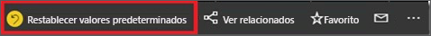

# Cambio del modo de ordenar un gráfico en un informe de Power BI
En un informe de Power BI, puede ordenar la mayoría de las visualizaciones alfabéticamente por los nombres de las categorías del gráfico, o bien por los valores numéricos de cada categoría. Por ejemplo, este gráfico se ordena por la categoría **nombre de tienda**.

Es fácil cambiar el criterio de ordenación y pasar de una categoría (nombre de almacén) a un valor (ventas por metro cuadrado).

1. Seleccione el botón de puntos suspensivos (…) y elija **Ordenar por > Ventas por metro cuadrado**.
2. Si es necesario, vuelva a seleccionar el botón de puntos suspensivos y elija **Orden descendente**.

   

> [!NOTE]
> No todos los objetos visuales se pueden ordenar. Por ejemplo, no se pueden ordenar los siguientes: Gráfico de rectángulos, Mapa, Mapa coroplético, Dispersión, Medidor, Tarjeta, Tarjeta de varias filas y Cascada.

## Guardar los cambios realizados en el criterio de ordenación
Los informes de Power BI conservan los filtros, las segmentaciones, la ordenación y otros cambios que se realizan en la vista de datos. Por lo que si sale de un informe y vuelve más tarde, se guardan los cambios.  Si quiere revertir los cambios a la configuración del diseñador del informe, seleccione **Restablecer valores predeterminados** en la barra de menús superior. 

Pero si el botón **Restablecer valores predeterminados** está atenuado, significa que el diseñador del informe ha deshabilitado la capacidad de guardar (conservar) los cambios.

## Ordenación siguiendo otros criterios
Es posible que, a veces, quiera ordenar el objeto visual mediante un campo diferente o siguiendo otros criterios.  Por ejemplo, quizás quiera ordenarlo por mes (y no en orden alfabético) o por números enteros en lugar de dígitos (ejemplo, 0, 1, 9, 20 y no 0, 1, 20, 9).  

En algunos casos, es posible que pueda ordenar el objeto visual de la forma que quiere, por ejemplo, por mes.  Pero si no es así, puede deberse a que el conjunto de datos subyacente al informe necesita algunos ajustes. Pida al diseñador del informe que actualice el conjunto de datos.

## Pasos siguientes
Más información sobre [Visualizaciones en Power BI](end-user-visualizations.md).

[Power BI: Conceptos básicos](end-user-basic-concepts.md)
