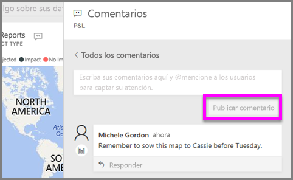
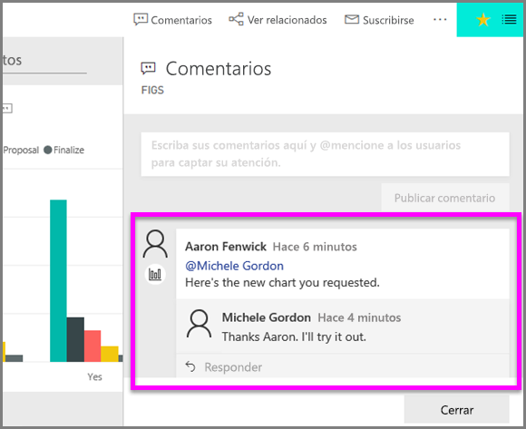

# Agregar comentarios a una visualización
Agregue un comentario personal o inicie una conversación sobre una visualización con sus compañeros. La característica **comentario** es solo una de las formas que tiene un *consumidor* de interactuar con una visualización. 

## Cómo usar la característica de comentarios

1. Mantenga el mouse encima de la visualización y seleccione los tres puntos (...).    
2. En la lista desplegable, seleccione **Agregar un comentario**.

      

3.  Escriba un comentario y seleccione **Publicar comentario**. Este comentario es para mí; contiene errores ortográficos.

      

4. Esta es una conversación que estoy manteniendo con el *diseñador* de la visualización. Usa el símbolo @ para asegurarse de que veo el comentario. Así sé que este comentario es para mí. Al abrir este panel de la aplicación en Power BI, selecciono **Comentarios** en el encabezado. El panel **Comentarios** se muestra en nuestra conversación. 

      

5. Haga clic en **Cerrar** para volver al panel o al informe.

## Pasos siguientes
Volver a [Visualizaciones para consumidores](end-user-visualizations.md)    
<!--[Select a visualization to open a report](end-user-open-report.md)-->