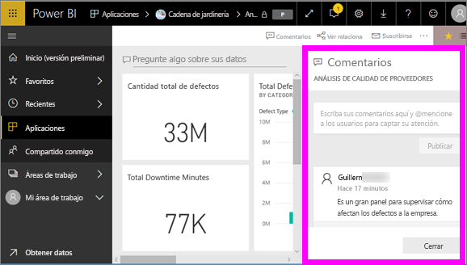
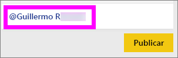
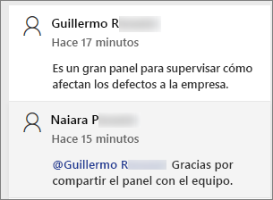
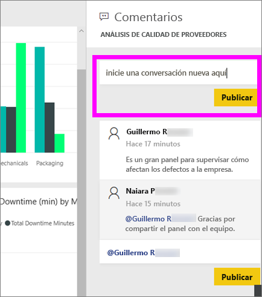
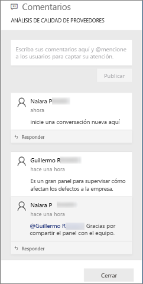
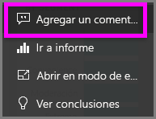
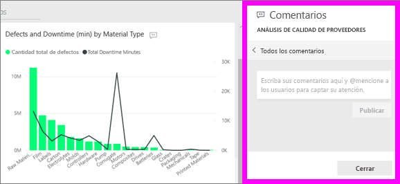
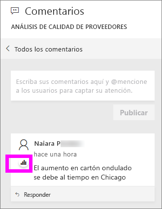
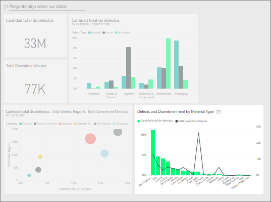
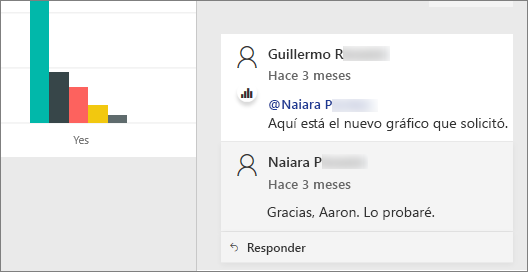

# Adición de comentarios a un panel
Agregue un comentario personal o empiece una conversación sobre un panel con sus compañeros. La característica **Comentarios** es solo una de las formas que tiene un *consumidor* de colaborar con otros. 

## Cómo usar la característica Comentarios
Los comentarios se pueden agregar a todo un panel o a objetos visuales individuales de un panel. Agregue un comentario general o un comentario dirigido a compañeros específicos.  

### Adición de un comentario general del panel
1. Abra un panel de Power BI y seleccione el icono **Comentarios**. Se abre el cuadro de diálogo Comentarios.

    

    Aquí vemos que el creador del panel ya agregó un comentario general.  Cualquier persona con acceso a este panel puede ver este comentario.

    

2. Para responder, seleccione **Responder**, escriba la respuesta y seleccione **Publicar**.  

    

    De forma predeterminada, Power BI dirige la respuesta al compañero que inició el hilo de comentarios, en este caso, Aaron F. 

    

 3. Si quiere agregar un comentario sobre un panel que no forma parte de ningún hilo de comentarios, escriba el comentario en el campo de texto superior.

    

    Los comentarios sobre este panel ahora tendrán este aspecto.

    

### Adición de un comentario a un objeto visual de panel concreto
1. Mantenga el mouse encima del objeto visual y seleccione los tres puntos (...).    
2. En la lista desplegable, seleccione **Agregar un comentario**.

      

3.  Se abre el cuadro de diálogo **Comentarios**. El objeto visual aún no tiene comentarios. 

      

4. Escriba un comentario y seleccione **Publicar**.

      

    El icono de gráfico  nos permite saber que este comentario está asociado a un objeto visual específico. Seleccione el icono para resaltar el objeto visual relacionado en el panel.

    

5. Seleccione **Cerrar** para volver al panel o al informe.

### Llamar la atención de sus compañeros mediante el signo @
Tanto si va a crear comentarios de panel como comentarios sobre un objeto visual determinado, puede captar la atención de sus compañeros mediante el símbolo "\@".  Cuando se escribe el símbolo "\@", Power BI abre una lista desplegable donde puede buscar y seleccionar personas de la organización. Cualquier nombre comprobado precedido por el símbolo "\@" se muestra en una fuente de color azul. 

Esta es una conversación que estoy manteniendo con el *diseñador* de la visualización. Usa el símbolo @ para asegurarse de que veo el comentario. Así sé que este comentario es para mí. Al abrir este panel de la aplicación en Power BI, selecciono **Comentarios** en el encabezado. El panel **Comentarios** se muestra en nuestra conversación.

  

## Pasos siguientes
Volver a [Visualizaciones para consumidores](end-user-visualizations.md)    
<!--[Select a visualization to open a report](end-user-open-report.md)-->
