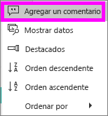
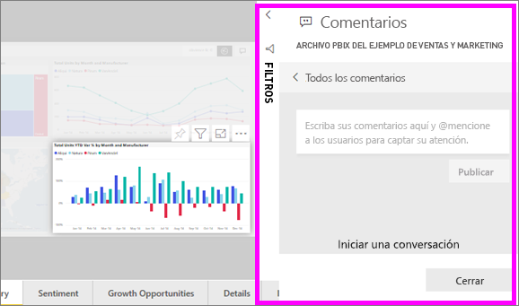
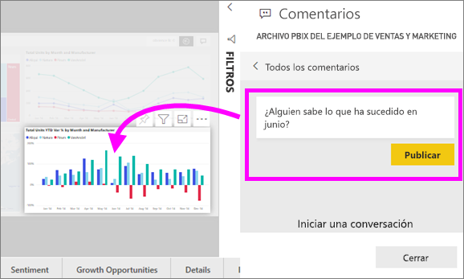
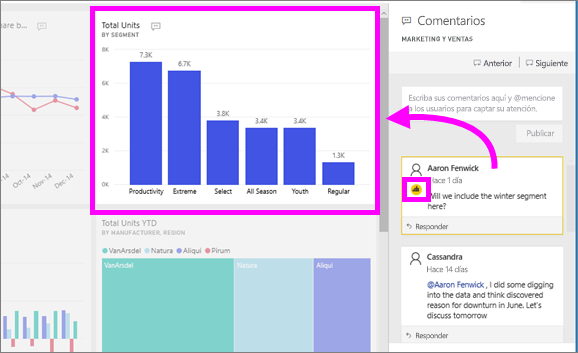

# Adición de comentarios en un panel o informe
Agregue un comentario personal o empiece una conversación sobre un panel o informe con sus compañeros. La característica **Comentarios** es solo una de las formas que tiene un *consumidor* de colaborar con otros. 

## Cómo usar la característica Comentarios
Se pueden agregar comentarios a un panel completo, a objetos visuales individuales en un panel, a una página de informe, a un informe paginado y a objetos visuales individuales en una página de informe. Agregue un comentario general o un comentario dirigido a compañeros específicos.  

Al agregar un comentario en un informe, Power BI captura los valores actuales de filtro y segmentación de datos. Esto significa que, al seleccionar un comentario o responder a él, la página o el objeto visual del informe pueden cambiar para mostrar la selección de filtros y la segmentación de datos que estaban activas al agregar el comentario inicialmente.  

¿Por qué esto es importante? Supongamos que un compañero ha aplicado un filtro que revela información interesante que quiere compartir con el equipo. Sin ese filtro seleccionado, es posible que el comentario no tenga sentido.

Si está usando un informe paginado, solo puede dejar un comentario general sobre el informe.  No se permite dejar comentarios sobre objetos visuales de informes individuales.

### Adición de un comentario general en un panel o informe
Los procesos para agregar comentarios en un panel o informe son similares.  En este ejemplo, usaremos un panel. 

1. Abra un panel de Power BI y seleccione el icono **Comentarios**. Se abre el cuadro de diálogo Comentarios.

    

    Aquí vemos que el creador del panel ya agregó un comentario general.  Cualquier persona con acceso a este panel puede ver este comentario.

    

2. Para responder, seleccione **Responder**, escriba la respuesta y seleccione **Publicar**.  

    

    De forma predeterminada, Power BI dirige la respuesta al compañero que inició el hilo de comentarios, en este caso, Aaron F. 

    

 3. Si quiere agregar un comentario que no forme parte de ningún hilo de comentarios, escriba el comentario en el campo de texto superior.

    

    Los comentarios sobre este panel ahora tendrán este aspecto.

    

### Adición de un comentario en objeto visual de un panel o informe concreto
Además de agregar comentarios en un panel completo o en toda una página de un informe, puede agregar comentarios en iconos u objetos visuales concretos del panel o informe en cuestión. Los procesos son similares; en este ejemplo usaremos un informe.

1. Mantenga el mouse encima del objeto visual y seleccione los tres puntos (...).    
2. En la lista desplegable, seleccione **Agregar un comentario**.

      

3.  Se abre el cuadro de diálogo **Comentarios**, y los demás objetos visuales de la página aparecen atenuados. El objeto visual aún no tiene comentarios. 

      

4. Escriba un comentario y seleccione **Publicar**.

      

    - Al seleccionar un comentario escrito en un objeto visual, en la página del informe, dicho objeto visual queda resaltado (ver arriba).

    - En un panel, el icono de gráfico  nos permite saber que un comentario está asociado a un objeto visual específico. Los comentarios que se aplican a todo el panel no tienen ningún icono especial. Al seleccionar el icono de gráfico, el objeto visual relacionado queda resaltado en el panel.

        

5. Seleccione **Cerrar** para volver al panel o al informe.

### Llamar la atención de sus compañeros mediante el signo @
Ya sea que cree un comentario de panel, de informe, de icono o de objeto visual, puede captar la atención de sus compañeros mediante el símbolo "\@".  Cuando se escribe el símbolo "\@", Power BI abre una lista desplegable donde puede buscar y seleccionar personas de la organización. Cualquier nombre comprobado precedido por el símbolo "\@" se muestra en una fuente de color azul. 

Esta es una conversación que estoy manteniendo con el *diseñador* de la visualización. Usa el símbolo @ para asegurarse de que vea el comentario. Así sé que este comentario es para mí. Al abrir este panel de la aplicación en Power BI, selecciono **Comentarios** en el encabezado. El panel **Comentarios** se muestra en nuestra conversación.

  

## Pasos siguientes
Volver a [Visualizaciones para consumidores](end-user-visualizations.md)    
<!--[Select a visualization to open a report](end-user-open-report.md)-->
