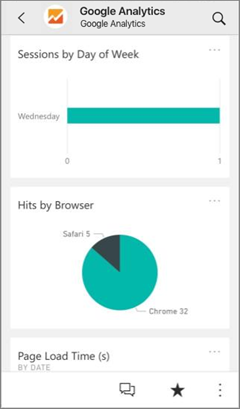
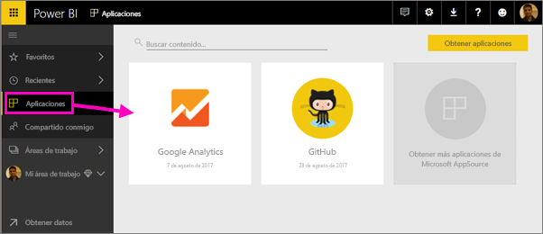
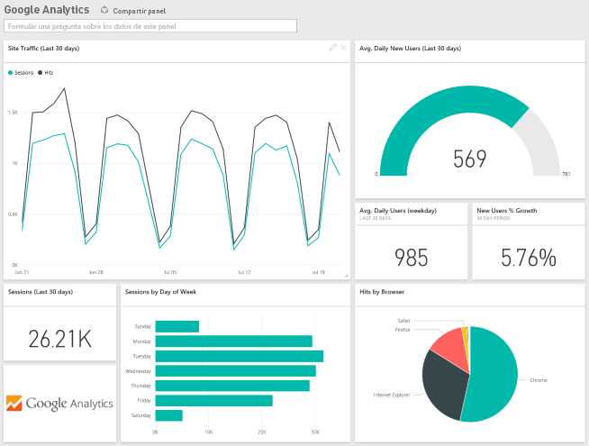
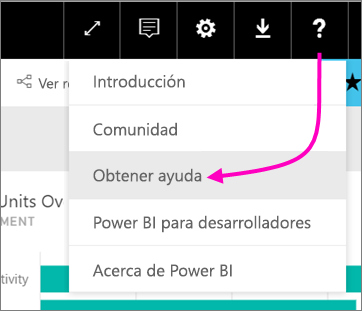

# Conexión a los servicios que usa con Power BI

Después de instalar la aplicación, tanto el panel como los informes se pueden ver en el servicio Power BI ([https://powerbi.com](https://powerbi.com)) y en las aplicaciones móviles de Power BI. 

## Comenzar
[!INCLUDE [powerbi-service-apps-get-more-apps](.././includes/powerbi-service-apps-get-more-apps.md)]

## Visualización del panel y los informes
Una vez completada la importación, la nueva aplicación aparece en la página Aplicaciones.

1. Seleccione **Aplicaciones** en el panel de navegación de la izquierda > seleccione la aplicación.
   
     
2. Para formular una pregunta, puede escribir en el cuadro de Preguntas o haga clic en un icono para abrir el informe subyacente. 
   
    
   
    Puede filtrar y resaltar los datos del informe, pero no se puede guardar los cambios.

## Qué se incluye
Después de conectarse a un servicio, verá una aplicación recién creada con un panel, informes y conjunto de datos. Los datos del servicio se centra en un escenario concreto y no pueden incluir toda la información del servicio. Está programado que los datos se actualicen automáticamente una vez al día. Para controlar la programación, seleccione el conjunto de datos.

Para más información acerca de cómo conectarse a servicios específicos, consulte las páginas de ayuda individuales.

## Solución de problemas
**Iconos vacíos**  
La primera vez que Power BI se conecte al servicio puede ver un conjunto vacío de iconos en el panel. Si el panel sigue vacío 2 horas después, es probable que se haya producido un error en la conexión. Si no ha visto ningún mensaje de error con información acerca de cómo corregir el problema, registre una incidencia de soporte técnico.

* Seleccione el icono de signo de interrogación (**?**) de la esquina superior derecha > **Obtener ayuda**.
  
    

**Falta información**  
Tanto el panel como los iconos incluyen contenido del servicio para en un escenario concreto y no incluyen toda la información del servicio. Si hay una métrica específica que no puede ver en el paquete de contenido, agregue una idea en la página de [soporte técnico de Power BI](https://support.powerbi.com/forums/265200-power-bi).

## Sugerir servicios
¿Utiliza un servicio que desea sugerir para una aplicación de Power BI? Vaya a la página de [soporte técnico de Power BI](https://support.powerbi.com/forums/265200-power-bi) y háganoslo saber.

¿Tiene algún servicio para el que desea generar una aplicación? [Envíe la nominación](https://azure.microsoft.com/marketplace/programs/certified/apply/) y seleccione "Publicar un paquete de contenido de Power BI" para empezar.

## Pasos siguientes
* [¿Qué son las aplicaciones en Power BI?](end-user-apps.md)
* [Obtener datos en Power BI](../service-get-data.md)
* ¿Tiene más preguntas? [Pruebe a preguntar a la comunidad de Power BI](http://community.powerbi.com/)

