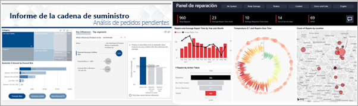
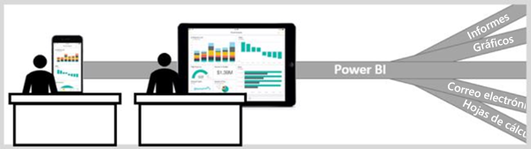

# Power BI para consumidores

Vivimos en una cultura de datos, en la que las decisiones empresariales se basan en hechos y no en opiniones. Para tomar estas decisiones necesita datos, para lo que cuenta con la ayuda de sus compañeros.     
 
Ellos le envían todo tipo de informes, hojas de cálculo, correos electrónicos con gráficos e incluso documentos impresos. A medida que se van acumulando estos datos, resulta más difícil encontrar rápidamente lo que necesita y le preocupa no estar usando la información más actualizada.  
 

## Servicio Power BI para *consumidores*

Power BI le facilita el trabajo y, al mismo tiempo, marca la diferencia. Todos los datos se convierten en gráficos y grafos que representan visualmente los datos al instante. En lugar de usar largas listas o tablas de números y palabras, la información que transmiten los datos es ***atractiva***: objetos visuales elegantes y llamativos que cuentan algo sobre los datos. 

 
Solo tiene que abrir el servicio Power BI en un explorador o un dispositivo móvil. Trabajará desde los mismos paneles e informes que sus compañeros, que se actualizan automáticamente, por lo que siempre estará trabajando con el contenido más actualizado.   

Dado que el contenido no es estático, puede profundizar en él, buscar tendencias, información útil y emplear otras técnicas de inteligencia empresarial. Segmente y desglose el contenido e incluso haga búsquedas en él formulando preguntas con sus propias palabras. O bien, deje que los datos le revelen información interesante, le envíen alertas cuando cambien los datos y le envíen informes por correo según la programación que haya configurado. Todos los datos, en cualquier momento, en la nube o de forma local, desde cualquier dispositivo. Eso es solo el principio de lo que puede Power BI puede conseguir. 

## ¿Soy un *consumidor* de Power BI?

La manera en que interactúa con Power BI dependerá de su función. Como usuario final o *consumidor*, recibe el contenido (paneles, informes y aplicaciones) de sus compañeros de trabajo. Puede trabajar en la versión en línea o móvil de Power BI, que se denomina servicio Power BI, revisando este contenido e interactuando con él para tomar decisiones empresariales. 
   
Como consumidor, no tendrá acceso a todas las funciones de Power BI. Y eso está bien, porque su trabajo no consiste en crear paneles e informes, sino que usará el servicio Power BI para el análisis, la supervisión, la exploración y la toma de decisiones. 

Sin duda, oirá el término "Power BI Desktop" o simplemente "Desktop": se trata de una herramienta independiente que usan los *diseñadores* que crean y comparten informes y paneles con usted.  Es importante saber que existen otras herramientas de Power BI, pero si usted es un consumidor, solo trabajará con el servicio Power BI. 

## Interacción segura con el contenido 
Cuando filtre, segmente, exporte y se suscriba, no se preocupe: su trabajo no afecta al conjunto de datos subyacente ni al contenido compartido original (paneles, informes y aplicaciones).  

No dañará los datos.  Power BI es un excelente lugar para que explore y experimente sin preocuparse por estropear algo.  
 
Eso no significa que los cambios no se puedan guardar: sí se puede. Pero estos cambios solo afectan a su vista del contenido. Y revertir a la vista predeterminada original es tan fácil como hacer clic en un botón.  

## Pasos siguientes

[Haga un recorrido por el servicio Power BI para consumidores](end-user-reading-view.md)    
[Aprendizaje del servicio Power BI para consumidores](https://docs.microsoft.com/en-us/learn/paths/consume-data-with-power-bi/)    
[Power BI: conceptos básicos del servicio Power BI*consumidores*](end-user-basic-concepts.md)    

