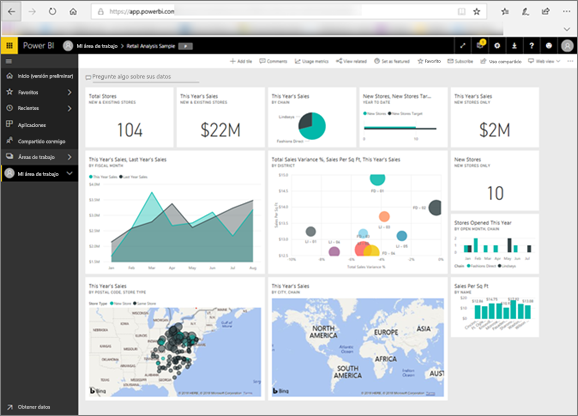

# Power BI para consumidores
La manera en que interactúa con Power BI dependerá de su función. Como *usuario final* o *consumidor*, recibe los paneles, los informes y las aplicaciones de sus compañeros de trabajo. Trabaja en el ***servicio Power BI*** para revisar este contenido e interactuar con él, a fin de tomar decisiones empresariales.

Si no está familiarizado con Power BI, le recomendamos que lea primero la [información general sobre Power BI](../power-bi-overview.md). Allí obtendrá información sobre el conjunto de herramientas que conforman Power BI.

Como consumidor, no tendrá acceso a las funcionalidades completas de Power BI. Y eso está bien, porque no es su trabajo crear paneles e informes. Su trabajo consiste en usar Power BI para el análisis, la supervisión, la exploración y la toma de decisiones.

A medida que lea los artículos para los consumidores, obtendrá información sobre la terminología, hará un recorrido por el servicio Power BI, averiguará cómo navegar por el contenido y después descubrirá cómo interactuar con ese contenido.  Comencemos.

## Pasos siguientes

[Power BI: conceptos básicos del servicio Power BI*consumidores*](end-user-basic-concepts.md)

<!-- [Get started guide for *consumers*] -->
[Tutorial: Introducción al servicio Power BI (app.powerbi.com)](../service-get-started.md)

