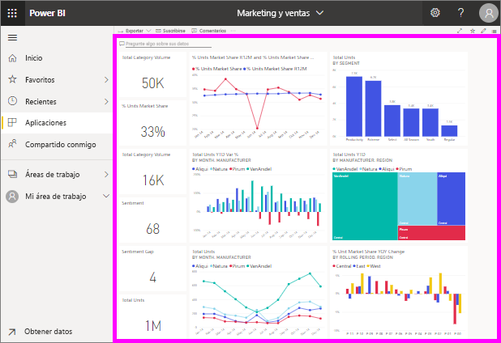

# Visualización de un panel
Los *consumidores* de Power BI dedican mucho tiempo a ver paneles. Los paneles están diseñados para resaltar información específica de los informes y los conjuntos de datos subyacentes. Y los consumidores de Power BI usan esa información con fines de seguimiento, supervisión, respuesta a preguntas, pruebas y mucho más, con el fin de tomar decisiones empresariales motivadas por datos.

Power BI Pro es necesario tanto para compartir un panel como para ver un panel compartido.

## Abrir un panel

|              |         |
|------------|--------------------------------|
|      |Los paneles se pueden abrir desde varias ubicaciones del servicio Power BI.   Solo tiene que buscar este icono del panel. Una vez que haya identificado un  panel, podrá abrirlo de forma sencilla: al seleccionarlo, el panel rellena  el lienzo de Power BI. |
|                    |          |

Puede encontrar paneles en todos los contenedores de la barra de navegación izquierda. 

- **Inicio** 
- **Favoritos**: si ha [establecido un panel como favorito](end-user-favorite.md)
- **Recientes**: si ha visitado recientemente un panel
- **Aplicaciones**: la mayoría de aplicaciones contienen paneles e informes
- **Compartido conmigo** : si un compañero ha [compartido un panel con usted](end-user-shared-with-me.md)
- **Mi área de trabajo**: si ha descargado alguno de los [ejemplos de Power BI](../sample-datasets.md)

## Pasos siguientes
* Familiarícese con los paneles viendo uno de nuestros [paneles de ejemplo](../sample-tutorial-connect-to-the-samples.md).
* Obtenga información acerca de los [iconos de panel](end-user-tiles.md) y lo que ocurre al seleccionar uno.