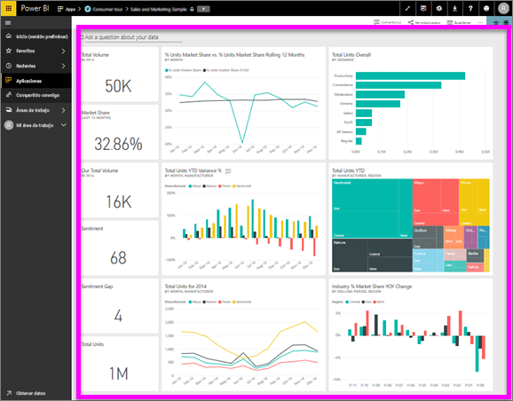

# Visualización de un panel
Los consumidores de Power BI dedican mucho tiempo a ver los paneles. Los paneles están diseñados para resaltar información específica de los informes y los conjuntos de datos subyacentes. Y los consumidores de Power BI usan esa información con fines de seguimiento, supervisión, respuesta a preguntas, pruebas y mucho más, con el fin de tomar decisiones empresariales motivadas por datos.

Power BI Pro es necesario tanto para compartir un panel como para ver un panel compartido.

## Abrir un panel
Los paneles se pueden abrir desde varias ubicaciones en el servicio Power BI.  La clave es decidir qué contenido se presenta en un panel (frente a un informe, por ejemplo). Una vez que haya identificado un panel, abrirlo es sencillo: simplemente haga clic y el panel ocupará la totalidad del lienzo de Power BI.

|              |         |
|------------|--------------------------------|
|      |La manera más fácil de identificar un panel consiste en buscar este  icono de panel. Cuando encuentre contenido con este icono, selecciónelo para abrir el panel. |
|                    |          |

 

<!--insert aGIF-->

Puede encontrar paneles en todos los contenedores de la barra de navegación izquierda. 
- **Inicio** (versión preliminar)
- **Favoritos**: si ha [establecido un panel como favorito](end-user-favorite.md)
- **Recientes**: si ha visitado recientemente un panel
- **Aplicaciones**: la mayoría de aplicaciones contienen paneles e informes
- **Compartido conmigo** : si un compañero ha [compartido un panel con usted](end-user-shared-with-me.md)
- **Mi área de trabajo**: si ha descargado alguno de los [ejemplos de Power BI](../sample-datasets.md)

## Pasos siguientes
* Familiarícese con los paneles viendo uno de nuestros [paneles de ejemplo](../sample-tutorial-connect-to-the-samples.md).
* Obtenga información acerca de los [iconos de panel](end-user-tiles.md) y lo que ocurre al seleccionar uno.
* ¿Desea realizar un seguimiento de un icono de panel individual y recibir un mensaje de correo electrónico al alcanzar un umbral determinado? [Cree alertas en iconos](end-user-alerts.md).
* Diviértase preguntando a su panel. Aprenda a utilizar [Preguntas y respuestas de Power BI](end-user-q-and-a.md) para formular una pregunta sobre los datos y recibir una respuesta en forma de visualización. 