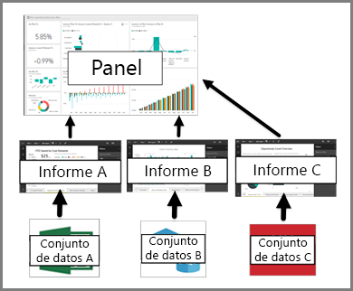

# Panel para los consumidores del servicio Power BI

Un ***panel*** de Power BI tiene una sola página, a menudo denominada lienzo, que usa visualizaciones para contar una historia. Dado que se limita a una sola página, un panel bien diseñado contiene únicamente los elementos más importantes de esa historia.

Las visualizaciones que se ven en el panel se denominan *iconos* y están *ancladas* al panel por los diseñadores de informes. Al seleccionar un icono, va a la página del informe donde se creó la visualización. Si no está familiarizado con Power BI, puede obtener una buena base leyendo [Conceptos básicos de Power BI](end-user-basic-concepts.md).

> [!NOTE]
> Los paneles se pueden [ver y compartir en dispositivos móviles](mobile/mobile-apps-view-dashboard.md).
>
> Para ver un panel que se haya compartido con usted, necesita Power BI Pro.
> 

Las visualizaciones de un panel proceden de informes y cada informe se basa en un conjunto de datos. De hecho, una manera de pensar en un panel es como vía de entrada a los informes y conjuntos de datos subyacentes. La selección de una visualización lleva al informe (y al conjunto de datos) utilizado para crearla.

## Ventajas de los paneles
Los paneles son una magnífica manera de supervisar su empresa, buscar respuestas y ver las métricas más importantes de un vistazo. Las visualizaciones de un panel pueden proceder de un conjunto de datos subyacente o de varios y de un informe subyacente o de varios. En un panel se pueden combinar datos locales y en la nube, de forma que se proporciona una vista consolidada, con independencia de dónde residan los datos.

Un panel no es simplemente una bonita imagen: es algo muy interactivo y personalizable, y los iconos se actualizarán según van cambiando los datos subyacentes.

## Paneles frente a informes para ***consumidores*** de Power BI
Los informes suelen confundirse con paneles, ya que son igualmente lienzos con visualizaciones. Sin embargo, hay algunas diferencias importantes desde el punto de vista de los *consumidores* de Power BI.

| **Funcionalidad** | **Paneles** | **Informes** |
| --- | --- | --- |
| Páginas |Una página |Una o varias páginas |
| Orígenes de datos |Uno o varios informes y uno o varios conjuntos de datos por cada panel |Un único conjunto de datos por informe |
| Suscribirse |Puede suscribirse a los correos electrónicos del panel |Puede suscribirse a los correos electrónicos de la página de informes |
| Filtrado |No es posible filtrar ni segmentar |Numerosas formas de filtrar, resaltar y segmentar |
| Establecimiento de alertas |Se pueden crear alertas para enviarlas por correo electrónico cuando se cumplen determinadas condiciones |No |
| Destacado |Se puede establecer un panel como panel "destacado" |No es posible crear un informe destacado |
| Consultas en lenguaje natural |Disponible en el panel |No disponible en los informes |
| Se pueden ver campos y tablas del conjunto de datos subyacentes |No. Se pueden exportar datos pero no se pueden ver tablas ni campos en el panel |Sí. Se pueden ver tablas, campos y valores del conjunto de datos |

## Creadores de paneles y consumidores de paneles
Como ***consumidor*** de Power BI, recibirá paneles de los *creadores*. Continúe aprendiendo sobre los paneles con estos temas:

* [Visualización de un panel](end-user-dashboard-open.md)
* Obtenga información acerca de los [iconos de panel](end-user-tiles.md) y lo que ocurre al seleccionar uno.
* ¿Desea realizar un seguimiento de un icono de panel individual y recibir un mensaje de correo electrónico al alcanzar un umbral determinado? [Cree alertas en iconos](end-user-alerts.md).
* Diviértase preguntando a su panel. Aprenda a utilizar [Preguntas y respuestas de Power BI](end-user-q-and-a.md) para formular una pregunta sobre los datos y recibir una respuesta en forma de visualización.

> [!TIP]
> Si no encuentra lo que está buscando aquí, utilice la tabla de contenido de la izquierda.
> 

## Pasos siguientes
[Visualización de un panel](end-user-dashboard-open.md) 