# Modo detallado en una visualización de Power BI

## El modo detallado necesita una jerarquía
Cuando un objeto visual tiene una jerarquía, se puede explorar en profundidad para mostrar detalles adicionales. Por ejemplo, puede tener una visualización que examine el número de medallas olímpicas mediante una jerarquía formada por deporte, disciplina y evento. De forma predeterminada, la visualización muestra el número de medallas por deporte, como gimnasia, esquí, deportes acuáticos, etc. Pero, como tiene una jerarquía, la selección de uno de los elementos visuales (por ejemplo, una barra, línea o burbuja), puede mostrar una imagen cada vez más detallada. Seleccione el elemento **aquatics** para ver los datos de natación, buceo y waterpolo.  Seleccione el elemento **diving** para ver los detalles de springboard, plataforma y eventos de buceo sincronizado.

Puede agregar jerarquías a los informes de su propiedad, pero no a los que se hayan compartido con usted.
¿No está seguro que visualizaciones de Power BI contienen una jerarquía?  Mantenga el cursor sobre una visualización y si ve estos controles de exploración en las esquinas superiores, significa que la visualización tiene una jerarquía.

    
   

Las fechas son un tipo único de jerarquía. Cuando agrega un campo de fechas a una visualización, Power BI agrega automáticamente una jerarquía de tiempo que contiene valores para el año, trimestre, mes y día. Para más información, consulte [Jerarquías visuales y comportamiento de exploración en profundidad](../guided-learning/visualizations.yml?tutorial-step=18) o vea el vídeo siguiente.

  <iframe width="560" height="315" src="https://www.youtube.com/embed/MNAaHw4PxzE?list=PL1N57mwBHtN0JFoKSR0n-tBkUJHeMP2cP" frameborder="0" allowfullscreen></iframe>

> [!NOTE]
> Para información sobre cómo crear jerarquías con Power BI Desktop, vea el vídeo [How to create and add hierarchies (Cómo generar y agregar jerarquías)](https://youtu.be/q8WDUAiTGeU)
> 

## Requisitos previos

1. En el servicio Power BI o en Desktop, para el modo detallado se necesita una visualización con una jerarquía. 
   
2. Para seguir el tutorial, [abra el ejemplo Retail Analysis](../sample-datasets.md) y cree un treemap que examine **Total Units This Year** (Values) [Unidades totales este año (Valores)] por **Territory** (Territorio), **City** (Ciudad), **PostalCode** (Código postal) y **Name** (Group) [Nombre (Grupo)].  El treemap tiene una jerarquía formada por el territorio, la ciudad, el código postal y el nombre de la ciudad. Cada territorio tiene una o varias ciudades, cada ciudad tiene uno o más códigos postales, etc. De forma predeterminada, la visualización muestra solo los datos de territorio, porque *Territory* (Territorio) aparece en primer lugar en la lista.
   
   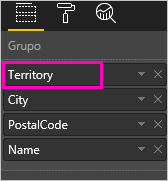

2. Como puede resultar confuso intentar comprender cómo funcionan entre sí los distintos iconos del modo detallado, vamos a filtrar el treemap para mostrar solo dos de los territorios más pequeños: **KY** y **TN**. Seleccione el treemap y, en **Filtros de nivel visual** expanda **Territory** (Territorio) y seleccione **KY** y **TN**.

    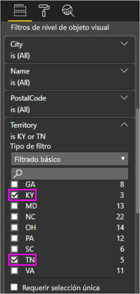    

   Ahora solo se muestran dos territorios en el treemap.

   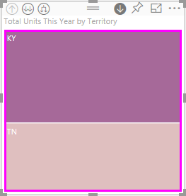

## Tres maneras de acceder a las características del modo detallado
Tiene varias opciones para acceder a las características de rastrear desagrupando datos, rastrear agrupando datos y expandir para las visualizaciones que tienen jerarquías. En este artículo se explica cómo usar la primera opción. Una vez que comprenda los aspectos básicos de rastrear desagrupando datos y expandir, verá que con los tres métodos consigue realizar lo mismo, así que pruébelos y elija el que más le guste.

- Mantenga el mouse sobre una visualización para ver y usar los iconos.  

    

- Haga clic con el botón derecho en una visualización para mostrar el menú y usarlo.
    
    

- En la barra de menús de Power BI, seleccione el botón **Explorar**.

   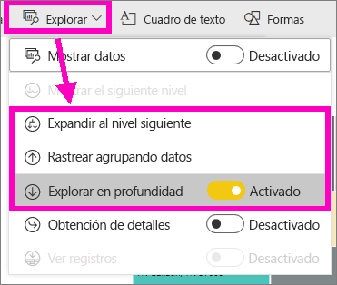

## Rutas de exploración
### Rastrear desagrupando datos
Existen varias formas de explorar en profundidad la visualización. ***Rastrear desagrupando datos*** le lleva al siguiente nivel en la jerarquía. Por tanto, si está mirando el nivel **Territory** (Territorio), puede rastrear desagrupando datos al nivel City (Ciudad) y luego al nivel PostalCode (Código postal) y, por último, al nivel Name (Nombre). Cada paso de la ruta muestra información nueva.

### Expandir

***Expandir*** agrega un nivel de jerarquía adicional a la vista actual. Por tanto, si está mirando el nivel **Territory** (Territorio), puede expandir y agregar City (Ciudad), PostalCode (Código postal) y Name (Nombre) al treemap. Cada paso de la ruta muestra la misma información y agrega un nivel de información nueva.

También puede elegir si quiere rastrear desagrupando datos o expandir solo un campo o todos los campos a la vez. 

## Rastrear desagrupando datos de todos los campos a la vez

1. Empiece en el nivel superior del treemap, que muestra datos de KY y TN. Amplíe el treemap seleccionando uno de los controladores y arrastrándolo a la derecha. 

    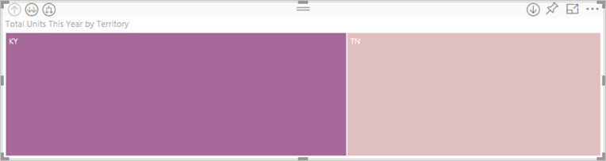 .

2. Para rastrear desagrupando datos de ***todos los campos a la vez***, seleccione la flecha doble de la esquina superior izquierda de la visualización . El treemap muestra ahora los datos de ciudad de Kentucky y Tennessee. 

    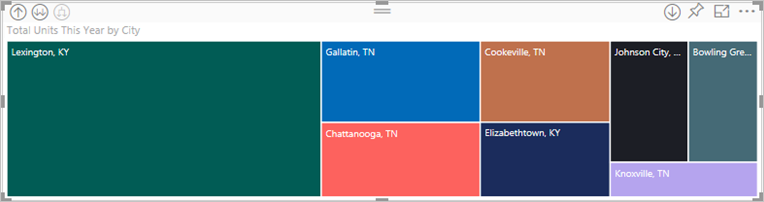
   
5. Rastree desagrupando datos una vez más en el nivel PostalCode (Código postal) de la jerarquía.

    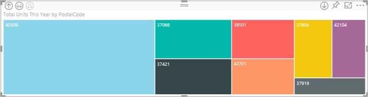

3. Para volver a rastrear agrupando datos, seleccione la flecha ascendente situada en la esquina superior izquierda de la visualización .

## Rastrear desagrupando datos un solo campo a la vez
Este método usa los iconos del modo detallado que aparecen en la esquina superior derecha de la propia visualización. 

1. Seleccione el icono de rastrear desagrupando datos para activar esta opción . Ahora tiene la opción de rastrear desagrupando datos de ***un solo campo a la vez***. 
   
   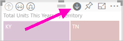

   Si no activa la opción de rastrear desagrupando datos, al seleccionar un elemento visual (como por ejemplo, una barra, una burbuja o un nodo hoja) no se rastreará desagrupando datos, sino que realizará un filtrado cruzado con otros gráficos en la página del informe.

2. Seleccione el *nodo hoja* para **TN**. El treemap muestra ahora todas las ciudades de Tennessee que tienen una tienda. 

    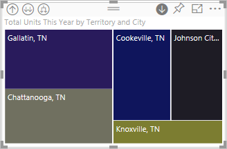

2. Aquí puede seguir rastreando desagrupando datos para Tennesee o puede rastrear desagrupando datos para una determinada ciudad de Tennesee, o bien puede expandir (vea **Expandir todos los campos a la vez** más adelante). Sigamos rastreando desagrupando datos de un solo campo a la vez.  Seleccione **Knoxville, TN**. El treemap muestra ahora el código postal de la tienda en Knoxville. 

   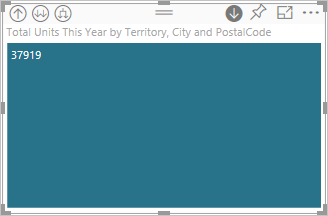

    Observe que el título cambia a medida que realiza la exploración en profundidad y vuelve a agruparlos de nuevo.  

## Expandir todo y expandir un campo a la vez
Tener un treemap que nos muestra solo un código postal no es muy informativo.  Así que vamos a expandir un nivel en la jerarquía.  

1. Con el treemap activo, seleccione el icono de *expandir* . El treemap muestra ahora dos niveles de la jerarquía: PostalCode (Código postal) y Name (Nombre) de la tienda. 

    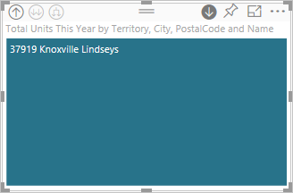

2. Para ver los cuatro niveles de jerarquía de datos para Tennesee, seleccione la flecha para rastrear agrupando datos hasta llegar al segundo nivel **Total units this year by territory and city** (Unidades totales este año por territorio y ciudad) del treemap. 

    

3. Asegúrese de que todavía está activada la opción de rastrear desagrupando datos  y seleccione el icono *expandir* . El treemap muestra ahora algunos detalles más. En lugar de mostrar solo la ciudad y el estado, también muestra el código postal. 

    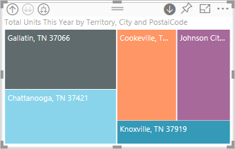

4. Seleccione el icono de *expandir* una vez más para mostrar los cuatro niveles de jerarquía de detalle para Tennesee en el treemap. Mantenga el mouse sobre un nodo hoja para ver más detalles.

   

## Filtros de detalles en otros objetos visuales
Cuando se trabaja en el modo detallado, tiene que decidir en qué medida afecta el rastreo desagrupando datos y la expansión a otras visualizaciones de la página. 

De forma predeterminada, el modo detallado no filtrará otros objetos visuales en un informe. Pero esta característica se puede habilitar en el servicio Power BI y en Power BI Desktop. 

1. En Desktop, seleccione la pestaña **Formato** y active la casilla para **Filtros de detalles en otros objetos visuales**.

    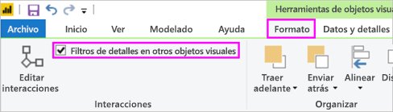

2. Ahora, cuando rastree desagrupando datos (o rastree agrupando datos o expanda) en un objeto visual con una jerarquía, esa acción filtrará los otros objetos visuales de la página. 

    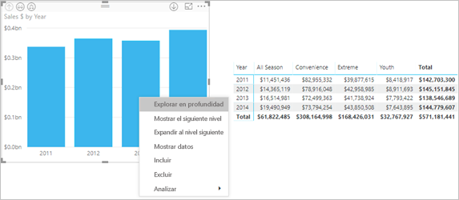

    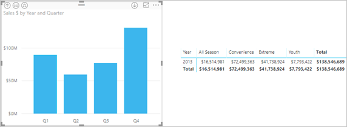

> [!NOTE]
> Para habilitar esta opción en el servicio Power BI, en la barra de menús superior, seleccione **Interacciones de objetos visuales > Filtros de detalles en otros objetos visuales**.
>
> 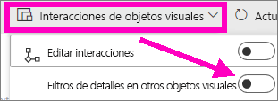

## Descripción del eje de jerarquías y el grupo de jerarquías
Puede pensar en el eje de jerarquías y el grupo de jerarquías como los mecanismos que puede usar para aumentar y reducir la granularidad de los datos que quiere ver. Los datos que se pueden organizar en categorías y subcategorías pueden tener una jerarquía. Eso, por supuesto, incluye las fechas y las horas.

En Power BI puede crear una visualización que tenga una jerarquía si selecciona uno o más campos de datos y los agrega al área **Eje** o **Grupo**, junto con los datos que quiere examinar como campos de datos en el área **Valores**. Sabrá que los datos son jerárquicos si aparecen los iconos del *modo detallado* en las esquinas superior izquierda y derecha de la visualización. 

Básicamente, resulta práctico considerarlo como dos tipos de datos jerárquicos:
- Datos de fecha y hora: si tiene un campo de datos con un tipo de datos DateTime, ya tiene datos jerárquicos. Power BI crea automáticamente una jerarquía para cualquier campo de datos cuyos valores se puedan analizar en una estructura [DateTime](https://msdn.microsoft.com/library/system.datetime.aspx). Solo tiene que agregar un campo DateTime al área **Eje** o **Grupo**.
- Datos de categorías: si los datos derivan de colecciones que contienen subcolecciones o tienen filas de datos que comparten valores comunes, tiene datos jerárquicos.

Power BI le permite expandir por uno o por todos los subconjuntos. Puede explorar en profundidad los datos para ver un único subconjunto en cada nivel o para ver todos los subconjuntos de forma simultánea en cada nivel. Por ejemplo, puede explorar en profundidad un año determinado o ver todos los resultados de cada año a medida que baja por la jerarquía. A la inversa, puede agrupar los datos de la misma manera.

En las secciones siguientes se describe la exploración en profundidad desde la vista superior, la media y la inferior.

### Datos jerárquicos y datos de hora
Para este ejemplo, siga con el [ejemplo Retail Analysis](../sample-datasets.md) y cree una visualización de gráfico de columnas apiladas que examine **Month** (eje) por **TotalSales** (valores).  

Aunque el campo de datos Axis es **Month**, sigue creando una categoría **Year** en el área **Axis**. Esto es debido a que Power BI proporciona la estructura DateTime completa para todos los valores que lee. La parte superior de la jerarquía muestra los datos del año.

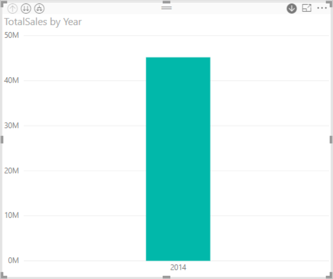

Con el modo de exploración en profundidad activado, haga clic en la barra del gráfico para bajar un nivel de la jerarquía. Verá tres barras para los datos de los trimestres disponibles. Entonces, en los iconos izquierdos superiores, elija **Expand all down one level of the hierarchy** (Expandir hacia abajo un nivel de la jerarquía). Luego vuelva a hacerlo para ir al nivel inferior de la jerarquía, que muestra resultados de cada mes.

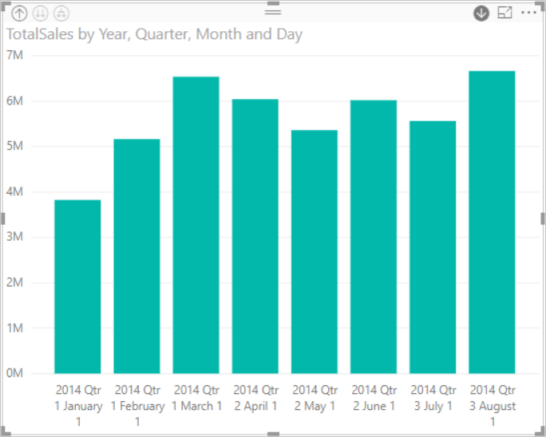

Además de la visualización, se puede ver la jerarquía reflejada en los datos representados para cada informe. La siguiente tabla muestra los resultados de **Mostrar datos** en un informe que explora en profundidad un solo mes o todos los meses. 

Observe que los datos son los mismos para los informes trimestrales y anuales, pero que después de explorar en profundidad al nivel de detalle especificado para **Valores**, puede ver cómo el informe se vuelve más específico y el informe "todos los meses" tiene más datos.

|Modo expandido|Año|Trimestre|Mes|Día|
| ---|:---:|:---:|:---:|---|
|Único|||||
|Todo|||||

### Datos de categoría jerárquicos
Los datos modelados a partir de colecciones y subcolecciones son jerárquicos. Un buen ejemplo son los datos de ubicación. Imagine una tabla de un origen de datos cuyas columnas son País, Estado, Ciudad y Código postal. Los datos que comparten el mismo País, Estado y Ciudad son jerárquicos.

Para este ejemplo, continúe con el [ejemplo Retail Analysis](../sample-datasets.md). Cree una visualización de gráfico de columnas apiladas que examine **Total Units This Year** (valores) por **Territory**, **City**, **PostalCode** y **Name** (grupo).  

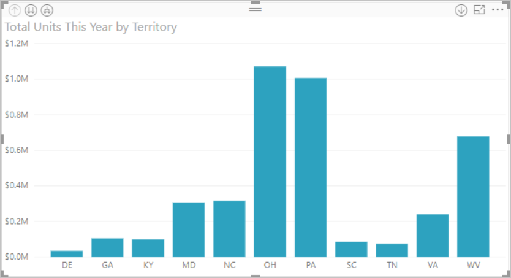

Con el modo de exploración en profundidad activado, en los iconos izquierdos superiores, elija **Expand all down one level of the hierarchy** (Expandir hacia abajo un nivel de la jerarquía) tres veces.
Debería encontrarse en el nivel inferior de la jerarquía, que muestra los resultados de Territory, City y Postal Code.

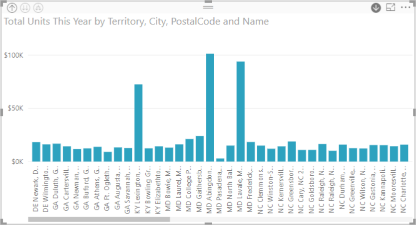

Además de la visualización, se puede ver la jerarquía reflejada en los datos representados para cada informe. La siguiente tabla muestra los resultados de **Mostrar datos** en un informe que explora en profundidad un solo territorio o todos. Al explorar en profundidad, puede ver cómo el informe se vuelve más específico y que el informe "todos los territorios" tiene más datos.

| Modo expandido|Territorio|Ciudad|Postal|Nombre|
| ---|:---:|:---:|:---:|---|
|Único|||||
|Todo|||||

## Consideraciones y limitaciones
* Si al agregar un campo de fecha a una visualización no se crea una jerarquía, es posible el campo de fecha no se guarde realmente como una fecha. Si es el propietario del conjunto de datos, ábralo en la vista *Datos* de Power BI Desktop, seleccione la columna que contiene la fecha y, en la pestaña Modelado, cambie el **Tipo de datos** a **Fecha** o **Fecha/hora**. Si el informe se ha compartido con usted, póngase en contacto con el propietario para solicitar el cambio.  
  
  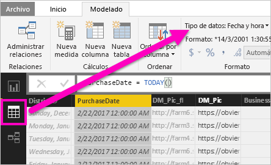

## Pasos siguientes
[Visualizaciones en informes de Power BI](../visuals/power-bi-report-visualizations.md)

[Informes de Power BI](end-user-reports.md)

[Power BI: Conceptos básicos](end-user-basic-concepts.md)

¿Tiene más preguntas? [Pruebe la comunidad de Power BI](http://community.powerbi.com/)

