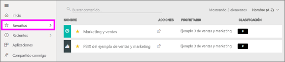
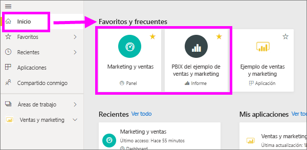
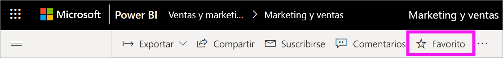
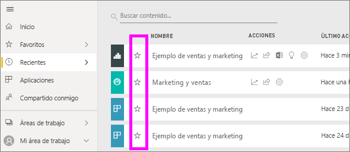
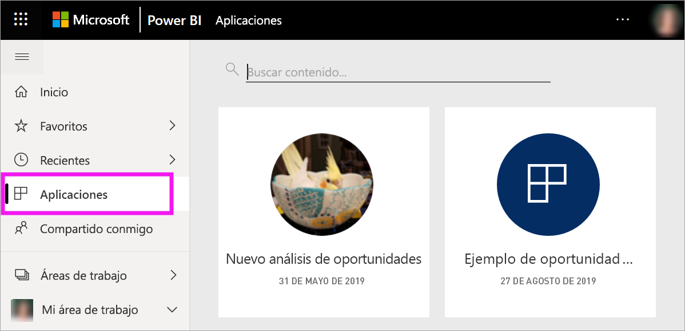
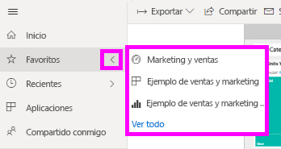
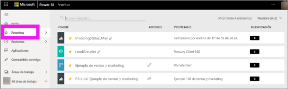
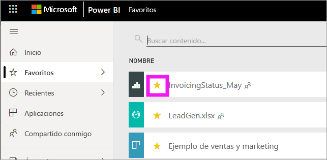

# Agregar a Favoritos aplicaciones, informes y paneles en el servicio Power BI
Cuando se convierte contenido en *favorito*, se puede acceder a él rápidamente desde la lista de contenido **Favoritos** y desde **Inicio** de Power BI > **Favoritos y frecuentes**. Los favoritos suelen ser contenido que se visita con más frecuencia y se identifican con una estrella amarilla.

   

   

También puede seleccionar un solo panel como [Panel destacado](end-user-featured.md) en el servicio Power BI.

## Incorporación de un panel o informe como favorito

1. Abra un panel o informe que use con frecuencia. El contenido que se ha compartido con usted también puede marcarse como favorito.

2. En la barra de menús superior del servicio Power BI, seleccione **Favorito** o el icono de estrella .
   
   
   
   También puede convertir en favorito un panel o un informe desde cualquier lugar en el que vea el icono de estrella, como Inicio, Recientes, Aplicaciones y Compartido conmigo. 
   
   

## Incorporación de una aplicación como favorita

1. En el panel de navegación, seleccione **Aplicaciones**.

   

2. Mueva el puntero sobre una aplicación para que se muestren más detalles. Seleccione el icono de estrella  para marcarla como favorita.
   
   

## Trabajo con Favoritos
1. Para acceder a los favoritos, seleccione la flecha de control flotante situada a la derecha de **Favoritos**. Ahí puede seleccionar un elemento favorito para abrirlo. Se muestran hasta cinco favoritos en orden alfabético. Si tiene más de cinco, seleccione **Ver todo** para abrir la lista de contenido Favoritos. 
   
   
2. Para ver todo el contenido que ha agregado como favorito, seleccione **Favoritos** en el panel de navegación o el  de Favoritos. 
   
    
   
   Desde aquí, puede realizar una acción. Puede abrir favoritos, identificar a los propietarios e incluso compartirlos con sus compañeros.

## Quitar contenido de Favoritos
Si ya no usa un informe tanto como antes, lo puede quitar de Favoritos. Al quitar contenido de Favoritos, desaparece de la lista, pero no de Power BI.

1. En el panel de navegación, seleccione **Favoritos** para abrir la pantalla **Favoritos**.
   
   
2. Seleccione la estrella amarilla que hay junto al contenido que quiere quitar de Favoritos.

> [!NOTE]
> También puede quitar de Favoritos un panel, un informe o una aplicación. Solo tiene que abrir y anular la selección del icono amarillo. 
> 
> 
## Limitaciones y consideraciones
De momento, puede convertir una aplicación en favorita y esto convierte automáticamente en favoritos a todos los informes y paneles de esa aplicación. No se puede convertir en Favoritos informes o paneles de aplicación individuales. 

## Pasos siguientes
- [Power BI: conceptos básicos](end-user-basic-concepts.md)
- ¿Tiene más preguntas? Consulte la [Comunidad de Power BI](https://community.powerbi.com/).

