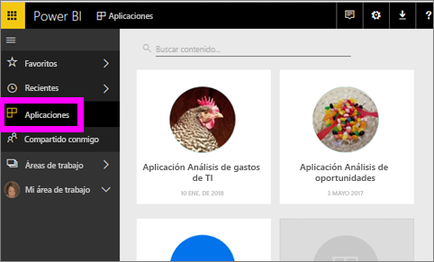
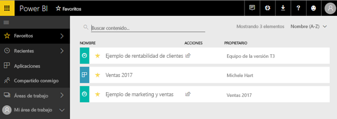
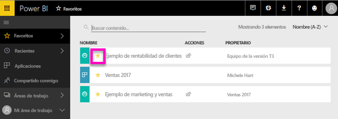

# Agregar a Favoritos aplicaciones, informes y paneles en el servicio Power BI
Al marcar contenido un *favorito*, podrá acceder a él rápidamente desde el **favoritos** lista de contenido y de **Power BI Home**  >   **Favoritos y frecuentes**.  Los favoritos son normalmente contenidos que visitan con más frecuencia y se identifican con una estrella amarilla.

   

   

También puede seleccionar un solo panel como un [panel destacado](end-user-featured.md) en el servicio Power BI.

## Agregar un panel o informe como *favorito*

1. Abra un panel o informe que use con frecuencia. El contenido que se ha compartido con usted también puede marcarse como *favorito*.

2. En la cinta de opciones superior del servicio Power BI, seleccione **favorito** o la estrella  icono.
   
   
   
   Puede marcar también como favorito un panel o informe desde cualquier lugar, verá el icono de estrella, como principal, recientes, las aplicaciones y compartido conmigo. 
   
   

## Agregar una aplicación como *favorita*

1. En el panel de navegación, seleccione **aplicaciones**.

   

2. Mueva el puntero sobre una aplicación para que se muestren más detalles.  Seleccione el icono de estrella   para marcarla como favorita.
   
   

## Uso de *Favoritos*
1. Para obtener acceso a sus favoritos, seleccione la flecha flotante situada a la derecha del **favoritos**.  Ahí puede seleccionar un elemento favorito para abrirlo. Solo se enumeran cinco favoritos (en orden alfabético). Si tiene más de cinco, seleccione **ver todo** para abrir el contenido de la lista Favoritos (vea #2, a continuación). 
   
   
2. Para ver **todas** el contenido que se ha agregado como favoritos, en el panel de navegación, seleccione **favoritos** o los favoritos  icono.  
   
    
   
   Aquí podrá llevar a cabo acciones, como abrirlos, identificar a los propietarios e incluso compartirlos con sus compañeros.

## Quitar contenido de Favoritos
¿Ya no usa un informe tanto como antes?  Puede quitarlo de sus favoritos. Al quitar contenido de Favoritos, desaparece de la lista, pero no de Power BI.

1. En el panel de navegación izquierdo, seleccione **Favoritos** para abrir la pantalla **Favoritos**.
   
   
2. Seleccione la estrella amarilla que hay junto al contenido para quitarlo de Favoritos.

> [!NOTE]
> También puede quitar un panel, un informe o la aplicación. Solo tiene que abrir y seleccionar el icono amarillo.   
> 
> 
## Limitaciones y consideraciones
En este momento, puede favoritos una aplicación y esta automáticamente favoritos de todos los informes y paneles para esa aplicación. No es posible que aplicaciones individuales favoritos informes o paneles. 

## Pasos siguientes
[Power BI: Conceptos básicos](end-user-basic-concepts.md)

¿Tiene más preguntas? [Pruebe la comunidad de Power BI](http://community.powerbi.com/)

