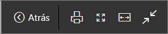
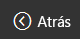
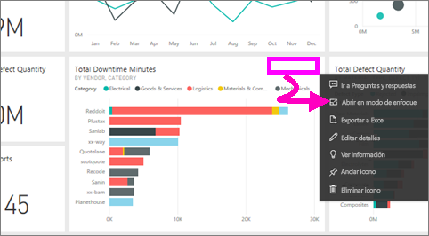
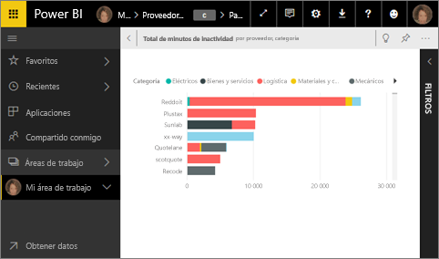
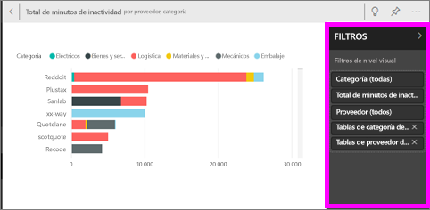
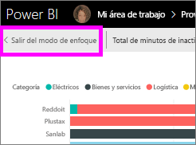
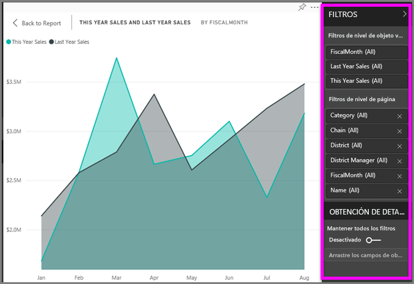
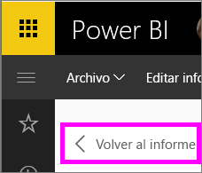

# Mostrar el contenido con más detalle: modo de enfoque y modo de pantalla completa

<iframe width="560" height="315" src="https://www.youtube.com/embed/dtdLul6otYE" frameborder="0" allowfullscreen></iframe>

El modo de enfoque y el modo de pantalla completa son dos maneras diferentes para ver más detalles en los objetos visuales, informes y paneles.  La principal diferencia es que la pantalla completa quita todos los paneles que rodean al contenido, mientras el modo de enfoque permite seguir interactuando con los objetos visuales. Veamos en más profundidad las similitudes y las diferencias.  

|Contenido    | Modo de enfoque  |Modo de pantalla completa  |
|---------|---------|----------------------|
|Panel     |   No es posible     | sí |
|Página de informe   | No es posible  | sí|
|Visualización de informe | sí    | sí |
|Icono del panel | sí    | sí |
|Windows 10 Mobile | No es posible | Sí |

## ¿Qué es el modo de pantalla completa?

Visualice el contenido del servicio Power BI (paneles, páginas de informes, iconos y visualizaciones) sin la distracción de los menús y las barras de navegación.  En todo momento se disfruta de una vista completa sin adulterar del contenido con un solo vistazo. Esto a veces se conoce como modo de televisión.   

Para abrir el modo de pantalla completa, seleccione el icono de **pantalla completa**  en la barra de menús del servicio Power BI encima del panel, el informe, el icono en modo de enfoque o el objeto visual en modo de enfoque.  El contenido seleccionado ocupa toda la pantalla.
Si usa Power BI para dispositivos móviles, [la pantalla completa está disponible para las aplicaciones móviles de Windows 10](./mobile/mobile-windows-10-app-presentation-mode.md). 

Algunos usos del modo de pantalla completa son:

* Presentar el panel, el icono, el objeto visual o el informe en una reunión o conferencia.
* Mostrar los elementos en una oficina en una pantalla de gran tamaño dedicada o un proyector.
* Visualizar en una pantalla pequeña.
* Revisar los elementos en modo bloqueado: puede tocar la pantalla o pasar el mouse sobre los iconos sin abrir el panel o el informe subyacente.

## ¿Qué es el modo de enfoque?
El modo de ***enfoque*** permite expandir (hacer emerger) un objeto visual o icono para verlos con mayor detalle.  Quizá tenga un panel o informe que está un poco amontonado y desea acercar un único objeto visual.  Se trata de un uso perfecto del modo de enfoque.  

En el modo de enfoque, un *consumidor* de Power BI puede interactuar con todos los filtros que se aplicaron cuando se creó este objeto visual.  En el servicio Power BI, puede usar el modo de enfoque en un icono de panel u objeto visual de informe.

## Trabajar en modo de pantalla completa
Para abrir un panel o la página de un informe en el modo de pantalla completa, seleccione el icono de pantalla completa  en la barra de navegación superior. Una vez que esté en modo de pantalla completa, al mover el ratón o el cursor, aparece un menú contextual. Puesto que ya está disponible el modo de pantalla completa para tal amplia variedad de contenido, las opciones del menú contextual son un poco distintas, pero no necesitan mucha explicación.  Simplemente mantenga el ratón sobre un icono para obtener una definición.

Menú de paneles    
    

Menú de páginas de informes    
    

  *     
  Use el botón **Atrás** para navegar a la página anterior del explorador. Si la página anterior era una página de Power BI, se mostrará también en el modo de pantalla completa.  El modo de pantalla completa se mantendrá hasta que salga.

  *     
  Use este botón para imprimir el panel o la página de informe en modo de pantalla completa.

  *     
    Use el botón **Ajustar a la pantalla** para mostrar el panel en el mayor tamaño posible sin tener que recurrir a las barras de desplazamiento.  

    

  *        
    En algunas ocasiones, no importan las barras de desplazamiento, sino que quiere que el panel ocupe todo el ancho del espacio disponible. Seleccione el botón **Ajustar al ancho**.    

    

  *        
    En los informes de pantalla completa, utilice estas flechas para desplazarse entre las páginas del informe.    
  * Para salir del modo de pantalla completa, seleccione el icono **Salir de pantalla completa**.

      

## Trabajar en modo de enfoque
Hay dos forma de abrir el modo de enfoque; una, para los iconos de panel y otra, para las visualizaciones de informe.

### Modo de enfoque en paneles
1. Abra un panel en el servicio Power BI.

2. Mantenga el puntero sobre un icono de panel o una visualización de informe, seleccione el botón de puntos suspensivos (...) y elija **Abrir en modo de enfoque**.

    .

2. El icono se abre y pasa a ocupar todo el lienzo del informe.

   

3. Expanda el panel Filtros para ver todos los filtros aplicados a este objeto visual.

   

4. Explore más mediante la [modificación de los filtros](end-user-report-filter.md) y la búsqueda de detecciones interesantes en los datos.  

5. Cierre el modo de enfoque y vuelva al panel. Para ello, seleccione  **Salir del modo de enfoque** (en la esquina superior izquierda del objeto visual).

        

## Modo de enfoque para las visualizaciones de informes
1. Abra un informe en el servicio Power BI.  En este ejemplo, se realizará una demostración con el ejemplo de análisis de minoristas.

1. Una vez que el informe esté abierto, seleccione la pestaña **Ventas mensuales de distrito**.

2. Mantenga el ratón sobre el gráfico de área de la esquina inferior izquierda y seleccione el icono de **modo de enfoque** .  

   
2. La visualización se abre y pasa a ocupar todo el lienzo.

   
3. De forma opcional, expanda el panel Filtros para interactuar con los filtros aplicados a este objeto visual. Profundice en los datos con la búsqueda de información detallada nueva y respuestas a preguntas. Como *consumidor*, no puede agregar nuevos filtros, cambiar los campos utilizados en las visualizaciones ni crear visualizaciones.  Sin embargo, cualquier modificación realizada en los filtros existentes se guarda al salir de Power BI. Si no desea que Power BI recuerde las modificaciones, seleccione **Restablecer valores predeterminados**.   

   

5. Cierre el modo de enfoque y vuelva al informe. Para ello, seleccione **Volver al informe** (en la esquina superior izquierda del objeto visual).

      

## Consideraciones y solución de problemas
* Al utilizar el modo de enfoque con una visualización de un informe, podrá ver todos los filtros e interactuar con ellos: el nivel de objeto visual, el nivel de página, la obtención de detalles y el nivel de informe.    
* Al utilizar el modo de enfoque con una visualización de un panel, podrá ver solo el filtro del nivel del objeto visual e interactuar con él.

## Pasos siguientes
[Configuración de la vista de informes](end-user-report-view.md)