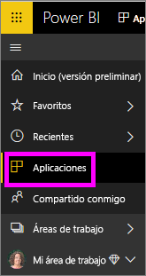
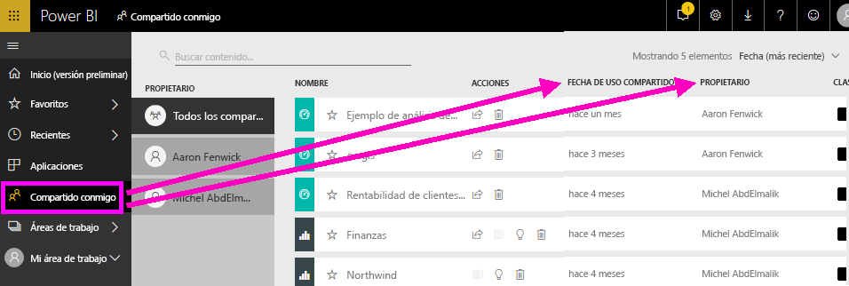
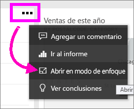
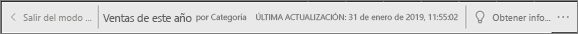
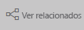
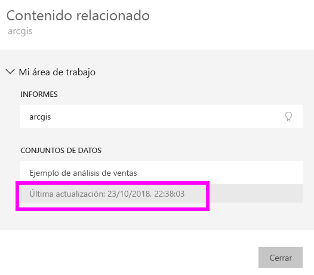

# Su contenido está actualizado
Como *consumidor*, interactúa con contenido creado por *diseñadores* y compartido con su usuario. Puede que se pregunte si ese contenido está actualizado o simplemente quiera saber cuándo se ha actualizado por última vez ese contenido. Saber que trabaja con el contenido más actualizado le dará confianza.  
 

El hecho de asegurarse de disponer de los datos más recientes suele ser crítico para tomar las decisiones correctas. ¿Qué puede hacer para asegurarse de usar siempre el contenido más reciente? En la mayoría de los casos, no es necesario realizar ninguna otra acción. Las aplicaciones compartidas con su usuario se actualizan automáticamente según la programación establecida por el diseñador de la aplicación. Lo mismo ocurre con los paneles e informes compartidos con usted: el diseñador actualiza el contenido de forma manual o usa una programación de actualización automatizada.  

Si tiene preguntas sobre la actualización de los datos, póngase en contacto con el diseñador.

## Búsqueda del nombre del diseñador

### Aplicaciones

En la pantalla de la aplicación, se muestra el nombre del diseñador y la fecha en que se ha creado la aplicación.  

1. Seleccione **Aplicaciones** en el panel de navegación izquierdo.

    

    En cada aplicación, verá el título y la fecha de creación. 

2. Mantenga el mouse sobre la aplicación para mostrar también el nombre del diseñador. 

    

### Compartido conmigo
En la pantalla **Compartidos conmigo**, se muestra el nombre del propietario del contenido, así como la fecha en la que se ha compartido el contenido con el usuario.

 

## Búsqueda de la fecha de la última actualización
Si le interesa, puede buscar la fecha de la última actualización de la mayoría del contenido. 

### Los iconos de panel
En el caso de los iconos del panel, visualice el icono en el modo de enfoque para ver la marca de tiempo de la última actualización.

1. En un icono del panel, seleccione el signo de puntos suspensivos (…) y haga clic en **Abrir en modo de enfoque**.

    

2. En la esquina superior derecha, se muestra la fecha de la última actualización. Si no la ve, expanda el explorador para hacerlo más ancho. 

    

### Desde paneles e informes
Otra forma de buscar la fecha de la última actualización es mediante la opción **Ver relacionados**.  La opción **Ver relacionados** está disponible en la barra de menús superior de Power BI.

En el panel **Contenido relacionado**, se muestra la información de la última actualización del conjunto de datos subyacente del panel o informe.

## Consecuencias de la eliminación de una aplicación por parte de un diseñador

Si un diseñador elimina una aplicación, los paneles e informes asociados a ella también se quitarán automáticamente del área de trabajo de Power BI. Ya no están disponibles y la aplicación no aparece en el panel de navegación.

## Suscripción para ver los cambios
Otra forma de mantenerse actualizado es suscribirse a un informe o panel. En lugar de tener que iniciar sesión y abrir un informe o panel, le indica a Power BI que le envíe una instantánea según una programación personalizada.  Para obtener más información, vea [Suscripción a paneles e informes](end-user-subscribe.md).

## Establecer alertas de datos
¿Quiere recibir notificaciones si los datos cambian por encima o por debajo de un límite que especifique? [Cree una alerta de datos](end-user-alerts.md).  Es fácil mantenerse actualizado mediante alertas de datos. Con las alertas de datos, le indica a Power BI que le envíe un correo electrónico en caso de que un valor en un informe supere un umbral específico.  Por ejemplo, si el inventario tiene menos de 25 unidades o si las ventas superan los objetivos.  

## Pasos siguientes
[Creación de una alerta de datos](end-user-alerts.md)    
[Suscripción a paneles e informes](end-user-subscribe.md)    
[Consulta de contenido relacionado](end-user-related.md)    
