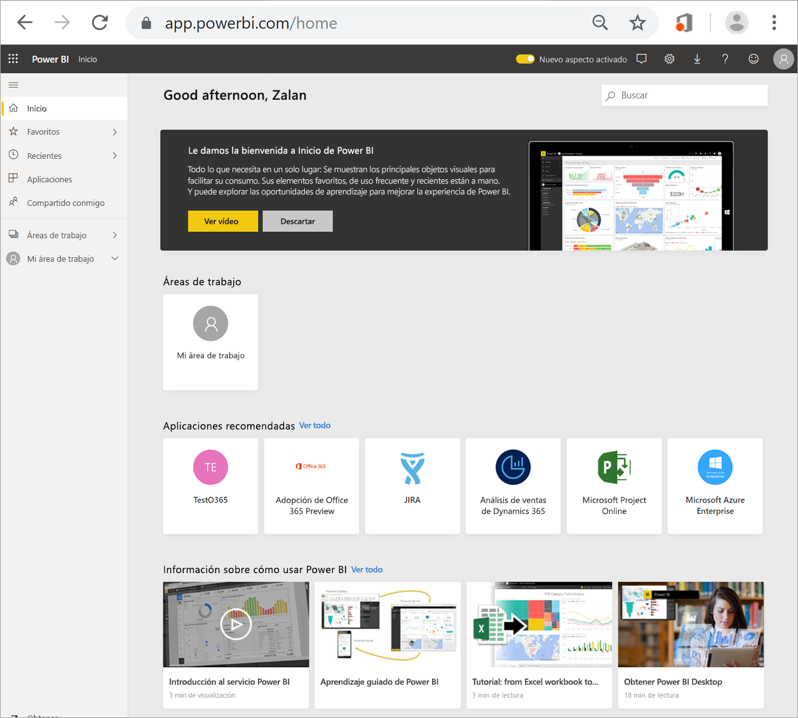
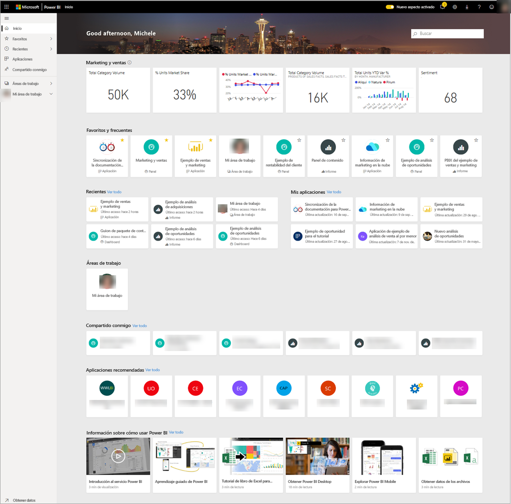
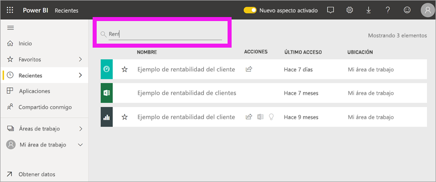

# Búsqueda de paneles, informes y aplicaciones
En Power BI, el término *contenido* se refiere a aplicaciones, paneles e informes. Los *diseñadores* de Power BI crean el contenido y lo comparten con colegas como usted. El contenido es accesible y visible en el servicio Power BI, donde el mejor lugar para empezar a trabajar es la página de aterrizaje Inicio.

## Exploración de Inicio de Power BI
Al iniciar sesión, Power BI se abre y muestra el lienzo Inicio, como se muestra en la imagen siguiente.
 

Inicio de Power BI ofrece tres formas diferentes de buscar y ver el contenido. Las tres acceden al mismo grupo de contenido, simplemente son maneras distintas de llegar a ese contenido. A veces, la búsqueda es la forma más sencilla y rápida de encontrar algo, mientras que otras, la selección de una *tarjeta* en el lienzo Inicio es la mejor opción.

- El lienzo Inicio muestra y organiza el contenido favorito y más reciente, además del contenido recomendado y los recursos de aprendizaje. Cada fragmento de contenido se muestra como una *tarjeta*, con un título y un icono. Al seleccionar una tarjeta se abre ese contenido.
- A lo largo del lado izquierdo hay un panel, que se conoce como panel de navegación. En este panel, el mismo contenido se organiza de un modo ligeramente distinto, por Favoritos, Recientes, Aplicaciones y Compartido conmigo. Desde aquí, puede ver listas de contenido y seleccionar la que quiere abrir.
- En la esquina superior derecha, el cuadro de búsqueda global permite buscar contenido por título, nombre o palabra clave.

En los temas siguientes se revisa cada una de estas opciones para buscar y ver contenido.

## Lienzo Página principal
En el lienzo Inicio, puede ver todo el contenido que tiene permiso para usar. Al principio es posible que no haya mucho contenido en el lienzo Inicio (vea la imagen anterior), pero eso cambia a medida que se empieza a usar Power BI con los colegas.

El lienzo Inicio también se actualiza con contenido recomendado y recursos de aprendizaje. 
 
A medida que se trabaja en el servicio Power BI, se reciben paneles, informes y aplicaciones de colegas, con lo que la página Inicio al final se rellena. Con el tiempo, puede parecerse a la siguiente página Inicio.

 
En los siguientes temas se examina con más detenimiento esta página Inicio, desde la parte superior a la inferior.

## Contenido más importante al alcance de la mano

### Favoritos y frecuentes
Esta sección superior contiene vínculos al contenido que se visita con mayor frecuencia o que se ha etiquetado como [destacado o favorito](end-user-favorite.md). Observe que varias tarjetas tienen estrellas amarillas; esas dos aplicaciones y ese panel se han etiquetado como favoritos.
 
### Recientes y mis aplicaciones
En la sección siguiente se muestra el contenido que se ha visitado más recientemente. Observe la marca de tiempo en cada tarjeta. En la sección **Mis aplicaciones** aparecen las aplicaciones que se han compartido con usted o que ha [descargado de AppSource](end-user-apps.md); las aplicaciones más recientes se indican aquí. Puede seleccionar **Ver todo** para mostrar una lista de todas las aplicaciones compartidas con usted.

### Áreas de trabajo
Como *consumidor* de Power BI, normalmente solo tiene un área de trabajo, **Mi área de trabajo**. 

### Compartido conmigo
Los colegas comparten aplicaciones con usted, pero también pueden compartir paneles e informes individuales. En la sección **Compartido conmigo**, observe que hay tres paneles y tres informes que los colegas han compartido con usted.

### Aplicaciones recomendadas
En función de la configuración de la cuenta y la actividad, Power BI muestra un conjunto de aplicaciones recomendadas. Al seleccionar una tarjeta de aplicación se abre ese aplicación.
 
### Recursos de aprendizaje
En la parte inferior del lienzo Inicio hay un conjunto de recursos de aprendizaje. Los recursos exactos que aparecen dependen de la actividad, la configuración y el administrador de Power BI. 
 
## Exploración del panel de navegación

Use el panel de navegación para buscar paneles, informes y aplicaciones y desplazarse por ellos. A veces, el uso del panel de navegación es la forma más rápida de llegar al contenido.
El panel de navegación está ahí al abrir la página de aterrizaje Inicio y permanece estática mientras se abren otras áreas del servicio Power BI.
  
El panel de navegación organiza el contenido en contenedores que son similares a lo que ya se ha visto en el lienzo Inicio: Favoritos, Recientes, Aplicaciones y Compartido conmigo. Con los controles flotantes, solo puede ver el contenido más reciente de cada uno de estos contenedores, o bien puede ir a listas de contenido para ver todo el contenido de cada categoría de contenedores.
 
- Para abrir una de estas secciones de contenido y mostrar una lista de todos los elementos, seleccione el encabezado.
- Para ver lo más reciente de cada contenedor, seleccione el control flotante ( **>** ).

    

 
El panel de navegación es otra manera de encontrar el contenido que se quiere rápidamente. El contenido está organizado de forma similar al del lienzo Inicio, aunque se muestra en listas en lugar de en tarjetas. 

## Búsqueda de todo el contenido
A veces, la manera más rápida de encontrar el contenido es buscarlo. Por ejemplo, quizás haya descubierto que un panel que no ha usado desde hace tiempo no aparece en el lienzo Inicio. O bien, quizás recuerde que su colega Aaron lo ha compartido con usted, pero no cómo lo ha denominado o de qué tipo de contenido se trata, si era un panel o un informe.
 
Puede escribir el nombre completo o parcial de ese panel y buscarlo. Además, puede escribir el nombre de su colega y buscar contenido que haya compartido con usted. La búsqueda se limita a buscar coincidencias en todo el contenido que posee o al que tiene acceso.

## Pasos siguientes
Información general sobre los [Conceptos básicos de Power BI](end-user-basic-concepts.md)
