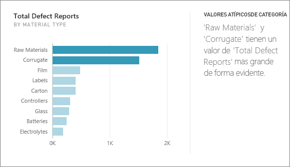
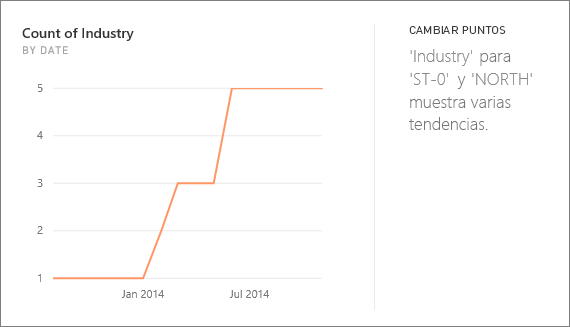
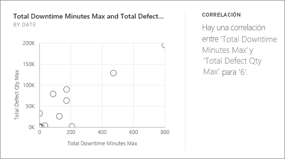
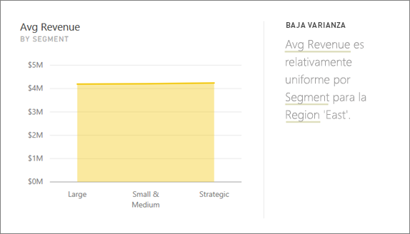
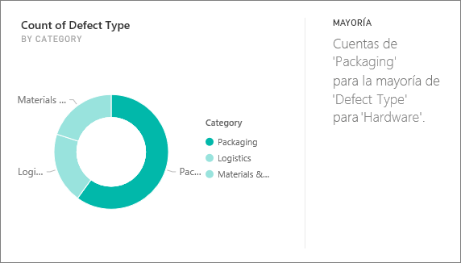
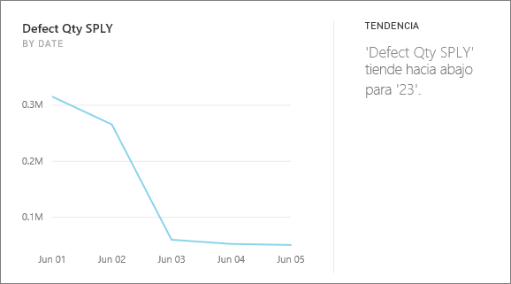
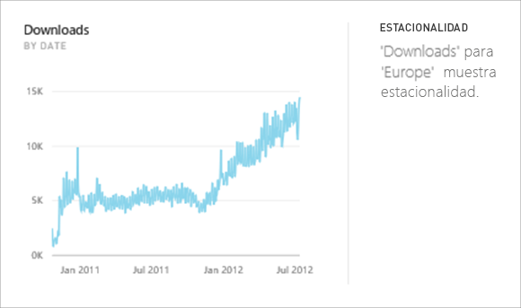
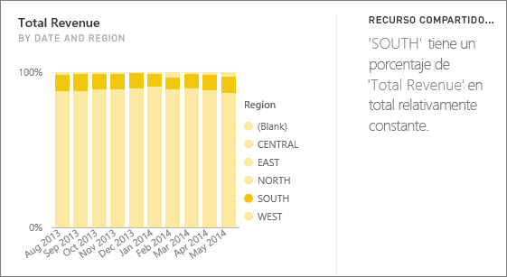
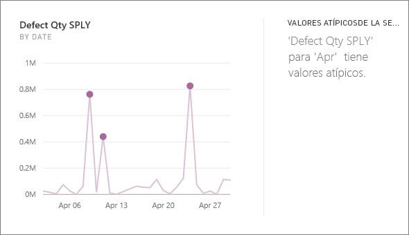

# Tipos de información compatibles con Power BI

Puede pedir a Power BI que examine los datos y encuentre patrones y tendencias interesantes. Estas tendencias y patrones se presentan en forma de objetos visuales denominados *conclusiones*. 

Para obtener más información sobre cómo usar las conclusiones, vea [Conclusiones de Power BI](end-user-insights.md).

## ¿Cómo funciona la búsqueda de información?
Power BI busca rápidamente en otros subconjuntos del conjunto de datos. Durante la búsqueda, Power BI aplica un conjunto de algoritmos sofisticados para detectar información potencialmente interesante. Los *consumidores* de Power BI pueden ejecutar conclusiones en los iconos de los paneles.

## Terminología
Power BI usa algoritmos estadísticos para revelar las conclusiones. Los algoritmos se enumeran y describen en la sección siguiente de este artículo. Antes de llegar a los algoritmos, aquí se enumeran las definiciones de algunos términos que pueden no resultar familiares. 

* **Medida**: una medida es un campo cuantitativo (numérico) que se puede usar para realizar cálculos. Los cálculos comunes son los de suma, promedio y mínimo. Por ejemplo, si la empresa fabrica y vende monopatines, las medidas podrían ser el número de monopatines vendidos y el beneficio medio al año.  
* **Dimensión**: las dimensiones son datos de categorías (texto). Una dimensión describe personas, objetos, elementos, productos, lugares y períodos de tiempo. En un conjunto de datos, las dimensiones son una manera de agrupar las *medidas* en categorías útiles. Para la empresa de monopatines, algunas dimensiones pueden incluir el análisis de las ventas (una medida) por modelo, color, país o campaña de marketing.   
* **Correlación**: una correlación indica cómo se relaciona el comportamiento de las cosas.  Si sus patrones de aumento y reducción son similares, se correlacionan de manera positiva. Del mismo nodo, si sus patrones son opuestos, se correlacionan de forma negativa. Por ejemplo, si las ventas del monopatín rojo aumentan cada vez que se lanza una campaña de marketing en televisión, las ventas del monopatín rojo y la campaña de televisión están correlacionadas de forma positiva.
* **Serie temporal**: una serie temporal es una forma de mostrar el tiempo como puntos de datos sucesivos. Estos puntos de datos pueden ser incrementos como segundos, horas, meses o años.  
* **Variable continua**: una variable continua puede ser cualquier valor entre sus límites mínimo y máximo; de lo contrario, es una variable discreta. Algunos ejemplos son la temperatura, la ponderación, la edad y el tiempo. Las variables continuas pueden incluir fracciones o partes del valor. El número total de monopatines azules vendidos es una variable discreta, ya que no se puede vender medio monopatín.  

## ¿Qué tipos de conclusiones se pueden encontrar?
Estos son los algoritmos que usa Power BI. 

### Valores atípicos de categoría (superior o inferior)
Resalta los casos en los que una o dos categorías tienen valores mucho mayores que otras categorías.  

### Cambiar los puntos de una serie temporal
Resalta cuando hay cambios significativos en las tendencias de datos de una serie temporal.

### Correlación
Detecta los casos en los que varias medidas muestran un patrón o una tendencia similar cuando se trazan sobre una categoría o un valor del conjunto de datos.

### Baja varianza
Detecta casos en los que los puntos de datos no están lejos de la media.

### Mayoría (factores principales)
Busca los casos en los que una mayoría de un valor total puede atribuirse a un único factor cuando se desglosa con otra dimensión.  

### Tendencias generales de la serie temporal
Detecta las tendencias hacia arriba o hacia abajo de los datos de la serie temporal.

### Estacionalidad de la serie temporal
Busca patrones periódicos en los datos de series temporales, por ejemplo, semanales, mensuales o de estacionalidad anual.

### Recurso compartido constante
Resalta los casos en los que hay una correlación de elementos primarios y secundarios entre el recurso compartido de un valor de secundario en relación con el valor global del elemento primario a través de una variable continua.

### Valores atípicos de la serie temporal
En el caso de los datos de una serie temporal, detecta si hay determinadas fechas u horas con valores significativamente diferentes de los demás valores de fecha y hora.

## Pasos siguientes
[Información de Power BI](end-user-insights.md)

¿Tiene más preguntas? [Pruebe la comunidad de Power BI](https://community.powerbi.com/)

