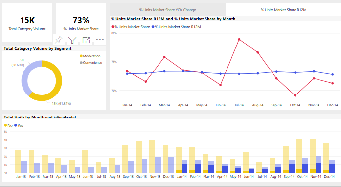

# Aplicación de un filtro cruzado entre objetos visuales en un informe de Power BI
Una de las grandes características de Power BI es la manera en que están conectados entre sí todos los objetos visuales en la página de un informe. Si selecciona un punto de datos en uno de los objetos visuales, todos los demás objetos visuales de la página que contienen ese dato cambian para adaptarse a la selección. 

## Cómo interactúan los objetos visuales entre sí

De forma predeterminada, al seleccionar un punto de datos en un objeto visual de una página de informe, se aplica filtro cruzado o resaltado cruzado a los demás objetos visuales en la página. El modo exacto en que interactúan los objetos visuales de una página se establece mediante el informe *diseñador*. Los *diseñadores* tienen opciones para activar y desactivar las interacciones de objetos visuales, y para cambiar el comportamiento predeterminado del filtrado cruzado, el resaltado cruzado y la [exploración en profundidad](end-user-drill.md). 

Si todavía no ha encontrado jerarquías o exploración en profundidad, puede leer [Explorar en profundidad en Power BI](end-user-drill.md) para obtener más información. 

El filtrado cruzado y el resaltado cruzado pueden ser útiles para identificar cómo contribuye un valor de los datos a otro. Por ejemplo, si selecciona el segmento Moderation (Moderación) del gráfico de anillos, se resalta la contribución de ese segmento a cada columna del gráfico "Total units by Month" (Unidades totales por mes) y se filtra el gráfico de líneas.

Consulte [Filtros y resaltado en informes de Power BI](end-user-report-filter.md). 

  
> [!NOTE]
> Los términos *filtro cruzado* y *resaltado cruzado* se usan para distinguir el comportamiento que aquí se describe de lo que sucede cuando se usa el panel **Filtros** para filtrar y resaltar objetos visuales.  

## Consideraciones y solución de problemas
- Si el informe tiene un objeto visual compatible con la [exploración](end-user-drill.md), de forma predeterminada, la exploración de un objeto visual no afecta a los demás de la página del informe.     
- Si usa visualA para interactuar con visualB, los filtros de nivel visual de visualA se aplican a visualB.

## Pasos siguientes
[Uso de filtros de informe](../power-bi-how-to-report-filter.md)
