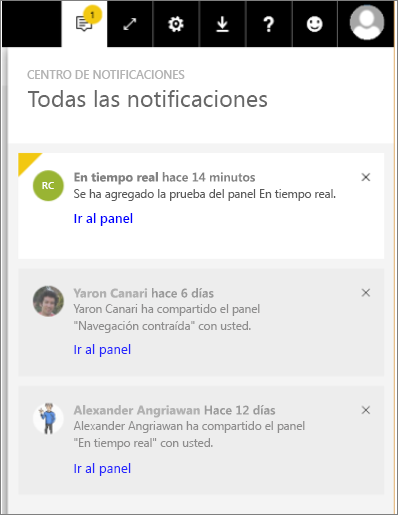

# Notificaciones de Power BI
El Centro de notificaciones es una fuente de información secuencial relacionada con su experiencia en Power BI. Ábralo para ver mensajes sobre nuevos paneles que se han compartido con usted, cambios en el espacio de grupo, información sobre eventos y reuniones de Power BI, alertas que ha establecido y mucho más. Puede [establecer alertas en el servicio Power BI](../service-set-data-alerts.md) y también en las aplicaciones para móviles de Power BI.

Vea cómo Amanda comprueba las notificaciones que ha recibido, cómo las administra y cómo responde a ellas. Luego, siga las instrucciones que encontrará debajo del video para intentarlo usted.

<iframe width="560" height="315" src="https://www.youtube.com/embed/bZMSv5KAlcE" frameborder="0" allowfullscreen></iframe>

1. Cuando inicie sesión en Power BI, las notificaciones nuevas que le hayan enviado mientras haya estado sin conexión se agregan a su fuente. Si tiene notificaciones nuevas, Power BI muestra una burbuja amarilla con el número de elementos nuevos.
   
   
2. En la barra de menús de Power BI, seleccione el icono de notificaciones.
   
   
3. La notificación más reciente se muestra en la parte superior y los mensajes no leídos se presentan resaltados. Las notificaciones se conservan durante 90 días a menos que las elimine antes o alcancen el límite máximo de 100.
   
   
4. Para descartar una notificación, seleccione el icono de X.

### Pasos siguientes
* [Alertas de datos en el servicio Power BI](../service-set-data-alerts.md)
* [Crear un flujo de Microsoft Flow que se desencadene mediante una alerta de datos de Power BI](../service-flow-integration.md)
* [Establecer alertas de datos en la aplicación de iPhone (Power BI para iOS)](mobile/mobile-set-data-alerts-in-the-mobile-apps.md)
* [Establecer alertas de datos en la aplicación móvil de Power BI para Windows 10](mobile/mobile-set-data-alerts-in-the-mobile-apps.md)
* ¿Tiene más preguntas? [Pruebe la comunidad de Power BI](http://community.powerbi.com/)

