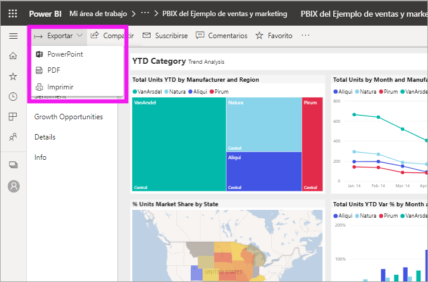
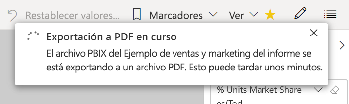

# Exportación de informes de Power BI a PDF

[!INCLUDE [power-bi-service-new-look-include](../includes/power-bi-service-new-look-include.md)]

Con Power BI, puede publicar el informe en formato PDF y crear fácilmente un documento basado en el informe de Power BI. Al exportar a PDF, cada página del informe de Power BI se convierte en una página individual en el documento PDF.

## Exportación del informe de Power BI a PDF
En el servicio Power BI, seleccione un informe para mostrarlo en el lienzo. También puede seleccionar un informe en la página **Inicio**, **Aplicaciones** o en cualquier otro contenedor del panel de navegación.

1. Seleccione **Exportar** > **PDF** en la barra de menús.

    

    Aparece una ventana emergente en la que tiene la opción de seleccionar los **Valores actuales** o los **Valores predeterminados**. Los **valores actuales** exportan el informe en el estado actual, lo que incluye los cambios activos que haya realizado en los valores de filtro o segmentación. La mayoría de los usuarios seleccionan esta opción. Como alternativa, al seleccionar **Valores predeterminados** se exporta el informe en su estado original, como lo haya compartido el *diseñador*, y no se reflejan los cambios que haya realizado en ese estado original.
    
    Además, hay una casilla para seleccionar si se quieren exportar o no las pestañas ocultas de un informe. Seleccione esta casilla si solo quiere exportar las pestañas del informe que son visibles para usted en el explorador. Si prefiere incluir todas las pestañas ocultas como parte de la exportación, puede dejar desactivada esta casilla. Si la casilla aparece atenuada, significa que no hay ninguna pestaña oculta en el informe. Seleccione **Exportar** para continuar cuando haya realizado las selecciones.
    
    En la esquina superior derecha se muestra una barra de progreso. La exportación puede tardar unos minutos. Puede continuar trabajando en Power BI mientras se exporta el informe.

    

    Cuando el servicio Power BI termina el proceso de exportación, el banner de notificación cambiará para informarle.

2. El archivo está disponible donde el explorador muestra los archivos descargados. En la siguiente imagen, se muestra como un banner de descarga en la parte inferior de la ventana del explorador.

    

Y eso es todo. Puede descargar el archivo y abrirlo con cualquier visor de PDF, como el disponible en Microsoft Edge.

## Limitaciones y consideraciones
Hay algunas consideraciones y limitaciones que se deben tener en cuenta cuando se trabaja con la característica **Exportar a PDF**.

* En la actualidad, no se admiten objetos visuales de R. En el archivo PDF, estos objetos visuales están en blanco y muestran un mensaje de error. 
* Los objetos visuales personalizados que se han certificado son compatibles. Para obtener más información acerca de los objetos visuales personalizados certificados, incluido cómo obtener un objeto visual personalizado, consulte [Obtener un objeto visual personalizado certificado](../power-bi-custom-visuals-certified.md). No se admiten los objetos visuales personalizados que no se hayan certificado. En el archivo PDF, se muestran con un mensaje de error. 
* Actualmente no se pueden exportar informes de más de 30 páginas.
* El proceso de exportación del informe a PDF puede tardar unos minutos en completarse, por lo que debe tener paciencia. Entre los factores que pueden afectar al tiempo requerido está la estructura del informe y la carga actual del servicio Power BI.
* Si el elemento de menú **Exportar a PDF** no está disponible en el servicio Power BI, probablemente se deba a que el administrador de inquilinos ha deshabilitado la característica. Póngase en contacto con el administrador de inquilinos para obtener más información.
* Las imágenes de fondo se recortan con el área de límite del gráfico. Se recomienda quitar las imágenes de fondo antes de realizar la exportación a PDF.
* Los informes que pertenecen a un usuario situado fuera del dominio del inquilino de Power BI como, por ejemplo, un informe de alguien de fuera de la organización y que han compartido con usted, no pueden publicarse en PDF.
* Si se comparte un panel con alguien de fuera de su organización y, por lo tanto, con un usuario que no está en su inquilino de Power BI, ese usuario no podrá exportar a PDF los informes asociados del panel compartido. Por ejemplo, si es aaron@contoso.com, puede compartir con cassie@cohowinery.com. Pero cassie@cohowinery.com no puede exportar los informes asociados a PDF.
* Al exportar a PDF con informes que contienen una imagen de fondo, puede que vea una imagen distorsionada en la exportación si usa las opciones **Normal** o **Rellenar** para el **Fondo de página**. Para obtener mejores resultados, use la opción **Ajustar** para evitar incidencias con el documento exportado.
* El servicio Power BI usa su propia configuración de idioma como idioma para la exportación de PDF. Para ver o configurar las preferencias de idioma, seleccione el icono de engranaje  > **Configuración** > **General** > **Idioma**.
* Actualmente no se respetan los filtros de las direcciones URL al elegir **Valores actuales** para la exportación.

## Pasos siguientes
[Imprimir un informe](end-user-print.md)
