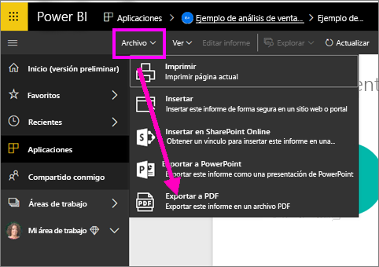
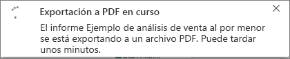
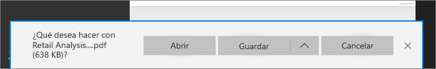

# Exportación de informes de Power BI a PDF
Con Power BI, puede publicar el informe en formato PDF, y crear fácilmente un documento basado en el informe de Power BI. Al **exportar a PDF**, cada página del informe de Power BI se convierte en una página individual en el documento PDF.

## Cómo exportar el informe de Power BI a PDF
En el servicio Power BI, seleccione un informe para mostrarlo en el lienzo. También puede seleccionar un informe desde la página Inicio, Aplicaciones o cualquier otra sección del panel de navegación de la izquierda.

1. Seleccione **Archivo** > **Exportar a PDF** en la barra de menús.

    

    En la esquina superior derecha se muestra una barra de progreso. La exportación puede tardar unos minutos, y puede continuar trabajando en Power BI mientras se exporta el informe.

    

    Cuando haya terminado, el banner de notificación cambiará para informarle de que el servicio Power BI ha terminado el proceso de exportación.

2. El archivo está disponible donde el explorador muestra los archivos descargados. En la siguiente imagen, se muestra como un banner de descarga en la parte inferior de la ventana del explorador.

    

Y eso es todo. Puede descargar el archivo y abrirlo con cualquier visor de PDF, como el disponible en Microsoft Edge.

## Limitaciones y consideraciones
Hay algunas consideraciones y limitaciones que tener en cuenta cuando se trabaja con la característica **Exportar a PDF**.

- La interactividad dentro de la sesión, como el resaltado, el filtrado, la exploración en profundidad, etc., todavía no se admiten al exportar a PDF. En el documento PDF exportado se muestran los objetos visuales originales como si se hubiesen guardado en el informe. Si ha aplicado filtros y segmentaciones, y quiere que se conserven en la exportación, guarde el informe y, después, realice la exportación.

* En la actualidad, no se admiten **objetos visuales de R**. En el archivo PDF, estos objetos visuales estarán en blanco y mostrarán un mensaje de error.  

* Los **objetos visuales personalizados** que se han **certificado** que son compatibles. Para más información acerca de los objetos visuales personalizados certificados, lo que incluye cómo obtener un objeto visual personalizado, consulte [Obtención de un objeto visual personalizado certificado](../power-bi-custom-visuals-certified.md). No se admiten los objetos visuales personalizados que no se hayan certificado. En el archivo PDF, se mostrarán con un mensaje de error.   

* Actualmente no se pueden exportar informes de más de 30 páginas.

* El proceso de exportación del informe a PDF puede tardar unos minutos en completarse, por lo que debe tener paciencia. Algunos factores que pueden afectar al tiempo requerido incluyen la estructura del informe y la carga actual del servicio Power BI.

* Si el elemento de menú **Exportar a PDF** no está disponible en el servicio Power BI, probablemente se deba a que el administrador de inquilinos ha deshabilitado la característica. Póngase en contacto con el administrador de inquilinos para obtener más información.

* Las imágenes de fondo se recortarán con área de límite del gráfico. Se recomienda quitar las imágenes de fondo antes de realizar la exportación a PDF.

* Los informes que pertenecen a un usuario situado fuera del dominio del inquilino de Power BI (como un informe de alguien de fuera de la organización y que han compartido con usted) no se pueden publicar en PDF.

* Si comparte un panel con alguien de fuera de la organización (y, por tanto, con un usuario que no está en el inquilino de Power BI), ese usuario no podrá exportar a PDF los informes asociados del panel compartido. Por ejemplo, si es aaron@contoso.com, puede compartir con cassie@cohowinery.com. Pero cassie@cohowinery.com no puede exportar los informes asociados a PDF.

* El servicio Power BI usa su propia configuración de idioma como idioma para la exportación de PDF. Para ver o configurar las preferencias de idioma, haga clic en el icono de engranaje > **Configuración** > **General** > **Idioma**.

## Pasos siguientes
[Imprimir un informe](end-user-print.md)