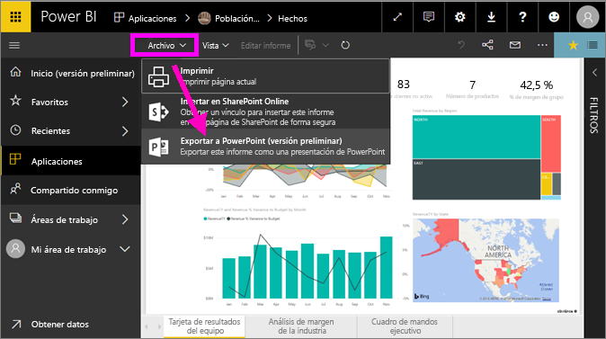
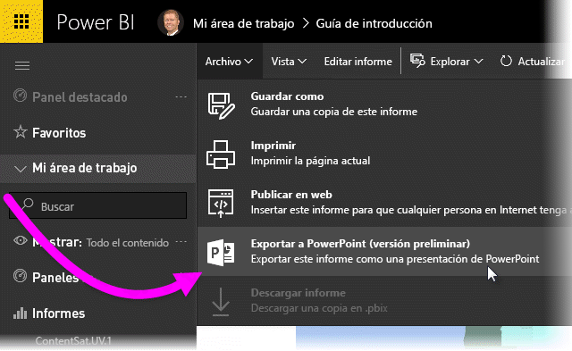
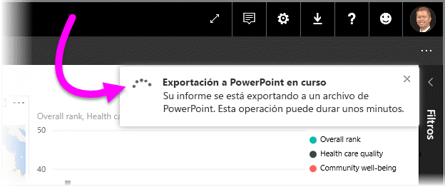
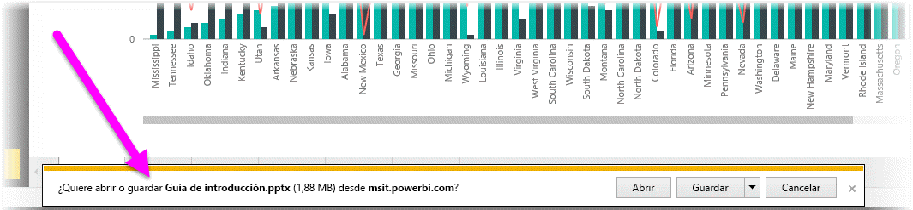
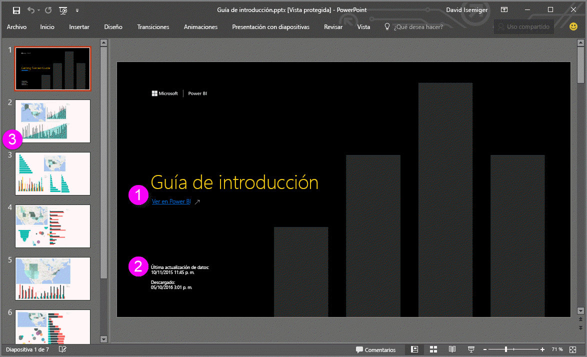
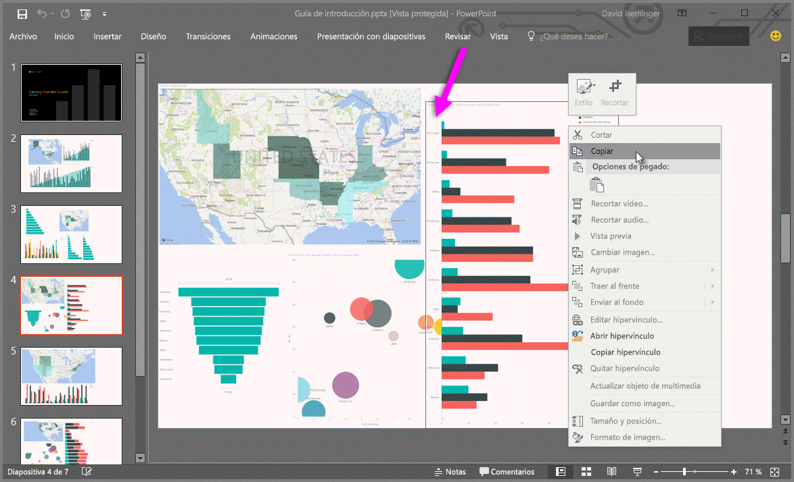

# Exportar informes de Power BI a PowerPoint
Con Power BI, ahora puede publicar el informe en **Microsoft PowerPoint** y crear fácilmente una presentación de diapositivas basada en el informe de Power BI. Cuando se **exporta a PowerPoint**, ocurre lo siguiente:

* Cada página del informe de Power BI se convierte en una diapositiva de PowerPoint.
* Cada página del informe de Power BI se exporta como una única imagen de alta resolución en PowerPoint <!-- * The filters and slicers settings that you added to the report are preserved. -->.
* Se crea un vínculo en PowerPoint que dirige al informe de Power BI 

Exportar su **informe de Power BI** a **PowerPoint** es muy fácil. Siga los pasos descritos en la sección siguiente.

## Cómo exportar su informe de Power BI a PowerPoint
En el servicio Power BI, seleccione un informe para mostrarlo en el lienzo. También puede seleccionar un informe en la página **Inicio**, **Aplicaciones** o cualquier otra sección del panel de navegación izquierdo.

Cuando en el lienzo aparezca el informe que desea exportar a PowerPoint, seleccione **Archivo > Exportar a PowerPoint** en la barra de menús del servicio Power BI.

Verá un banner de notificación en la esquina superior derecha de la ventana del explorador del servicio Power BI conforme el informe se está exportando a PowerPoint. Esto puede tardar unos minutos y puede continuar trabajando en Power BI mientras se exporta el informe.

Cuando haya terminado, el banner de notificación cambiará para informarle de que el servicio Power BI ha terminado el proceso de exportación.

El archivo está disponible donde el explorador muestra los archivos descargados. En la siguiente imagen, se muestra como un banner de descarga en la parte inferior de la ventana del explorador.

Y eso es todo. Puede descargar el archivo, abrirlo con PowerPoint y, a continuación, modificarlo o mejorarlo, tal como lo haría con cualquier otra presentación de PowerPoint.

## Desproteger el archivo exportado de PowerPoint
Al abrir el archivo de PowerPoint que exportó Power BI, encontrará unos cuantos elementos útiles e interesantes. Eche un vistazo a la siguiente imagen y desproteja los siguientes elementos que describen algunas de esas características interesantes.

1. La primera página de la presentación de diapositivas incluye el nombre del informe y un vínculo para que pueda **Ver en Power BI** el informe en el que se basa la presentación de diapositivas.
2. Obtendrá información útil acerca del informe, incluidos la *última actualización de datos* en los que se basa el informe exportado y la fecha y hora de *descarga*, que es la hora y fecha en que se exportó el informe de Power BI a un archivo de PowerPoint.
3. Cada página del informe es una diapositiva independiente, tal como se muestra en el panel de navegación izquierdo. 
4. El informe publicado se representa en el idioma configurado en Power BI, o de acuerdo con el valor de configuración regional del explorador. Para ver o configurar las preferencias de idioma, seleccione el icono de engranaje   **> Configuración > General > Idioma.** Para obtener información sobre la configuración regional, consulte [Idiomas y países o regiones admitidos para Power BI](../supported-languages-countries-regions.md).
5. La presentación de PowerPoint incluye una diapositiva de portada con la hora exportada en la zona horaria correcta.

Cuando vaya a una diapositiva individual, observará que cada página del informe es una imagen independiente.

>[!NOTE]
> Tener un objeto visual por cada página del informe es el nuevo comportamiento. El comportamiento anterior, que proporcionaba una imagen independiente para cada objeto visual, ya no se implementa. 
 

Lo que haga con la presentación de PowerPoint a partir de este punto, o con cualquiera de las imágenes de alta resolución, ya es su decisión.

## Limitaciones
Hay algunas consideraciones y limitaciones a tener en cuenta al trabajar con la característica **Exportar a PowerPoint**.

* La interactividad dentro de la sesión, como resaltado, filtrado, exploración en profundidad, etc., todavía no se admiten para exportarse a PowerPoint. El PowerPoint exportado muestra los objetos visuales como si se hubiesen guardado en el informe. Si ha aplicado filtros y segmentaciones de datos y quiere que se conserven en la exportación, guarde el informe y, a continuación, realice la exportación.
* En la actualidad, no se admiten **objetos visuales de R**. Los objetos visuales este tipo se exportan como una imagen en blanco a PowerPoint con un mensaje de error que indica que el objeto visual no se admite.
* Los **objetos visuales personalizados** que se han **certificado** que son compatibles. Para más información acerca de los objetos visuales personalizados certificados, lo que incluye cómo obtener un objeto visual personalizado, consulte [Obtención de un objeto visual personalizado certificado](../power-bi-custom-visuals-certified.md). Los objetos visuales personalizados que no se han certificado no se admiten y se exportan como una imagen en blanco a PowerPoint con un mensaje de error que indica que el objeto visual no se admite.
* Actualmente no se pueden exportar informes de más de 30 páginas.
* El proceso de exportación del informe a PowerPoint puede tardar unos minutos en completarse. Le pedimos que sea paciente. Algunos factores que pueden afectar al tiempo requerido incluyen la estructura del informe y la carga actual del servicio Power BI.
* Si el elemento de menú **Exportar a PowerPoint** no está disponible en el servicio Power BI, probablemente sea porque el administrador de inquilinos ha deshabilitado la característica. Póngase en contacto con el Administrador de inquilinos para obtener más información.
* Las imágenes de fondo se recortarán con área de límite del gráfico. Se recomienda quitar las imágenes de fondo antes de realizar la exportación a PowerPoint.
* Las páginas de PowerPoint siempre se crean en el tamaño estándar 16:9, sin tener en cuenta los tamaños de página ni las dimensiones originales del informe de Power BI.
* Los informes que pertenecen a un usuario situado fuera del dominio de su inquilino de Power BI (por ejemplo, un informe que alguien de fuera de su organización ha compartido con usted) no pueden publicarse en PowerPoint.
* Si se comparte un panel con alguien de fuera de su organización (y, por lo tanto, un es usuario que no está en su inquilino de Power BI), ese usuario no podrá exportar a PowerPoint los informes asociados del panel compartido. Por ejemplo, si es aaron@contoso.com, puede compartir con david@cohowinery.com. Pero david@cohowinery.com no puede exportar los informes asociados a PowerPoint.
* Como se mencionó anteriormente, cada página del informe se exporta como una única imagen en el archivo de PowerPoint.
* El servicio Power BI utiliza su propia configuración de idioma como idioma para la exportación de PowerPoint. Para ver o configurar las preferencias de idioma, seleccione el icono de engranaje   **> Configuración > General > Idioma.**
* La opción de hora de **descarga** en la diapositiva de portada para el archivo PowerPoint exportado se establece en la zona horaria de su equipo en el momento de la exportación.

## Pasos siguientes
[Imprimir un informe](end-user-print.md)