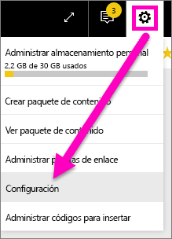
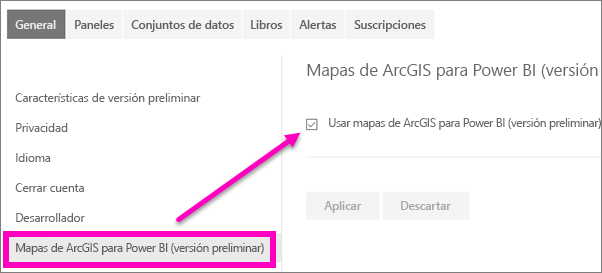

# Participación en las características de versión preliminar del servicio Power BI
## ¿Qué son las *características de vista previa*?
A medida que introducimos mejoras en el servicio Power BI, publicamos algunas funcionalidades nuevas como *características de versión preliminar*. Las características de vista previa se pueden activar y desactivar, lo que le ofrece la oportunidad de probarlas.

> [!TIP]
> Las características de versión preliminar también están disponibles para Power BI Desktop. Para más información, [visite el foro de la comunidad de Power BI Desktop](https://community.powerbi.com/t5/Desktop/bd-p/power-bi-designer).
> 
> 

## Busque versiones preliminares y actívelas (o desactívelas)
1. Abra el menú Configuración, seleccione el icono de engranaje en la esquina superior derecha de la pantalla de Power BI y elija **Configuración**.
   
   .
2. Seleccione la pestaña **General**. Si existen versiones preliminares, verá una opción para **Características de versión preliminar** o verá una característica de versión preliminar a la izquierda.  En este ejemplo, hay una característica de versión preliminar de ArcGIS Maps. 
   
   
3. Seleccione el botón de opción **Activar**, o marque la casilla, para probar la nueva experiencia. Después, seleccione **Aplicar**.
4. Para desactivar las características de versión preliminar, siga los pasos 1 y 3 anteriores y, en el paso 3, elija **Desactivar**, o desactive la casilla, y seleccione **Aplicar**.

¿Tiene preguntas o comentarios? [Visite el foro de la comunidad de Power BI](http://community.powerbi.com/t5/Navigation-Preview-Forum/bd-p/NavigationPreview).

