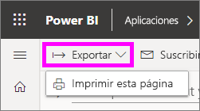
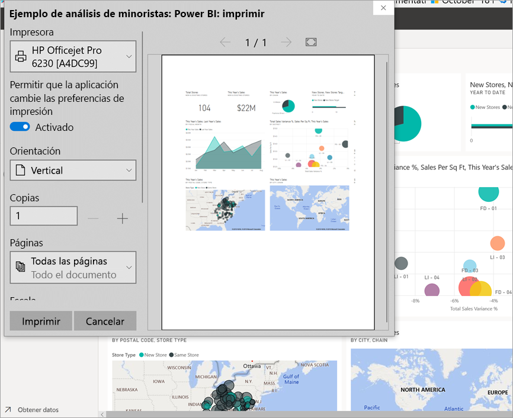
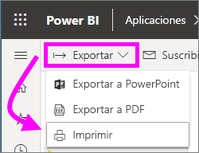

# Impresión desde el servicio Power BI
Imprima todo un panel, un icono de panel, una página de informe o un objeto visual de informe desde el servicio Power BI. Solo se puede imprimir una página de informe a la vez; no es posible imprimir todo el informe de una vez.

   > [!NOTE]
   > El cuadro de diálogo de impresión que vea dependerá del explorador que use.
   > 
## Imprimir un panel
1. Abra el panel que quiere imprimir.
2. En la esquina superior izquierda, seleccione Exportar y luego **Imprimir esta página**.
   
    
3. Se abre la ventana de impresión del explorador. Elija la configuración y el destino de la impresión y seleccione **Imprimir**.
   

   
    

## Imprimir un icono de panel
1. Abra el panel en [modo de pantalla completa](end-user-focus.md) al seleccionar el icono de pantalla completa  en la barra de menús superior.
3. [Abra el icono en modo de enfoque](end-user-focus.md) al mantener el mouse para que aparezcan los puntos suspensivos (...) y seleccionar **Abrir en modo de enfoque** o el icono de enfoque .
   
    
4. Mantenga el mouse sobre el icono para que se muestren las opciones de menú.
   
    
4. Seleccione el icono de impresión .     
   

## Imprimir una página de un informe
Los informes se pueden imprimir una página a la vez.

1. Abra el informe y seleccione **Exportar** > **Imprimir** para imprimir la página actual del informe.
   
    
3. Se abre la ventana de impresión del explorador.
   

## Imprimir un objeto visual de informe
1. [Abra el objeto visual en modo de enfoque](end-user-focus.md) al mantener el puntero sobre el icono y seleccionar el icono de enfoque  en la esquina superior derecha.

2. En la esquina superior izquierda, seleccione **Exportar** > **Imprimir** para imprimir el objeto visual.

    

## Consideraciones y solución de problemas

* P: No puedo imprimir todas las páginas de un informe a la vez.    
* R: Así es. Las páginas de informes solo se pueden imprimir una a la vez.
* P: No puedo imprimir a un archivo PDF.    
* R: Solo verá esta opción si tiene configurado el controlador PDF del explorador.    
* P: Lo que veo cuando selecciono **Imprimir** no es lo que me muestran aquí.    
* R: Las pantallas de impresión varían en función del explorador y la versión de software.
* P: Mi copia impresa no tiene una escala correcta.  El panel no se ajusta a la página. Otras preguntas sobre escala y orientación.    
* R: No se puede garantizar que la copia impresa sea idéntica a lo que aparece en el servicio Power BI. Power BI no controla aspectos como la escala, los márgenes, los detalles de los objetos visuales, la orientación ni el tamaño. Para ayuda con problemas similares, consulte la documentación correspondiente al explorador específico.      

## Pasos siguientes
[Uso compartido de paneles e informes con compañeros y otros usuarios](../service-share-dashboards.md)

¿Tiene más preguntas? [Pruebe la comunidad de Power BI](http://community.powerbi.com/)

