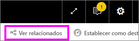

# Preguntas y respuestas para **consumidores** de Power BI
## ¿Qué son las preguntas y respuestas?
A veces, la manera más rápida de obtener una respuesta de sus datos es formular una pregunta con un lenguaje natural. Por ejemplo, "¿Cuáles fueron las ventas totales del año pasado?"

Use Preguntas y respuestas para explorar los datos a través de las capacidades de lenguaje natural e intuitivo y reciba respuestas en forma de gráficos. Preguntas y respuestas es diferente de un motor de búsqueda, ya que solamente proporciona resultados sobre los datos de Power BI.

**Preguntas y respuestas de Power BI** está disponible con una licencia Pro o Premium.  [Preguntas y respuestas de las aplicaciones de Power BI Mobile](mobile/mobile-apps-ios-qna.md) y [Preguntas y respuestas de Power BI Embedded](../developer/qanda.md) se tratan en artículos independientes. En este momento, **Preguntas y respuestas de Power BI** solo admite la respuesta a las consultas en lenguaje natural en inglés, aunque hay una vista previa disponible en español que puede ser habilitada por el administrador de Power BI.

La formulación de la pregunta es solo el principio.  Diviértase mientras recorre sus datos, perfecciona o amplía su pregunta, descubre valiosa información nueva, profundice al máximo en los detalles u obtenga una visión más amplia. Se sentirá encantado con la información y los descubrimientos realizados.

La experiencia es verdaderamente interactiva... ¡y rápida! Con la tecnología del almacenamiento en memoria, la respuesta es casi instantánea.

## ¿Dónde se pueden usar Preguntas y respuestas?
Encontrará Preguntas y respuestas en los paneles del servicio Power BI, en la parte inferior del panel en Power BI Mobile. A menos que el diseñador le haya concedido permisos de edición, podrá usar Preguntas y respuestas para explorar los datos, pero no podrá guardar las visualizaciones creadas con Preguntas y respuestas.

## Uso de las Preguntas y respuestas en un panel del servicio Power BI
En el servicio Power BI (app.powerbi.com), un panel contiene iconos anclados desde uno o varios conjuntos de datos, por lo que puede formular preguntas sobre cualquiera de los datos contenidos en cualquiera de estos conjuntos de datos. Para ver los informes y conjuntos de datos que se usaron para crear el panel, seleccione **Ver relacionado** desde la barra de menús.

## ¿Cómo empiezo?
En primer lugar, familiarícese con el contenido. Eche un vistazo a los objetos visuales en el panel y en el informe. Hágase una idea clara del tipo y el intervalo de datos que están disponibles para usted. 

Por ejemplo:

* Si las etiquetas y valores del eje de un objeto visual incluyen "ventas", "cuenta", "mes" y "oportunidades", puede entonces hacer preguntas como: "Qué *cuenta* tiene la más alta *oportunidad* o mostrar *ventas* por mes como un gráfico de barras".

* Si tiene datos de rendimiento del sitio web en Google Analytics, puede preguntar a Preguntas y respuestas sobre el tiempo transcurrido en una página web, el número de visitas únicas a una página y el índice de fidelidad de los usuarios. O bien, si está consultando datos demográficos, podría preguntar sobre la edad y los ingresos por ubicación.

Una vez que esté familiarizado con los datos, vuelva a centrarse al panel y coloque el cursor en el cuadro de pregunta. Se abrirá la pantalla de Preguntas y respuestas.

 

Incluso antes de comenzar a escribir, Preguntas y respuestas muestra una nueva pantalla con sugerencias que le ayudarán a realizar la pregunta. Verá las frases y preguntas que contienen los nombres de las tablas de los conjuntos de datos subyacentes y puede incluso ver una lista de preguntas *destacadas** creadas por el propietario del conjunto de datos.

Puede seleccionar cualquiera de ellas para agregarlas al cuadro de preguntas y luego refinarlas para encontrar una respuesta específica. 

Otra manera en que Preguntas y respuestas puede ayudar a formular preguntas es mediante peticiones de confirmación, rellenado automático o indicaciones visuales. 

 

### ¿Qué visualización usa Preguntas y respuestas?
Preguntas y respuestas escoge la mejor visualización en función de los datos que se muestran. A veces los datos del conjunto de datos subyacente se definen como un determinado tipo o categoría y esto ayuda a Preguntas y respuestas a saber cómo mostrarlos. Por ejemplo, si los datos se definen como un tipo de fecha, es más probable que se muestren como un gráfico de líneas. Los datos que se clasifican como ciudad es más probable que se muestren como un mapa.

También puede indicar a Preguntas y respuestas qué objeto visual usar agregándolo a su pregunta. Pero tenga en cuenta que no siempre es posible para Preguntas y respuestas mostrar los datos en el tipo de objeto visual solicitado. Preguntas y respuestas le pedirá confirmación acerca de una lista de tipos de objetos visuales factibles.

## Consideraciones y solución de problemas
**Pregunta:** No veo Preguntas y respuestas en este panel.    
**Respuesta 1:** Si no ve un cuadro de pregunta, compruebe primero la configuración. Para ello, en la esquina superior derecha de la barra de herramientas de Power BI, seleccione el icono de engranaje.   

A continuación, elija **Configuración** > **Paneles**. Asegúrese de que hay una marca de verificación junto a **Mostrar el cuadro de búsqueda de Preguntas y respuestas en este panel**.    
  

**Respuesta 2:** A veces, el *diseñador* del panel o el administrador desactiva Preguntas y respuestas. Póngase en contacto con ellos para ver si pueden volver a activarlo.   

**Pregunta:** No obtengo los resultados que quiero ver cuando escribo una pregunta.    
**Respuesta:** Póngase en contacto con el *diseñador* del panel. El diseñador puede hacer muchas cosas para mejorar los resultados de Preguntas y respuestas. Por ejemplo, el diseñador puede cambiar el nombre de las columnas del conjunto de datos para usar unos términos que se entiendan fácilmente (`CustomerFirstName` en lugar de `CustFN`). Dado que el diseñador conoce realmente bien el conjunto de datos, el diseñador también puede plantear preguntas útiles y agregarlas al lienzo de Preguntas y respuestas.

## Pasos siguientes
[Sugerencias de preguntas y respuestas para consumidores de Power BI](end-user-q-and-a.md)
