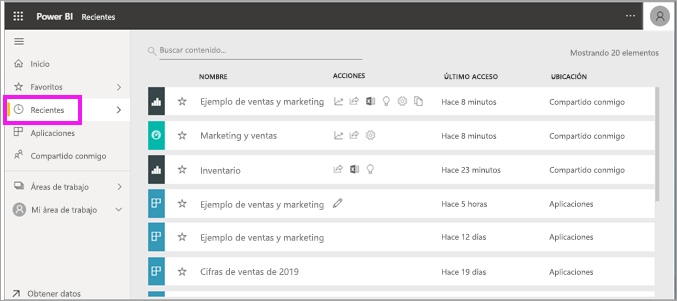
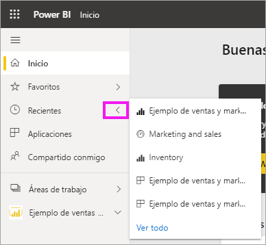
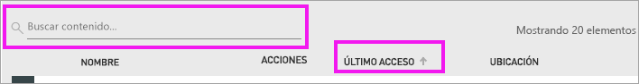

# Contenido **reciente** en el servicio Power BI
El contenido reciente son los últimos elementos visitados en el servicio Power BI, hasta un máximo de 20 elementos.  Estos incluyen: paneles, informes, aplicaciones y libros.

Amanda muestra cómo se rellenan las listas de contenido **Recientes** del servicio Power BI; después, siga las instrucciones paso a paso que aparecen debajo del vídeo para intentarlo.

<iframe width="560" height="315" src="https://www.youtube.com/embed/G26dr2PsEpk" frameborder="0" allowfullscreen></iframe>

> [!NOTE]
> En este vídeo se usa una versión anterior del servicio Power BI.

## Mostrar el contenido reciente
Para ver los cinco elementos visitados más recientemente, en el panel de navegación, seleccione la flecha a la derecha de **Reciente**.  Desde aquí puede seleccionar contenido reciente para abrirlo. Solo se muestran los cinco elementos más recientes.

Si tiene más de cinco elementos visitados recientemente, seleccione **Ver todo** para abrir la pantalla Reciente. También puede seleccionar **Reciente** o el  en el panel de navegación.

## Acciones disponibles en la lista de contenido **Reciente**
Las acciones disponibles dependerán de la configuración que asigna el *diseñador* de contenido. Algunas de las opciones pueden incluir lo siguiente:
* Seleccione el icono de estrella para añadir un  de [un panel, informe o aplicación a Favoritos](end-user-favorite.md).
* Algunos paneles e informes se pueden volver a compartir  .
* [Abrir el informe en Excel](end-user-export.md)  
* [Ver información](end-user-insights.md) que Power BI encuentra en el  de datos.
* Además, si las listas son largas, puede [usar el campo de búsqueda y la ordenación para encontrar lo que necesite](end-user-search-sort.md). Para averiguar si se puede ordenar una columna, mantenga el puntero para ver si aparece una flecha. En este ejemplo, al mantener el puntero sobre **Último acceso** se revela una flecha: su contenido reciente se puede ordenar por fecha de acceso. 

    

## Pasos siguientes
[Aplicaciones del servicio Power BI](end-user-apps.md)

¿Tiene más preguntas? [Pruebe la comunidad de Power BI](https://community.powerbi.com/)

