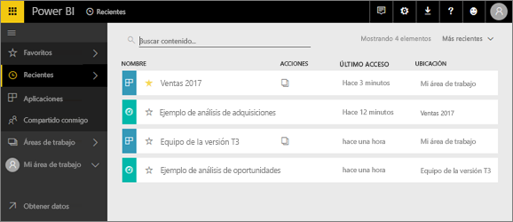
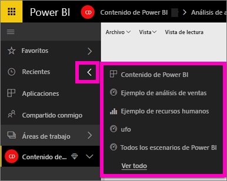
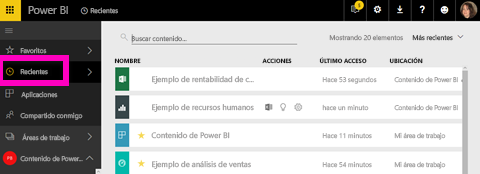

# Contenido **reciente** en el servicio Power BI
El contenido reciente son los últimos elementos visitados en el servicio Power BI, hasta un máximo de 20 elementos.  Estos incluyen: paneles, informes, aplicaciones y libros en todas las áreas de trabajo.

Amanda muestra cómo se rellenan las listas de contenido **Recientes** del servicio Power BI; después, siga las instrucciones paso a paso que aparecen debajo del vídeo para intentarlo.

<iframe width="560" height="315" src="https://www.youtube.com/embed/G26dr2PsEpk" frameborder="0" allowfullscreen></iframe>

## Mostrar el contenido reciente
Para ver los cinco elementos visitados más recientemente, en el panel de navegación izquierdo, seleccione la flecha a la derecha de **Reciente**.  Desde aquí puede seleccionar contenido reciente para abrirlo. Solo se muestran los cinco elementos más recientes.

Si tiene más de cinco elementos visitados recientemente, seleccione **Ver todo** para abrir la pantalla Reciente (consulte a continuación). También puede seleccionar **Reciente** o el  en la barra de navegación izquierda.

Desde aquí puede interactuar con el contenido como haría en cada pestaña [**Paneles**](end-user-dashboards.md), [ **Informes**](end-user-reports.md) y **Libros** y en la pantalla <!--[**Apps**](end-user-apps.md)--> de las aplicaciones.

## Pasos siguientes
<!--[Power BI service Apps](end-user-apps.md)-->

¿Tiene más preguntas? [Pruebe la comunidad de Power BI](http://community.powerbi.com/)

