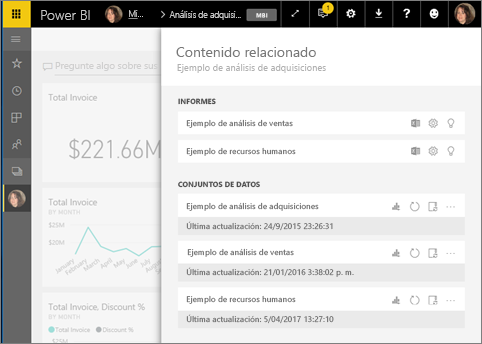
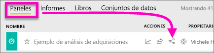
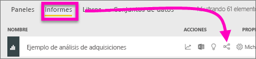
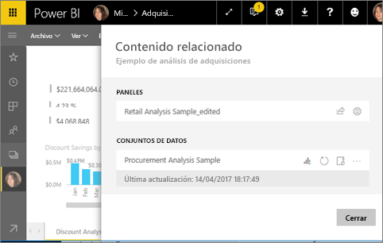
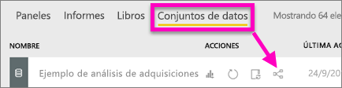
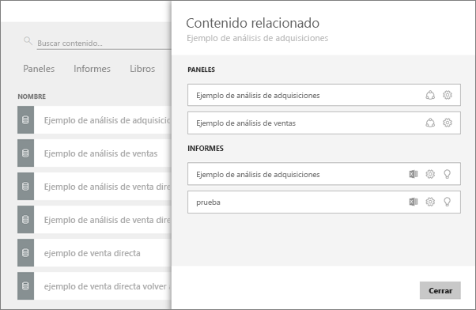

# Visualización del contenido relacionado en el servicio Power BI
El panel **Contenido relacionado** muestra cómo está interconectado el contenido del servicio Power BI: paneles, informes y conjuntos de datos. El panel de contenido relacionado también es un panel de inicio para la realización de acciones. Desde aquí puede actualizar, cambiar el nombre, generar perspectivas y mucho más. Seleccione un panel o un informe relacionado, y se abrirán en el área de trabajo de Power BI.   

En Power BI, los informes se integran en conjuntos de datos, las visualizaciones de informes se anclan a los paneles y los objetos visuales de paneles se vinculan a los informes. Pero ¿cómo sabe cuáles son los paneles que tienen las visualizaciones de su informe de marketing? ¿Y cómo se buscan esos paneles? ¿Está usando el panel de adquisiciones visualizaciones de más de un conjunto de datos? Si es así, ¿cómo se denominan y cómo puede abrir y editarlas? ¿Se está utilizando el conjunto de datos de recursos humanos en algún informe o panel? O bien, ¿se puede mover sin provocar la ruptura de los vínculos? Preguntas como estas pueden responderse en el panel **Contenido relacionado**.  No solo el panel muestra el contenido relacionado, también permite realizar acciones en el contenido y navegar fácilmente entre el contenido relacionado.

> [!NOTE]
> La característica de contenido relacionado no funciona con los conjuntos de datos de streaming.
> 
> 

## Visualización del contenido relacionado de un panel
Vea el vídeo sobre la visualización del contenido relacionado de un panel. Luego, siga las instrucciones paso a paso que aparecen debajo del vídeo para intentarlo con el conjunto de datos de ejemplo de análisis de adquisiciones.

<iframe width="560" height="315" src="https://www.youtube.com/embed/B2vd4MQrz4M#t=3m05s" frameborder="0" allowfullscreen></iframe>

Necesitará, como mínimo, permisos de *visualización* en un panel para abrir el panel **Contenido relacionado**. En este ejemplo usamos el [ejemplo de análisis de adquisiciones](../sample-procurement.md).

**Método 1**

En un área de trabajo, seleccione la pestaña **Paneles** y, luego, el icono de **Ver relacionados** .

 

**Método 2**

Con un panel abierto, seleccione el    en la barra de menús superior.

Se abre el panel **Contenido relacionado**. Muestra todos los informes con visualizaciones ancladas al panel y los conjuntos de datos asociados. Para este panel, hay visualizaciones ancladas desde tres informes diferentes y estos se basan en tres conjuntos de datos distintos.

Desde aquí, pueda realizar una acción directa en el contenido relacionado.  Por ejemplo, seleccione el nombre de un informe para abrirlo.  Para un informe de la lista, seleccione un icono para [analizar en Excel](../service-analyze-in-excel.md), [cambiar el nombre de](../service-rename.md) u [obtener información detallada](end-user-insights.md). Para conjunto de datos, seleccione un icono para [crear un informe](../service-report-create-new.md), [actualizar](../refresh-data.md), cambiar nombres, [analizar en Excel](../service-analyze-in-excel.md), [obtener información detallada](end-user-insights.md) o abrir la ventana **Configuración** del conjunto de datos.  

## Visualización del contenido relacionado de un informe
Necesitará, como mínimo, permisos de *visualización* en un informe para abrir el panel **Contenido relacionado**. En este ejemplo usamos el [ejemplo de análisis de adquisiciones](../sample-procurement.md).

**Método 1**

En un área de trabajo, seleccione la pestaña **Informes** y, luego, el icono de **Ver relacionados** .

 

**Método 2**

Abra el informe en la [vista de lectura](end-user-reading-view.md) y seleccione el  en la barra de menús superior.

Se abre el panel **Contenido relacionado**. Muestra el conjunto de datos asociado y todos los paneles que tienen, al menos, un icono anclado desde el informe. Para este informe, hay visualizaciones ancladas a dos paneles diferentes.

Desde aquí, pueda realizar una acción directa en el contenido relacionado.  Por ejemplo, seleccione el nombre de un panel para abrirlo.  Para cualquier panel de la lista, seleccione un icono para [compartir el panel con otros usuarios](../service-share-dashboards.md) o abrir la ventana **Configuración** del panel. Para el conjunto de datos, seleccione un icono para [crear un informe](../service-report-create-new.md), [actualizar](../refresh-data.md), cambiar nombres, [analizar en Excel](../service-analyze-in-excel.md), [obtener información detallada](end-user-insights.md) o abrir la ventana **Configuración** del conjunto de datos.  

## Visualización del contenido relacionado de un conjunto de datos
Necesitará, como mínimo, permisos de *visualización* en un conjunto de datos para abrir el panel **Contenido relacionado**. En este ejemplo usamos el [ejemplo de análisis de adquisiciones](../sample-procurement.md).

En un área de trabajo, seleccione la pestaña **Conjuntos de datos** y busque el icono de **Ver relacionados** .

Seleccione el icono para abrir el panel **Contenido relacionado**.

Desde aquí, pueda realizar una acción directa en el contenido relacionado. Por ejemplo, seleccione un nombre de panel o informe para abrirlo.  Para cualquier panel de la lista, seleccione un icono para [compartir el panel con otros usuarios](../service-share-dashboards.md) o abrir la ventana **Configuración** del panel. Para un informe, seleccione un icono para [analizar en Excel](../service-analyze-in-excel.md), [cambiar el nombre de](../service-rename.md) u [obtener información detallada](end-user-insights.md).  

## Limitaciones y solución de problemas
* Si no ve "Ver relacionados", busque el icono . Seleccione el icono para abrir el panel **Contenido relacionado**.
* Para abrir el contenido relacionado de un informe, debe estar en la [vista de lectura](end-user-reading-view.md).
* La característica de contenido relacionado no funciona con los conjuntos de datos de streaming.

## Pasos siguientes
* [Introducción al servicio Power BI](../service-get-started.md)
* ¿Tiene más preguntas? [Pruebe la comunidad de Power BI](http://community.powerbi.com/)

