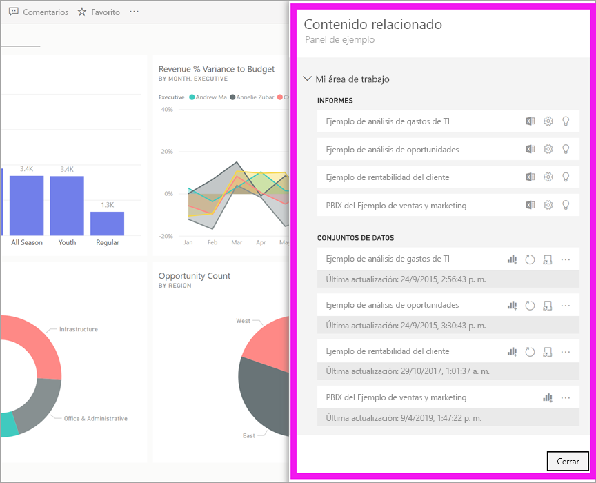
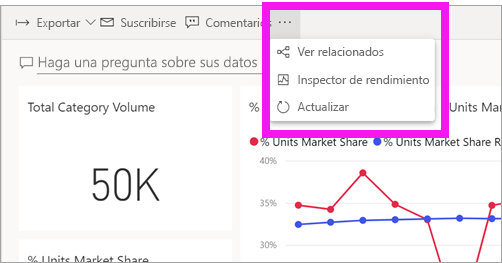
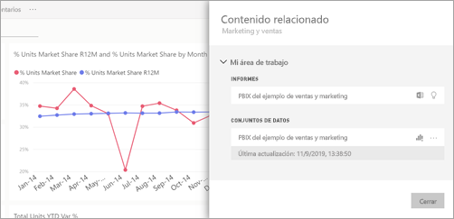
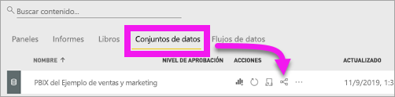
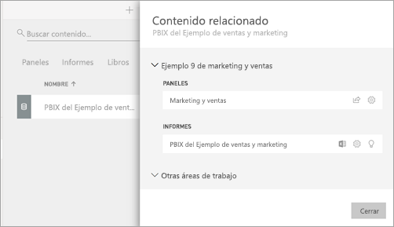

# Visualización del contenido relacionado en el servicio Power BI

[!INCLUDE [power-bi-service-new-look-include](../includes/power-bi-service-new-look-include.md)]

El panel **Contenido relacionado** muestra cómo está interconectado el contenido del servicio Power BI: paneles, informes y conjuntos de datos. El panel **Contenido relacionado** también es un panel de inicio para la realización de acciones. Desde aquí puede hacer cosas como abrir un panel, abrir un informe, generar información, analizar los datos en Excel y mucho más.  

En Power BI, los informes se integran en conjuntos de datos, las visualizaciones de informes se anclan a los paneles y los objetos visuales de paneles se vinculan a los informes. Pero ¿cómo sabe cuáles son los paneles que tienen las visualizaciones de su informe de marketing? ¿Y cómo se buscan esos paneles? ¿Está usando el panel de adquisiciones visualizaciones de más de un conjunto de datos? Si es así, ¿cómo se denominan y cómo puede abrir y editarlas? ¿Se está utilizando el conjunto de datos de recursos humanos en algún informe o panel? O bien, ¿se puede mover sin provocar la ruptura de los vínculos? Preguntas como estas pueden responderse en el panel **Contenido relacionado**.  No solo el panel muestra el contenido relacionado, también permite realizar acciones en el contenido y navegar fácilmente entre el contenido relacionado.

> [!NOTE]
> La característica de contenido relacionado no funciona con los conjuntos de datos de streaming.
> 
> 

## Visualización del contenido relacionado de un panel o informe
Vea el vídeo sobre la visualización del contenido relacionado de un panel. Luego, siga las instrucciones paso a paso que aparecen debajo del vídeo para intentarlo con el conjunto de datos de ejemplo de análisis de adquisiciones.

<iframe width="560" height="315" src="https://www.youtube.com/embed/B2vd4MQrz4M#t=3m05s" frameborder="0" allowfullscreen></iframe>

Con el panel o informe abierto, seleccione **Más opciones** (…) en la barra de menús y elija **Ver relacionados** en el menú desplegable.

Se abre el panel **Contenido relacionado**. Para un panel, muestra todos los informes con visualizaciones ancladas al panel y los conjuntos de datos asociados. En este panel, hay visualizaciones ancladas desde un solo informe y ese informe se basa en solo un conjunto de datos. 

Desde aquí, pueda realizar una acción directa en el contenido relacionado.  Por ejemplo, seleccione el nombre de un informe o panel para abrirlo.  Para un informe de la lista, seleccione un icono para [analizar en Excel](../service-analyze-in-excel.md) u [obtener información detallada](end-user-insights.md). Para un conjunto de datos, puede ver la fecha y hora de la última actualización, [analizar en Excel](../service-analyze-in-excel.md) y [obtener información detallada](end-user-insights.md).  

## Visualización del contenido relacionado de un conjunto de datos
Necesitará, como mínimo, permisos de *visualización* en un conjunto de datos para abrir el panel **Contenido relacionado**. En este ejemplo usamos el [ejemplo de análisis de adquisiciones](../sample-procurement.md).

En el panel de navegación, busque el encabezado **Áreas de trabajo** y seleccione un área de trabajo de la lista. Si tiene contenido en un área de trabajo, se mostrará en el lienzo de la derecha. 

En un área de trabajo, seleccione la pestaña **Conjuntos de datos** y busque el icono de **Ver relacionados** .

Seleccione el icono para abrir el panel **Contenido relacionado**.

Desde aquí, pueda realizar una acción directa en el contenido relacionado. Por ejemplo, seleccione un nombre de panel o informe para abrirlo.  Para cualquier panel de la lista, seleccione un icono para [compartir el panel con otros usuarios](../service-share-dashboards.md) o abrir la ventana **Configuración** del panel. Para un informe, seleccione un icono para [analizar en Excel](../service-analyze-in-excel.md), [cambiar el nombre de](../service-rename.md) u [obtener información detallada](end-user-insights.md).  

## Limitaciones y solución de problemas
* Si no ve "Ver relacionados", busque el icono . Seleccione el icono para abrir el panel **Contenido relacionado**.
* Para abrir el contenido relacionado de un informe, debe estar en la [vista de lectura](end-user-reading-view.md).
* La característica de contenido relacionado no funciona con los conjuntos de datos de streaming.

## Pasos siguientes
* [Introducción al servicio Power BI](../service-get-started.md)
* ¿Tiene más preguntas? [Pruebe la comunidad de Power BI](https://community.powerbi.com/)

