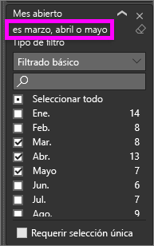
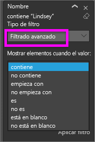
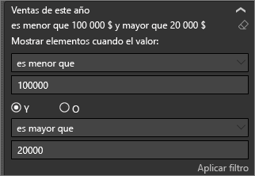
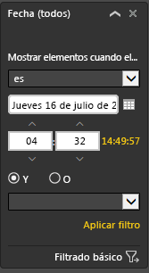

# Ver el panel Filtros del informe

En este artículo se analiza el panel **Filtros** del informe en el servicio Power BI. Use los filtros para descubrir nuevas conclusiones en los datos.

Hay muchas formas diferentes de filtrar los datos en Power BI. Para obtener más información sobre los filtros, vea [Filtros y resaltado en informes de Power BI](../power-bi-reports-filters-and-highlighting.md).

## Trabajar con el panel Filtros de informes

Cuando algún compañero comparta un informe con usted, asegúrese de buscar el panel **Filtros**. A veces se contrae en el borde derecho del informe. Selecciónelo para expandirlo.

El panel **Filtros** contiene filtros que el *diseñador* de informes ha agregado al informe. Los *consumidores*, como usted, pueden interactuar con los filtros existentes y guardar los cambios, pero no pueden agregar nuevos filtros al informe. Por ejemplo, en la captura de pantalla anterior el diseñador agregó dos filtros de nivel de página: **Segmento** y **Año**. Puede cambiar estos filtros e interactuar con ellos, pero no puede agregar un tercer filtro de nivel de página.

En el servicio Power BI, los informes conservan los cambios que haga en el panel **Filtros**. El servicio lleva esos cambios mediante la versión móvil del informe.

Para restablecer los valores predeterminados del diseñador en el panel **Filtro**, seleccione  en la barra de menú superior.

## Ver todos los filtros de la página de un informe

En el panel **Filtros** se muestran todos los filtros que ha agregado el diseñador al informe. El panel **Filtros** también es el área donde puede ver información sobre los filtros e interactuar con ellos. Puede guardar los cambios que haga o usar la opción **Restablecer valores predeterminados** para volver a la configuración original del filtro.

Si quiere guardar algún cambio, también puede crear un marcador personal.  Para obtener más información, consulte [¿Qué son los marcadores?](end-user-bookmarks.md)

En el panel **Filtros** se muestran y administran varios tipos de filtros de informe. Se pueden aplicar a un objeto visual, a una página de informe y a todo el informe.

En este ejemplo, hemos seleccionado un objeto visual que cuenta con dos filtros. La página del informe también tiene filtros, que aparecen debajo del encabezado **Filtros de esta página**. Además, todo el informe tiene un filtro de **Fecha**.

Algunos de los filtros tienen **(Todos)** junto a ellos. **(Todos)** implica que se incluyen todos los valores en el filtro. En la captura de pantalla anterior, **Segmento(Todos)** indica que esta página del informe incluye datos sobre todos los segmentos de productos. Si selecciona el filtro de nivel de página **Región es Oeste**, la página del informe solo incluye los datos de la región Oeste.

Cualquier persona que vea este informe puede interactuar con estos filtros.

### Ver solo esos filtros aplicados a un objeto visual

Para obtener un análisis más detallado de los filtros aplicados a un objeto visual específico, mueva el puntero sobre el objeto visual para mostrar el icono de filtro . Seleccione ese icono de filtro para ver una ventana emergente con todos los filtros, las segmentaciones, etc., que afectan a ese objeto visual. Los filtros de la ventana emergente son los mismos que se muestran en el panel **Filtros**.

Estos son los tipos de filtros que se pueden mostrar en esta vista:

- Filtros básicos

- Segmentaciones

- Resaltado cruzado

- Filtrado cruzado

- Filtros avanzados

- N filtros principales

- Filtros de fecha relativa

- Segmentaciones de sincronización

- Filtros de inclusión o exclusión

- Filtros que se pasan mediante una dirección URL

En el ejemplo siguiente:

1. Podemos ver que se ha aplicado un filtro cruzado al gráfico de columnas.

1. **Incluido** nos indica que el filtro cruzado es para **Segmento**, y que se incluyen tres.

1. Se ha aplicado una segmentación a **Trimestre**.

1. **Región** es un filtro que se ha aplicado a esta página del informe.

1. E **isVanArsdel** y **Año** son filtros que se han aplicado a este objeto visual.

### Búsqueda en un filtro

A veces, un filtro puede tener una lista larga de valores. Use el cuadro de búsqueda para buscar y seleccionar el valor que quiera.

### Mostrar detalles del filtro

Para comprender un filtro, eche un vistazo a los valores y recuentos disponibles.  Para ver los detalles del filtro, mueva el puntero sobre él y seleccione la flecha situada junto al nombre del filtro.
  

### Cambiar las selecciones de filtros

Una forma de buscar conclusiones sobre los datos es interactuar con los filtros. Puede cambiar las selecciones de filtros mediante la flecha desplegable situada junto al nombre del campo.  En función del filtro y el tipo de datos que esté filtrando Power BI, sus opciones variarán desde selecciones simples de una lista hasta identificar intervalos de fechas o números. En el filtro avanzado que se muestra a continuación, hemos cambiado el filtro **Total de unidades hasta la fecha** del gráfico de rectángulos para estar entre 2000 y 3000. Fíjese en que este cambio elimina Prirum del gráfico de rectángulos.
  

> [!TIP]
> Para seleccionar más de un valor de filtro a la vez, mantenga presionada la tecla CTRL. La mayoría de los filtros admiten la selección múltiple.

### Restablecer los valores predeterminados del filtro

Si quiere eliminar todos los cambios que ha realizado en los filtros, seleccione **Restablecer valores predeterminados** en la barra de menús superior.  Esta selección devuelve los filtros a su estado original, según lo establecido en el diseñador de informes.

### Borrado de un filtro

Si solo quiere establecer un filtro en **(Todos)** , bórrelo; para ello, seleccione el icono de borrador  que está junto al nombre del filtro.
  
<!--  too much detail for consumers

## Types of filters: text field filters
### List mode
Ticking a checkbox either selects or deselects the value. The **All** checkbox can be used to toggle the state of all checkboxes on or off. The checkboxes represent all the available values for that field.  As you adjust the filter, the restatement updates to reflect your choices. 

Note how the restatement now says "is Mar, Apr or May".

### Advanced mode
Select **Advanced Filtering** to switch to advanced mode. Use the dropdown controls and text boxes to identify which fields to include. By choosing between **And** and **Or**, you can build complex filter expressions. Select the **Apply Filter** button when you've set the values you want.  

## Types of filters: numeric field filters
### List mode
If the values are finite, selecting the field name displays a list.  See **Text field filters** &gt; **List mode** above for help using checkboxes.   

### Advanced mode
If the values are infinite or represent a range, selecting the field name opens the advanced filter mode. Use the dropdown and text boxes to specify a range of values that you want to see. 

By choosing between **And** and **Or**, you can build complex filter expressions. Select the **Apply Filter** button when you've set the values you want.

## Types of filters: date and time
### List mode
If the values are finite, selecting the field name displays a list.  See **Text field filters** &gt; **List mode** above for help using checkboxes.   

### Advanced mode
If the field values represent date or time, you can specify a start/end time when using Date/Time filters.  

-->

## Pasos siguientes

Obtenga información sobre cómo y por qué [los objetos visuales se aplican el filtro cruzado y el resaltado cruzado entre ellos en una página de informe](end-user-interactions.md).