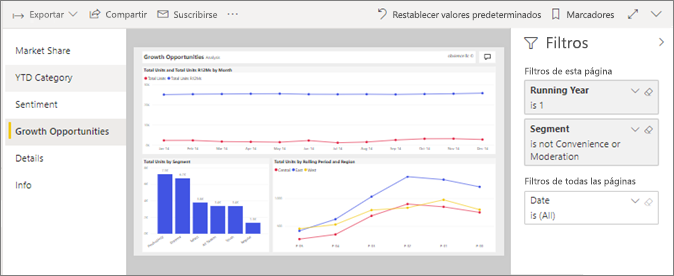
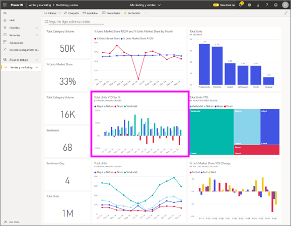

# Visualización de un informe en el servicio Power BI para *consumidores*
Un informe consta de una o varias páginas de objetos visuales. Se crean informes de Power BI *diseñadores* y [compartido con *consumidores* directamente](end-user-shared-with-me.md) o como parte de un [aplicación](end-user-apps.md). 

Hay muchas maneras diferentes para abrir un informe y le mostraremos dos de ellos: abra desde casa y desde un panel. 

<!-- add art-->

## Abrir un informe desde Power BI Home
Vamos a abrir un informe que se ha compartido con usted directamente y, a continuación, vamos a abrir un informe que se ha compartido como parte de una aplicación.

   

### Apertura de un informe que se ha compartido con usted
Power BI *diseñadores* pueden compartir un informe directamente con usted. Contenido que se comparte de este modo se muestra en el **compartido conmigo** contenedor en su barra de navegación de la barra y en el **compartido conmigo** sección del lienzo principal.

1. Abra el servicio Power BI (app.powerbi.com).

2. En la barra de navegación, seleccione **inicio** para mostrar el lienzo principal.  

   
   
3. Desplácese hacia abajo hasta que vea **Compartido conmigo**. Busque el icono de informe . En esta captura de pantalla, tenemos un panel y un informe denominado *ejemplo de marketing y ventas*. 
   
   

4. Simplemente seleccione el informe *tarjeta* para abrir el informe.

   

5. Tenga en cuenta las pestañas del lado izquierdo.  Cada pestaña representa una *página* del informe. Actualmente tenemos el *oportunidades de crecimiento* página abierta. Seleccione el *categoría hasta la fecha* ficha para abrir esa página del informe en su lugar. 

   

6. Ahora que vemos en la página de informe completa. Para cambiar la presentación (zoom) de la página, seleccione la lista desplegable de vista en la esquina superior derecha ( **>** ) y elija **tamaño real**.

   

   

### Apertura de un informe que forma parte de una aplicación
Si ha recibido las aplicaciones de compañeros de trabajo o de AppSource, esas aplicaciones estén disponibles desde casa y desde el **aplicaciones** contenedor en la barra de navegación. Una [aplicación](end-user-apps.md) es un conjunto de paneles e informes.

1. Vuelva a casa seleccionando **inicio** desde la barra de navegación.

7. Desplácese hacia abajo hasta que vea **Mis aplicaciones**.

   

8. Seleccione una de las aplicaciones para abrirla. Dependiendo de las opciones establecidas por el *diseñador* de la aplicación, esta abrirá un panel, un informe o la lista de contenido de una aplicación. Si al seleccionar la aplicación:
    - se abre el informe, ya ha terminado.
    - se abre un panel, vea ***Apertura de un informe desde un panel***, a continuación.
    - se abre la lista de contenido de la aplicación, en **Informes**, seleccione el informe para abrirlo.

## Apertura de un informe desde un panel
Los informes se pueden abrir desde un panel. La mayoría de los iconos de panel están *anclados* y remiten a los informes. Al seleccionar un icono se abre el informe que se usó para crear el icono. 

1. En un panel, seleccione un icono. En este ejemplo hemos seleccionado el icono del gráfico de columnas "Total unidades hasta la fecha...".

    

2.  Se abre el informe asociado. Tenga en cuenta que estamos en la página "Categoría hasta la fecha". Se trata de la página del informe que contiene el gráfico de columnas que hemos seleccionado desde el panel.

    

> [!NOTE]
> No todos los iconos conducen a un informe. Si selecciona un icono que ha sido [creado con Preguntas y respuestas](end-user-q-and-a.md), se abrirá la pantalla de Preguntas y respuestas. Si selecciona un icono que ha sido [creado mediante el widget **Agregar icono** del panel](../service-dashboard-add-widget.md), pueden pasar varias cosas.  

##  Más maneras aún de abrir un informe
Como resulte más fácil de navegar por el servicio Power BI, averiguará los flujos de trabajo que funcionan mejor para usted. Algunas otras maneras de acceder a los informes:
- Desde el panel de navegación de la barra utilizando **favoritos** y **recientes**    
- Mediante [Ver relacionados](end-user-related.md)    
- En un correo electrónico cuando alguien [comparte con usted](../service-share-reports.md) o [establece una alerta](end-user-alerts.md).    
- Desde el [Centro de notificaciones](end-user-notification-center.md)    
- Y más

## Pasos siguientes
Hay [muchas formas de interactuar con un informe](end-user-reading-view.md).  Empezar a explorar seleccionando cada pestaña en el lado del lienzo del informe.

