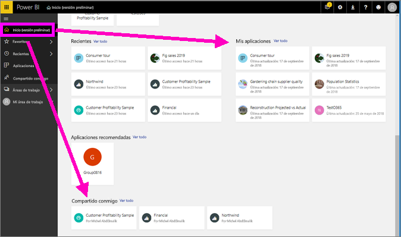
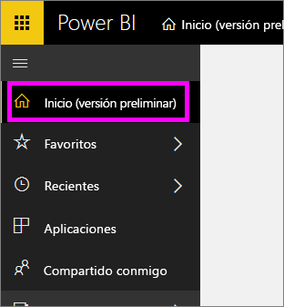
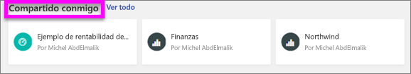
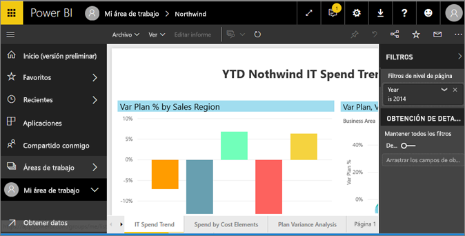
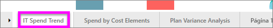
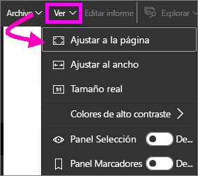
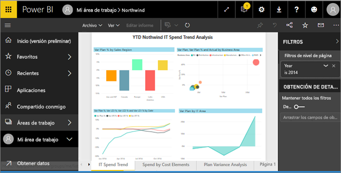
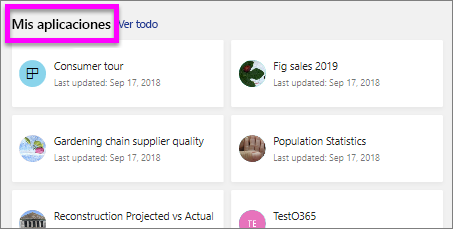
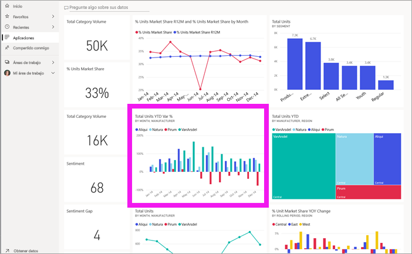
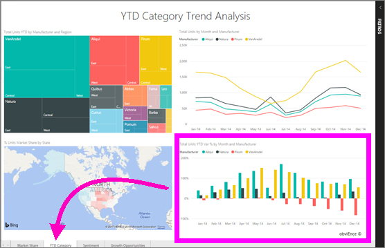

# Visualización de un informe en el servicio Power BI (app.powerbi.com)
Un informe consta de una o varias páginas de objetos visuales. Los informes se crean por *diseñadores de informes* de Power BI y [se comparten con usted directamente](end-user-shared-with-me.md) o como parte de una [aplicación](end-user-apps.md). 

Hay muchas maneras diferentes de abrir un informe; aquí le mostraremos dos de ellas: desde la página principal y desde un panel. 

<!-- add art-->

## Apertura de un informe desde la página principal
Vamos a abrir un informe que se ha compartido con usted directamente y, a continuación, vamos a abrir un informe que se ha compartido como parte de una aplicación.

   

### Apertura de un informe que se ha compartido con usted
Los *diseñadores* de Power BI pueden compartir un informe directamente con usted haciendo clic en el botón **Compartir** en su barra de menús superior. El contenido que se comparte de este modo se muestra en el contenedor **Compartido conmigo** de la barra de navegación izquierda y en la sección **Compartido conmigo** de la página principal.

1. Abra el servicio Power BI (app.powerbi.com)

2. En la barra de navegación de la izquierda, seleccione **Inicio (versión preliminar)** para abrir la página principal.  

   
   
3. Desplácese hacia abajo hasta que vea **Compartido conmigo**. Busque el icono de informe . En esta captura de pantalla, tenemos dos informes: *Financial* y *Northwind*. 
   
   

4. Simplemente seleccione una de las tarjetas de informe para abrir el informe.

   

5. Observe las pestañas de la parte inferior. Cada pestaña representa una *página* del informe. Actualmente tenemos abierta la página *IT Spend Trend*. Seleccione otra pestaña para abrir esa página del informe. 

   

6. Ahora podemos ver solo una parte de la página del informe. Para cambiar la presentación (zoom) de la página, seleccione **Vista** > **Ajustar a la página**.

   

   

### Apertura de un informe que forma parte de una aplicación
Si ha recibido aplicaciones de compañeros de trabajo o de AppSource, esas aplicaciones están disponibles en la página principal y el contenedor **Aplicaciones** de la barra de navegación izquierda. Una [aplicación](end-user-apps.md) es un conjunto de paneles e informes.

1. Vuelva a la página principal seleccionando **Inicio (versión preliminar)** desde la barra de navegación izquierda.

7. Desplácese hacia abajo hasta que vea **Mis aplicaciones**.

   

8. Seleccione una de las aplicaciones para abrirla. Dependiendo de las opciones establecidas por el *diseñador* de la aplicación, esta abrirá un panel o un informe. Si al seleccionar la aplicación:
    - se abre el informe, ya ha terminado.
    - se abre un panel, vea [Apertura de un informe desde un panel](#Open-a-report-from-a-dashboard), a continuación.

## Apertura de un informe desde un panel
Los informes se pueden abrir desde un panel. La mayoría de los iconos de panel están *anclados* y remiten a los informes. Al seleccionar un icono se abre el informe que se usó para crear el icono. 

1. En un panel, seleccione un icono. En este ejemplo hemos seleccionado el icono del gráfico de columnas "Total unidades hasta la fecha...".

    

2.  Se abre el informe asociado. Tenga en cuenta que estamos en la página "Categoría hasta la fecha". Se trata de la página del informe que contiene el gráfico de columnas que hemos seleccionado desde el panel.

    

> [!NOTE]
> No todos los iconos conducen a un informe. Si selecciona un icono que ha sido [creado con Preguntas y respuestas](../service-dashboard-pin-tile-from-q-and-a.md), se abrirá la pantalla de Preguntas y respuestas. Si selecciona un icono que ha sido [creado mediante el widget **Agregar icono** del panel](../service-dashboard-add-widget.md), se abrirá el asistente para **editar el icono**.  

##  Más maneras aún de abrir un informe
A medida que se vaya sintiendo cómodo al navegar por el servicio Power BI, averiguará los flujos de trabajo que funcionan mejor en su caso. Algunas otras maneras de acceder a los informes:
- Desde el panel de navegación izquierdo con **Favoritos** y **Recientes**    
- Mediante [Ver relacionados](end-user-related.md)    
- En un correo electrónico cuando alguien [comparte con usted](../service-share-reports.md) o [establece una alerta](../service-set-data-alerts.md).    
- Desde el [Centro de notificaciones]    (end-user-notification-center.md).    
- Y más

## Pasos siguientes
Hay [muchas formas de interactuar con un informe](end-user-reading-view.md).  Empiece a explorar seleccionando cada una de las pestañas en la parte inferior del lienzo del informe.

