# Cambiar el tamaño de una página del informe
En el [artículo y el vídeo anteriores](../power-bi-report-display-settings.md), conoció las dos maneras distintas de controlar la presentación de una página en los informes de Power BI: **Vista** y **Tamaño de página**. La vista de página y el tamaño de página están disponibles en el servicio Power BI y en Power BI Desktop y tienen una apariencia y comportamiento similar, pero en este tutorial vamos a utilizar el servicio Power BI.

### Requisitos previos
- Servicio Power BI   
- [Informe del Ejemplo de análisis de minoristas](../sample-retail-analysis.md)

## En primer lugar, vamos a cambiar la configuración de la vista de página

1. Abra el informe en la vista de lectura o la vista de edición y seleccione la pestaña del informe **Nuevas tiendas**. De forma predeterminada, esta página del informe se muestra con la configuración **Ajustar a la página**.  En este caso, la configuración Ajustar a la página muestra la página del informe sin barras de desplazamiento, pero no se pueden leer algunos de los detalles y títulos porque son demasiado pequeños.

   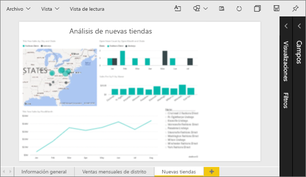
2. Asegúrese de que no haya ninguna visualización seleccionada en el lienzo. Seleccione **Vista** y revise las opciones de presentación.

   * En la vista de lectura verá esto.

     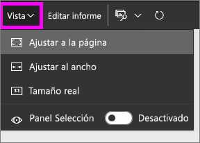
   * En la vista de edición verá esto.

     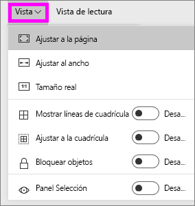

3. Veamos cómo se muestra la página con la opción **Tamaño real**.

   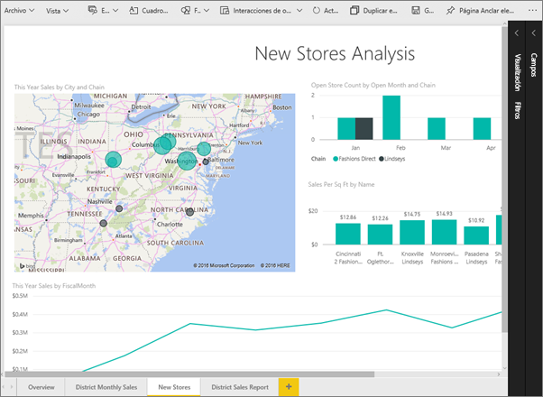

   No se ve muy bien, ya que ahora el panel tiene barras de desplazamiento dobles.
4. Cambie a **Ajustar al ancho**.

   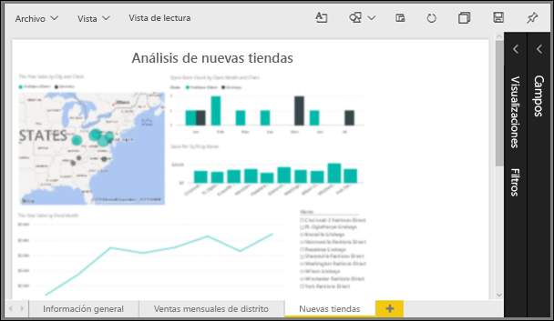

   Tiene un mejor aspecto, aún tenemos una barra de desplazamiento, pero es más fácil leer los detalles.

## Cambiar la vista predeterminada de una página de informe
Si es un *creador* del informe, puede cambiar la vista predeterminada de las páginas del informe. Al compartir el informe con otros usuarios, las páginas del informe se abrirán con la vista que ha establecido. Los *consumidores* del informe podrán cambiar la vista, pero no podrán guardar los cambios realizados después de salir del informe.

1. En la página **New stores** del informe, cambie a la vista **Tamaño real**.

   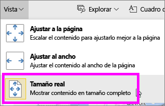

2. En la página del informe **Ventas mensuales del distrito**, establezca la vista en **Ajustar al ancho**.

3. En la página del informe **Información general**, deje la configuración de vista predeterminada.

4. Ahora, guarde el informe seleccionando **Archivo > Guardar**. La próxima vez que abra este informe, las páginas se mostrarán con las nuevas opciones de vista. Vamos a verlo.

   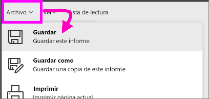
3. Seleccione el nombre del área de trabajo actual en la barra de navegación superior para volver a esa área de trabajo.  

   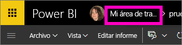
4. Seleccione la pestaña **Informes** y elija el mismo informe (Ejemplo de análisis de minoristas).

    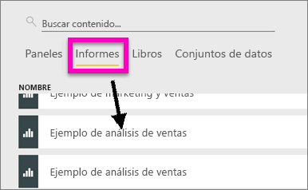
5. Abra cada página del informe para ver la nueva configuración.

   

## Ahora, vamos a explorar la configuración del *tamaño de página*
Los valores de tamaño de página solo están disponibles en la [vista de edición](../service-interact-with-a-report-in-editing-view.md), por lo que debe tener permisos de edición (*creador*) en el informe para cambiar los valores de tamaño de página. Si se conectó a cualquiera de nuestros [ejemplos](../sample-datasets.md), tendrá permisos de *creador* en esos informes.

1. Abra la página "District monthly sales" del [Ejemplo de análisis de venta directa](../sample-retail-analysis.md) en la vista de edición.
2. Asegúrese de que no haya ninguna visualización seleccionada en el lienzo.  En el panel **Visualizaciones**, seleccione el icono del rodillo de pintura .
3. Seleccione **Tamaño de página** &gt; **Tipo** para mostrar las opciones de tamaño de página.

   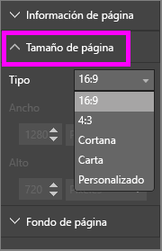
4. Seleccione **Carta**.  En el lienzo, solo el contenido que se ajusta a 816 x 1056 píxeles (tamaño Carta) permanece en la parte en blanco del lienzo.

   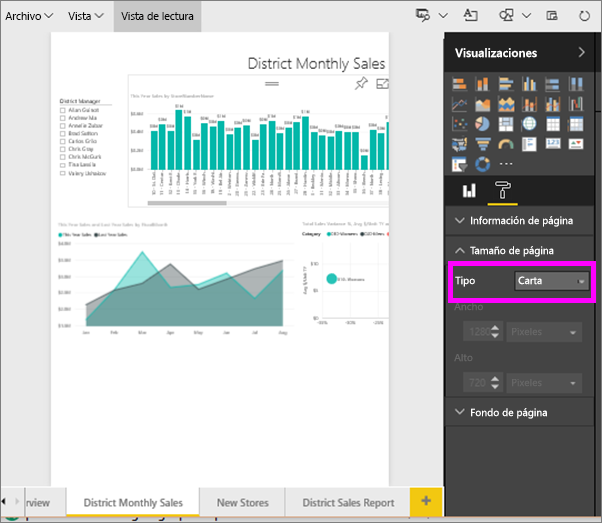
5. Seleccione **Tamaño de página** relación **16:9**.

   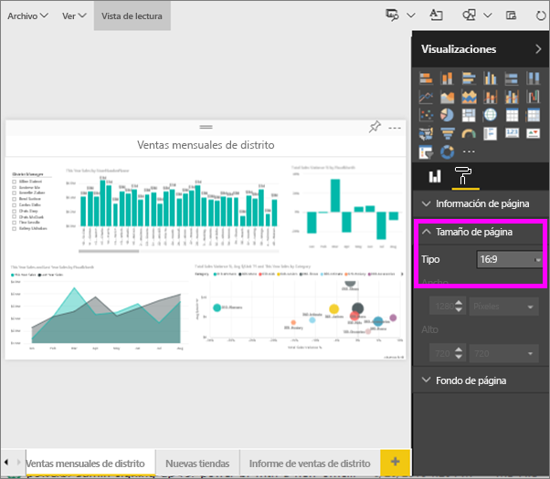

   La página del informe se muestra con una relación de 16 de ancho por 9 de alto. Para ver el tamaño real en píxeles que se usa, mire los campos Ancho y Alto (1280x720), que aparecen atenuados. Hay mucho espacio vacío alrededor del lienzo del informe; esto se debe a que antes establecimos **Vista** en "Ajustar al ancho".
7. Continúe explorando las opciones de **Tamaño de página**.

## Uso de Vista de página y Tamaño de página conjuntamente
Use la vista de página y el tamaño de página conjuntamente para crear un informe que tenga un aspecto óptimo al ser compartido con los compañeros o insertado en otra aplicación.

En este ejercicio, creará una página de informe que se mostrará en una aplicación que tenga espacio para 500 píxeles de ancho por 750 píxeles de alto.

Recuerde que, en el paso anterior, vimos que nuestra página de informe se muestra en 1280 píxeles de ancho por 720 píxeles de alto. Así pues, sabemos que tendremos que cambiar bastante el tamaño y la organización para que quepan todos nuestros gráficos.

1. Cambie el tamaño de los objetos visuales y muévalos para que quepan en menos de la mitad del área de lienzo actual.

    
2. Seleccione **Tamaño de página** &gt; **Personalizado**.
3. Establezca el ancho en 500 y el alto en 750.

    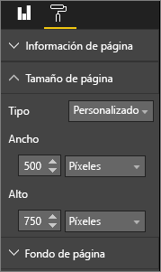
4. Retoque la página de informe para que tenga un aspecto óptimo. Cambie entre **Vista > Tamaño real** y **Vista > Ajustar a la página** para realizar ajustes.

    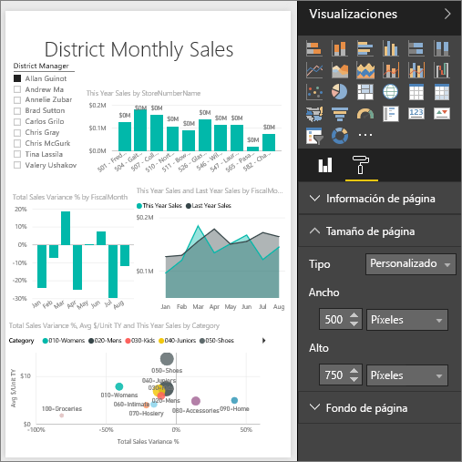

## Pasos siguientes
[Crear informes para Cortana](../service-cortana-answer-cards.md)

Vuelva a [Configuración de presentación de página en un informe de Power BI](../power-bi-report-display-settings.md)

¿Tiene más preguntas? [Pruebe la comunidad de Power BI](http://community.powerbi.com/)
