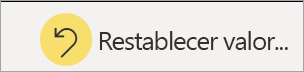

# Informes en Power BI

[!INCLUDE [power-bi-service-new-look-include](../includes/power-bi-service-new-look-include.md)]

Un informe de Power BI es una vista de varias perspectivas de un conjunto de datos, con objetos visuales que representan diferentes hallazgos y conclusiones de ese conjunto de datos.  Un informe puede tener un solo objeto visual o páginas llenas de objetos visuales. En función de su rol de trabajo, es posible que sea alguien que *diseña* informes. También puede ser alguien que *consume* o usa informes. Este artículo es para *consumidores*.

A. Este informe tiene seis páginas (o pestañas) y actualmente está viendo la página **Opinión**.    
B. En esta página hay cinco objetos visuales diferentes y un título de página.    
C. En el panel *Filtros* se muestra un filtro aplicado a todas las páginas del informe. Para contraer el panel Filtros, seleccione la flecha ( **>** ).    
D. En el banner de Power BI se muestra el nombre del informe y la fecha de la última actualización. Seleccione la flecha para abrir un menú que muestre también el nombre del propietario del informe.    
E. La barra de acciones contiene las acciones que puede realizar en este informe.  Por ejemplo, puede agregar un comentario, ver un marcador o exportar datos del informe.  Seleccione **Más opciones** (...) para mostrar una lista de funcionalidades adicionales del informe.    

Si no está familiarizado con Power BI, puede obtener una buena base si lee [Conceptos básicos para consumidores de Power BI](end-user-basic-concepts.md). Los informes se pueden ver, compartir y anotar en dispositivos móviles. Para obtener más información, consulte [Exploración de informes en las aplicaciones móviles de Power BI](mobile/mobile-reports-in-the-mobile-apps.md).

## Ventajas de los informes

Power BI basa un informe en un único conjunto de datos. Los *diseñadores* de informes crean los objetos visuales en un informe que representa un fragmento de información. Los objetos visuales no son estáticos.  Se actualizan cuando cambian los datos subyacentes. Puede interactuar con los objetos visuales y los filtros a medida que profundiza en los datos para descubrir conclusiones y buscar respuestas. Del mismo modo que un panel, un informe es un elemento sumamente interactivo y muy personalizable.

### Interacción segura con el contenido

Conforme explora e interactúa con el contenido (mediante el filtrado, la segmentación, la suscripción y la exportación), no puede interrumpir los informes. Su trabajo no afecta al conjunto de datos subyacente ni al contenido original compartido. Esto se aplica a paneles, informes y aplicaciones.

> [!NOTE]
> Recuerde que no puede dañar los datos. Power BI es un excelente lugar para que explore y experimente sin preocuparse por estropear algo.

### Guardado de los cambios o vuelta a la configuración predeterminada

Eso no significa que no se puedan guardar los cambios. Sí se puede, pero esos cambios solo afectan a su vista del contenido. Para volver a la vista predeterminada original del informe, seleccione **Restablecer valores predeterminados**.

## Paneles frente a informes

Los [paneles](end-user-dashboards.md) suelen confundirse con informes, ya que también son lienzos con objetos visuales. Pero hay algunas diferencias importantes.  

| **Funcionalidad** | **Paneles** | **Informes** |
| --- | --- | --- |
| Páginas |Una página |Una o varias páginas |
| Orígenes de datos |Uno o varios informes y uno o varios conjuntos de datos por cada panel |Un único conjunto de datos por informe |
| Filtrado |No es posible filtrar ni segmentar |Numerosas formas de filtrar, resaltar y segmentar |
| Establecimiento de alertas |Se pueden crear alertas para enviarlas por correo electrónico cuando el panel cumple determinadas condiciones |No |
| Destacado |Se puede establecer un panel como panel destacado |No es posible crear un informe destacado |
| Se pueden ver campos y tablas del conjunto de datos subyacentes |No. Se pueden exportar los datos, pero no se pueden ver las tablas ni los campos del conjunto de datos en el panel |Sí. Se pueden ver las tablas, los campos y los valores del conjunto de datos para los que se tienen permisos |
| Personalización |No  |Se puede filtrar, exportar, ver el contenido relacionado, agregar marcadores, generar códigos QR, analizar en Excel, etc. |

<!--| Available in Power BI Desktop |No |Yes, can create and view reports in Desktop |
| Pinning |Can pin existing visuals (tiles) only from current dashboard to your other dashboards |Can pin visuals (as tiles) to any of your dashboards. Can pin entire report pages to any of your dashboards. | -->

## Diseñadores de informes y consumidores de informes

En función de su rol, es posible que sea un *diseñador*, alguien que crea informes para su propio uso o para compartir con compañeros de trabajo. Querrá obtener información sobre cómo crear y compartir informes.

O bien, es posible que sea un *consumidor*, alguien que recibe los informes de otras personas. Querrá obtener información sobre cómo comprender los informes e interactuar con ellos. Si es un *consumidor* de informes, estos vínculos son para usted:

* Comience con un [paseo por el servicio Power BI](end-user-basic-concepts.md) para saber dónde se encuentran los informes y las herramientas de informes.
* Aprenda a [abrir un informe](end-user-report-open.md) y conozca todas las [interacciones disponibles para los consumidores](end-user-reading-view.md).
* Familiarícese con los informes viendo uno de nuestros [ejemplos](../sample-tutorial-connect-to-the-samples.md).  
* Para ver qué conjunto de datos usa el informe y qué paneles muestran objetos visuales del informe (*marcas*), consulte [Visualización del contenido relacionado en el servicio Power BI](end-user-related.md).

> [!TIP]
> Si no encuentra lo que está buscando aquí, use la tabla de contenido de la izquierda para explorar todos los artículos sobre *informes*.

## Pasos siguientes

[Abrir y ver un informe](end-user-report-open.md)    
[Paneles en el servicio Power BI](end-user-dashboards.md)