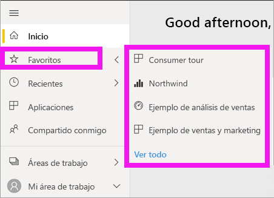

# Navegación: búsqueda, detección y ordenación de contenido en el servicio Power BI

[!INCLUDE [power-bi-service-new-look-include](../includes/power-bi-service-new-look-include.md)]

Hay muchas maneras de navegar por el contenido en el servicio Power BI. El contenido de su área de trabajo está organizado por tipos: paneles e informes.  Y también se organiza el contenido por usos: favoritos, reciente, aplicaciones, compartido conmigo y destacado. Para que no haya que moverse de un lado a otro, el *inicio* de Power BI organiza todo el contenido en una página. Estos diferentes métodos de acceso al contenido le permiten encontrar rápidamente lo que necesita en el servicio Power BI.  

## Navegación en áreas de trabajo

Los *consumidores* de Power BI suelen tener solo un área de trabajo: **Mi área de trabajo**. En **Mi área de trabajo** se incluirá contenido si ha descargado los ejemplos de Microsoft o creado o descargado sus propios paneles, informes o aplicaciones.  

En **Mi área de trabajo**, el servicio Power BI separa el contenido por tipo: paneles, informes, libros y conjuntos de datos. Verá esta organización cuando seleccione un área de trabajo. En este ejemplo, **Mi área de trabajo** contiene un panel, un informe, ningún libro y un conjunto de datos.

________________________________________
## Navegación mediante el campo de búsqueda
Use la vista de contenido de **Mi área de trabajo** para buscar, filtrar y ordenar el contenido. En el campo de búsqueda, escriba el nombre completo de un panel, un informe, un libro o un propietario, o bien una parte de él.  

Si solo tiene algunos elementos de contenido, la búsqueda y la ordenación no son necesarias.  En cambio, si tiene listas largas de paneles e informes, podrá comprobar que la búsqueda y la ordenación son muy útiles. Por ejemplo, la lista de informes siguiente tiene 83 elementos. 

También puede ordenar el contenido por nombre o propietario. Tenga en cuenta la flecha hacia arriba a la derecha del **Nombre**. Actualmente estamos ordenando 83 elementos alfabéticamente por nombre, de modo ascendente. Para cambiar el criterio de ordenación a descendente, seleccione **Nombre**. La flecha hacia arriba cambia a una flecha hacia abajo.

No todas las columnas se pueden ordenar. Mantenga el puntero sobre los encabezados de columna para detectar aquellas que pueden ordenarse.

___________________________________________________________________
## Navegación mediante el panel de navegación
El panel de navegación clasifica el contenido de forma que le ayude a encontrar lo que necesita rápidamente.  

- El contenido que se comparte con usted está disponible en **Compartido conmigo**.
- El contenido visto por última vez está disponible en **Recientes**. 
- Las aplicaciones se pueden encontrar al seleccionar **Aplicaciones**.
- **Inicio** es una vista de página única que presenta el contenido más importante y los orígenes de aprendizaje y contenido sugeridos.

Además, puede etiquetar el contenido como [favorito](end-user-favorite.md) y [destacado](end-user-featured.md). Seleccione el panel o el informe que espera ver más a menudo y establézcalo como contenido *destacado*. Cada vez que abra el servicio Power BI, el panel destacado será el que vea primero. ¿Tiene un número de paneles y aplicaciones que visita con frecuencia? Si los establece como favoritos, siempre estarán disponibles en el panel de navegación.

.

## Consideraciones y solución de problemas
* En los conjuntos de datos, **Ordenar por** no está disponible por propietario.

## Pasos siguientes
[Ordenación de objetos visuales en informes](end-user-change-sort.md)

¿Tiene más preguntas? [Pruebe la comunidad de Power BI](https://community.powerbi.com/)
