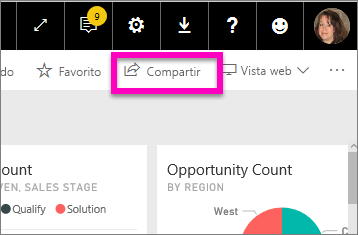
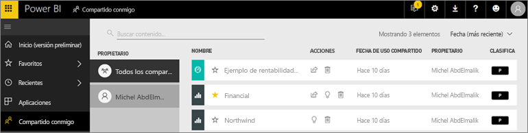
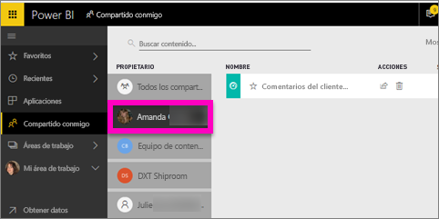

# Mostrar los paneles y los informes que se han compartido conmigo
## Compartido conmigo

Cuando algún compañero comparta contenido con usted con el botón **Compartir**, aparecerá en su contenedor **Compartido conmigo**. El panel o informe solo está disponible en **Compartido conmigo** y no en las **Aplicaciones**.

Amanda explica la lista de contenido **Compartido conmigo** y muestra cómo navegar y filtrar la lista. Luego, siga las instrucciones paso a paso que aparecen debajo del vídeo para intentarlo. Para poder ver paneles que hayan compartido con usted, debe tener una licencia de Power BI Pro. Para más información, lea [What is Power BI Premium?](../service-premium.md) (¿Qué es Power BI Premium?)

<iframe width="560" height="315" src="https://www.youtube.com/embed/G26dr2PsEpk" frameborder="0" allowfullscreen></iframe>

Tendrá opciones para interactuar con los paneles y los informes, en función de los permisos que le otorgue el diseñador. como poder realizar copias del panel, abrir el informe [en la vista de lectura](end-user-reading-view.md) y volver a compartir con otros compañeros.

## Acciones disponibles en el contenedor **Compartido conmigo**
* Selección del icono de estrella para añadir [un panel o informe a Favoritos](end-user-favorite.md).
* Retirada de un panel o informe  
* Algunos paneles e informes se pueden volver a compartir  
* Además, si las listas son largas, puede [usar el campo de búsqueda y la ordenación para encontrar lo que necesite](end-user-search-sort.md).
  
  > [!NOTE]
  > Para información sobre las clasificaciones de EGRC, seleccione el botón de clasificación o visite la [Clasificación de datos del panel](../service-data-classification.md).
  > 
  > 
* Selección del nombre de un panel para abrirlo y explorar. Una vez abierto el panel compartido, puede usar preguntas y respuestas para consultar los datos subyacentes o seleccionar un icono para abrir el informe e interactuar con él en la vista de lectura.

## Filtro de los paneles compartidos por propietario
El contenido de la pantalla **Compartido conmigo** se puede filtrar aún más, por el propietario del contenido. Por ejemplo, si seleccionamos **Amanda**, veremos solo el panel que Amanda haya compartido conmigo.

