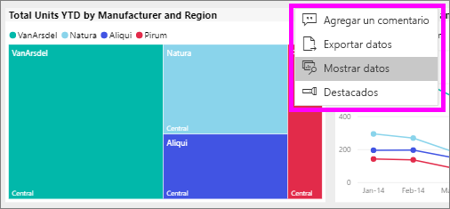
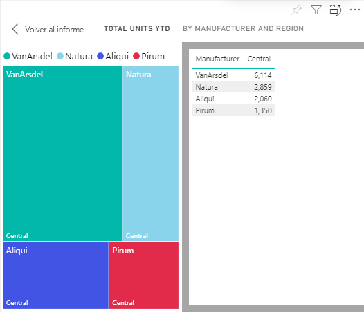

# Mostrar los datos que se usan para crear el objeto visual

Un objeto visual de Power BI se construye con datos de conjuntos de datos subyacente. Si quiere ver lo que sucede en segundo plano, Power BI le permite *mostrar* los datos que se usan para crear el objeto visual. Al seleccionar **mostrar datos**, Power BI muestra los datos por debajo (o junto a) el objeto visual.

1. En el servicio Power BI, [abrir un informe](end-user-report-open.md) y seleccione un objeto visual.  
2. Para que se muestren los datos que hay detrás del objeto visual, seleccione los puntos suspensivos (...) y elija **Mostrar datos**.
   
   
3. De manera predeterminada, los datos aparecen debajo del objeto visual.
   
   

4. Para cambiar la orientación, seleccione el diseño vertical  en la esquina superior derecha de la visualización.
   
   

## Pasos siguientes
[Objetos visuales en informes de Power BI](../visuals/power-bi-report-visualizations.md)    
[Informes de Power BI](end-user-reports.md)    
