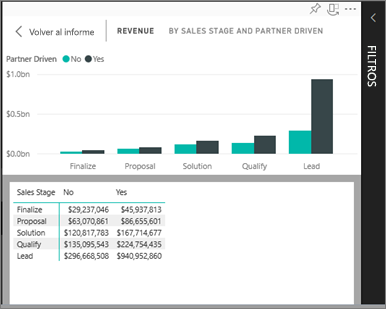
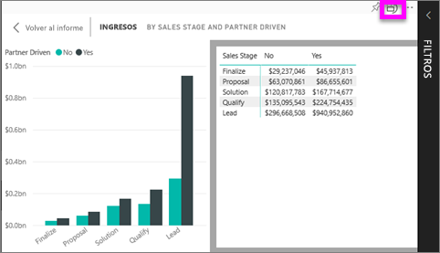

# Mostrar los datos que se utilizaron para crear la visualización
## Mostrar datos
Una visualización de Power BI se construye con datos provenientes de los conjuntos de datos subyacentes. Si quiere ver lo que sucede en segundo plano, Power BI le permite *mostrar* los datos que se usan para crear el objeto visual. Cuando se selecciona **Mostrar datos**, Power BI muestra los datos que están situados debajo (o cerca) de la visualización.

## Uso de *Mostrar datos* en el servicio Power BI
1. En el servicio Power BI, abra un informe y seleccione un objeto visual.  
2. Para que se muestren los datos que hay detrás del objeto visual, seleccione los puntos suspensivos (...) y elija **Mostrar datos**.
   
   
3. De manera predeterminada, los datos aparecen debajo del objeto visual.
   
   

4. Para cambiar la orientación, seleccione el diseño vertical  en la esquina superior derecha de la visualización.
   
   

### Pasos siguientes
[Visualizaciones de informes de Power BI](../visuals/power-bi-report-visualizations.md)    
[Informes de Power BI](end-user-reports.md)    
