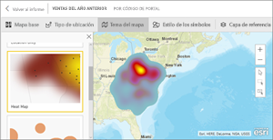
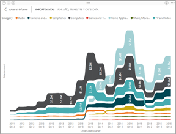
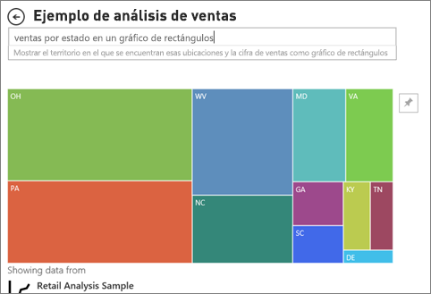

# Tipos de visualización en Power BI
Encontrará las visualizaciones en informes, paneles, aplicaciones y preguntas y respuestas. Algunos de estos tipos de visualización se empaquetan con Power BI, y algunas son *objetos visuales personalizados*. Los objetos visuales personalizados se crean fuera de Power BI y de una manera que permite a los *diseñadores de informes* agregarlos a aplicaciones, paneles e informes de Power BI. 

En este artículo se proporciona información general sobre las visualizaciones que se empaquetan con Power BI.  Son las visualizaciones que encontrará con mayor frecuencia. 

> [!NOTE]
> Para obtener información sobre los objetos visuales personalizados, búsquelos en la sección **Power BI visuals** (Objetos visuales de Power BI) de [Microsoft AppSource](https://appsource.microsoft.com/marketplace/apps?product=power-bi-visuals). Para cada objeto visual, encontrará una descripción, información sobre el creador y capturas de pantalla o un vídeo. 

## Lista de visualizaciones disponibles en Power BI
Todas estas visualizaciones se pueden encontrar en las aplicaciones, informes y paneles de Power BI, y [especificadas en Preguntas y respuestas](#gna).

### Gráficos de áreas: básico (en capa) y de área apilada

El gráfico de área básico se basa en el gráfico de líneas con el área entre el eje y la línea rellena. Los gráficos de área destacan la magnitud del cambio con el tiempo y se pueden usar para llamar la atención sobre el valor total en una tendencia. Por ejemplo, se pueden trazar datos que representan el beneficio en el tiempo en un gráfico de área para destacar el beneficio total.

### Gráficos de barras y columnas

 

Los gráficos de barras son el estándar para buscar un valor concreto en categorías diferentes.

### Tarjetas: número único

En las tarjetas de número único se muestra un solo hecho, un único punto de datos. A veces, un único número es lo más importante que desea seguir en el panel o informe de Power BI, como las ventas totales, la cuota de mercado interanual o el total de oportunidades.  

### Tarjetas: de varias filas

En las tarjetas de varias filas se muestran uno o varios puntos de datos, uno por fila.

### Gráficos combinados

Un gráfico combinado combina un gráfico de columnas y un gráfico de líneas. La combinación de los dos gráficos en uno permite realizar una comparación más rápida de los datos. Los gráficos combinados pueden tener uno o dos ejes Y, por lo que debe fijarse con atención. 

Los gráficos combinados son una excelente opción:
- Si tiene un gráfico de líneas y un gráfico de columnas con el mismo eje X.
- Para comparar varias medidas con distintos intervalos de valores.
- Para ilustrar la correlación entre dos medidas en una visualización.
- Para comprobar si una medida cumple el objetivo que se define mediante otra medida.
- Para ahorrar espacio en el lienzo.

### Gráficos de anillos

Los gráficos de anillos son similares a los gráficos circulares.  Muestran la relación de las partes con el todo. La única diferencia es que el centro está en blanco y deja espacio para un icono o una etiqueta.

### Gráficos de embudo

Los embudos ayudan a visualizar un proceso que tiene fases y elementos que fluyen de forma secuencial de una fase a la siguiente.  Un ejemplo es un proceso de ventas que empieza con clientes potenciales y termina con la realización de la compra.

Por ejemplo, un embudo de ventas que realiza el seguimiento de los clientes a través de las fases: Cliente potencial > Cliente potencial calificado > Posible cliente > Contrato > Cierre. De un vistazo, la forma del embudo indica el estado del proceso del que está realizando el seguimiento.
Cada fase del embudo representa un porcentaje del total. Por lo tanto, en la mayoría de los casos, un gráfico de embudo tiene la forma de embudo: la primera fase es la más grande y cada fase posterior es menor que su predecesora. Los embudos en forma de pera también son útiles, porque pueden identificar un problema en el proceso. Pero por lo general, la primera fase, la fase de "entrada", es la de mayor tamaño.

Los gráficos de embudo son una excelente opción:
- Cuando los datos son secuenciales y se mueven por al menos 4 fases.
- Cuando se espera que el número de "elementos" de la primera fase sea mayor que el número de la fase final.
- Para calcular el potencial (ingresos, ventas, ofertas, etc.) por fases.
- Para calcular las tasas de conversión y retención y realizar un seguimiento de las mismas.
- Para mostrar cuellos de botella en un proceso lineal.
- Para realizar el seguimiento del flujo de trabajo de un carro de la compra.
- Para realizar el seguimiento del progreso y el éxito de las campañas de marketing y publicidad de click-through.

### Gráficos de medidor

Un gráfico de medidor radial tiene un arco circular y muestra un único valor que mide el progreso hacia un objetivo o KPI. El valor del objetivo se representa mediante la línea (aguja). El progreso hacia ese objetivo se representa mediante el sombreado. Y el valor que representa el progreso se muestra en negrita dentro del arco. Todos los valores posibles están repartidos por igual a lo largo del arco, del mínimo (valor más a la izquierda) al máximo (valor más a la derecha).

En el ejemplo anterior, somos vendedores de automóviles y realizamos el seguimiento de la media de ventas por mes de nuestro equipo de ventas. Nuestro objetivo es 140 y está representado por la aguja negra. La media mínima posible de ventas es 0 y hemos establecido el máximo en 200. El sombreado azul muestra que la media de ventas de este mes es de 120. Por suerte, todavía tenemos otra semana para lograr nuestro objetivo.

Los medidores radiales son una excelente opción para:
- Mostrar el progreso hacia un objetivo.
- Representar una medida percentil, como un KPI.
- Mostrar el estado de una única medida.
- Mostrar información que se pueda analizar y comprender rápidamente.

<!-- ### Key influencers chart

A key influencer chart displays the major contributors to a selected result or value.  -->

### KPI

Un indicador clave de rendimiento (KPI) es una indicación visual que comunica el progreso realizado para lograr un objetivo cuantificable. 

Los KPI son una excelente opción:
- para medir el progreso (¿voy adelantado o retrasado?)
- para medir la distancia hasta un objetivo (¿cuánto adelanto o retraso tengo?)

### Gráficos de líneas

Los gráficos de líneas resaltan la forma general de toda una serie de valores, normalmente a lo largo del tiempo.

### Mapas: mapas básicos

Un mapa básico se usa para asociar información cuantitativa y de categorías con ubicaciones espaciales.

### Mapas: Mapas de ArcGIS

Con la combinación de ArcGIS Maps y Power BI, los mapas no se limitan a ser una representación de puntos, sino que alcanzan un nivel completamente nuevo. Las opciones disponibles para mapas base, tipos de ubicación, temas, estilos de símbolos y capas de referencia crean magníficas visualizaciones informativas de mapas. La combinación de capas de datos relevantes (como datos del censo) en un mapa con el análisis espacial transmite una comprensión más profunda de los datos en la visualización.

### Mapas: mapas coropléticos

Los mapas coropléticos usan sombreado, tintes o patrones para mostrar las diferencias de un valor en proporción en una ubicación geográfica o región. Muestre rápidamente estas diferencias relativas con sombreados que va del claro (valores menos frecuentes o inferiores) a oscuro (más frecuentes o superiores).

### Mapas: mapas de formas

Los mapas de formas comparan las regiones de un mapa mediante colores. A diferencia del objeto visual M\mapa, los mapas de formas no pueden mostrar las ubicaciones geográficas precisas de los puntos de datos en un mapa. En su lugar, su propósito principal es mostrar comparaciones relativas de las regiones de un mapa mediante colores diferentes.

### Matriz

El objeto visual de matriz es un tipo de objeto visual de tabla (vea "Tabla" más abajo) que es compatible con un diseño escalonado. A menudo, los diseñadores de informes incluyen matrices en informes y paneles para permitir a los usuarios seleccionar uno o varios elementos (filas, columnas, celdas) de la matriz para realizar el resaltado cruzado de otros objetos visuales de una página del informe.  

### Gráficos circulares

Los gráficos circulares muestran la relación de las partes con un todo. 

### Gráfico de la barra de herramientas

Los gráficos de la barra de herramientas muestran qué categoría de datos tiene la clasificación más alta (el valor mayor). Los gráficos de cinta de opciones son eficaces para mostrar un cambio de clasificación, con el intervalo más alto (valor) siempre en la parte superior de cada período de tiempo.

### Gráficos de dispersión, de burbujas y de trazado de punto

Un gráfico de dispersión siempre tiene dos ejes de valores con el fin de mostrar un conjunto de datos numéricos en un eje horizontal y otro conjunto de valores numéricos a lo largo de un eje vertical. El gráfico muestra puntos en la intersección de un valor numérico x e y, y combina estos valores en puntos de datos únicos. Estos puntos de datos pueden estar distribuidos uniformemente o de forma desigual entre el eje horizontal, en función de los datos.

Un gráfico de burbujas reemplaza los puntos de datos con burbujas, cuyo tamaño representa una dimensión adicional de los datos.

Un gráfico de trazado de puntos es similar a un gráfico de burbujas y a un gráfico de dispersión, con la excepción de que puede trazar datos numéricos o categóricos a lo largo del eje X.

### Dispersión de alta densidad

Por definición, se muestrean los datos de alta densidad para crear visualizaciones de forma razonablemente rápida que responden a interactividad. En el muestreo de alta densidad se usa un algoritmo que elimina los puntos que se superponen y se asegura de que todos los puntos del conjunto de datos se representan en el objeto visual. No traza solamente una muestra representativa de los datos.  

Esto garantiza la mejor combinación de capacidad de respuesta, representación y conservación de los puntos importantes en el conjunto de datos.

### Segmentaciones

Una segmentación de datos es un gráfico independiente que se puede usar para filtrar el resto de objetos visuales de la página. Las segmentaciones de datos se presentan en muchos formatos diferentes (categoría, intervalo, fecha, etc.) y pueden tener un formato que permita la selección de un solo valor, de varios o de todos los valores disponibles. 

Las segmentaciones de datos son una excelente opción para:
- Mostrar filtros importantes o que se usan comúnmente en el lienzo de informes para facilitar el acceso.
- Facilitar la visualización del estado filtrado actual sin tener que abrir una lista desplegable.
- Filtrar por columnas innecesarias y ocultas en las tablas de datos.
- Crear informes más enfocados mediante la colocación de las segmentaciones de datos junto a objetos visuales importantes.

### Imágenes independientes

Una imagen independiente es un gráfico que se ha agregado a un informe o panel. 

### Tablas

Una tabla es una cuadrícula que contiene datos relacionados en una serie lógica de filas y columnas. También puede contener encabezados y una fila de totales. Las tablas funcionan bien con comparaciones cuantitativas en las que está mirando muchos valores para una única categoría. Por ejemplo, en esta tabla se muestran cinco medidas distintas para Categoría.

Las tablas son una excelente opción:
- Para ver y comparar datos detallados y valores exactos (en lugar de representaciones visuales)
- Para mostrar datos en un formato tabular
- Para mostrar datos numéricos por categorías

### Gráficos de rectángulos

Los gráficos de rectángulos son gráficos de rectángulos coloreados, cuyo tamaño representa el valor.  Puede ser jerárquicos, con rectángulos anidados dentro de los rectángulos principales. El espacio dentro de cada rectángulo se asigna en función del valor que se va a medir. Y los rectángulos se organizan por tamaño desde la esquina superior izquierda (mayor) a la inferior derecha (menor).

Los gráficos de rectángulos son una excelente opción:
- Para mostrar grandes cantidades de datos jerárquicos.
- Cuando un gráfico de barras no puede administrar eficazmente un gran número de valores.
- Para mostrar las proporciones entre cada parte y el todo.
- Para mostrar el patrón de la distribución de la medida en cada nivel de categorías de la jerarquía.
- Para mostrar los atributos mediante códigos de color y tamaño.
- Para detectar patrones, valores atípicos, colaboradores más importantes y excepciones.

### Gráficos de cascada

Los gráficos de cascada muestran un total acumulado a medida que se suman o se restan valores. Son útiles para comprender cómo afecta una serie de cambios positivos y negativos a un valor inicial (por ejemplo, ingresos netos).

Las columnas están codificadas por color para identificar rápidamente los aumentos y las disminuciones. Las columnas de valores iniciales y finales a menudo comienzan en el eje horizontal, mientras que los valores intermedios son columnas flotantes. Debido a este "aspecto", los gráficos de cascada también se denominan gráficos de puente.

Los gráficos de cascada son una excelente opción:
- Cuando la medida sufre cambios a lo largo de una serie temporal o en distintas categorías.
- Para auditar los cambios más importantes que contribuyen al valor total.
- Para trazar el beneficio anual de la compañía mostrando varias fuentes de ingresos y obtener la ganancia total (o pérdida).
- Para ilustrar la plantilla inicial y final de su empresa en un año.
- Para visualizar la cantidad de dinero que genera y gasta cada mes, y el saldo corriente de su cuenta.

## Indica a Preguntas y respuestas qué visualización usar
Al escribir las consultas en lenguaje natural con Preguntas y respuestas de Power BI, puede especificar el tipo de visualización en la consulta.  Por ejemplo:

"***ventas por estado en un gráfico de rectángulos***"

## Pasos siguientes
[Visualizaciones de informes de Power BI](end-user-visualizations.md)    
[The right visual reference from sqlbi.com](http://www.sqlbi.com/wp-content/uploads/videotrainings/dashboarddesign/visuals-reference-may2017-A3.pdf) (La referencia visual correcta de sqlbi.com)