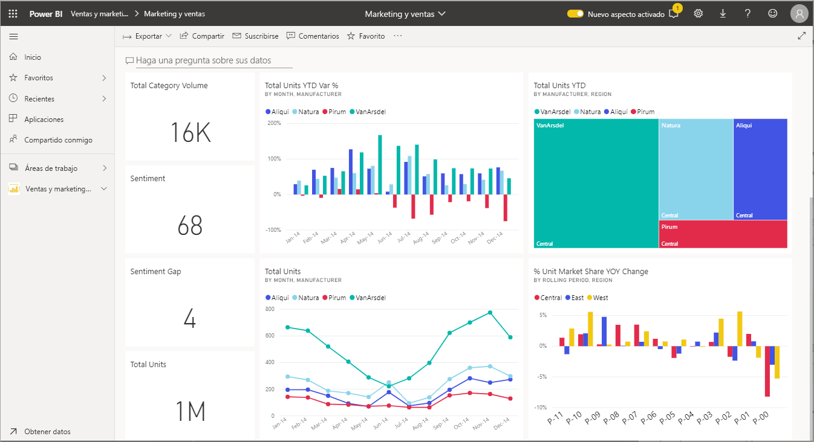
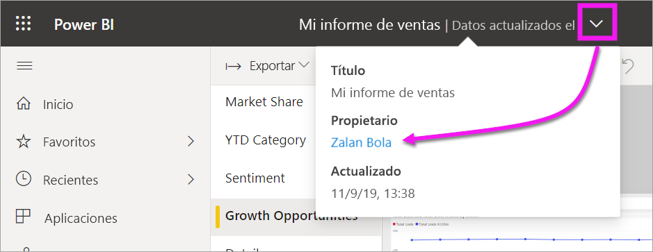

# Interacción con objetos visuales en informes, paneles y aplicaciones

En su concepto más básico, una ***visualización*** (u *objeto visual*) es un tipo de gráfico generado por *diseñadores* de Power BI que utiliza los datos de los informes y los conjuntos de datos. 

Los objetos visuales se encuentran en los paneles, en los informes y se pueden crear sobre la marcha mediante Preguntas y respuestas de Power BI. Cuando un diseñador crea un objeto visual en un informe, puede *anclarlo* a un panel. Un [objeto visual en un panel se denomina *icono*](end-user-tiles.md). Este panel tiene ocho iconos. 

> [!TIP]
> Le recomendamos que consulte primero el tema de información general sobre [conceptos básicos de Power BI para *consumidores*](end-user-basic-concepts.md) antes de leer este contenido más específico.

## ¿Qué puedo hacer con los objetos visuales?

Los objetos visuales se crean por parte de los *diseñadores* de informes y paneles y se comparten con los *consumidores*. Como consumidor, puede interactuar de muchas maneras con objetos visuales para obtener diferentes puntos de vista y tomar decisiones empresariales fundadas en los datos. La mayoría de estas opciones se muestra en la tabla siguiente, con vínculos a instrucciones detalladas.

Para muchas de estas opciones, el administrador o el *diseñador* pueden deshabilitar la capacidad de ver o usar estas características. Y algunas de estas características solo funcionan en objetos visuales específicos.  Si tiene alguna pregunta, póngase en contacto con el administrador o con el propietario del informe o panel. Para buscar el propietario, seleccione el menú desplegable del panel o informe. 

> [!IMPORTANT]
> Pero primero, detengámonos un momento en Preguntas y respuestas. Preguntas y respuestas es la herramienta de búsqueda de lenguaje natural de Power BI. El usuario escribe una pregunta con lenguaje natural y Preguntas y respuestas responde a la pregunta con un objeto visual. Preguntas y respuestas es un medio por el que los consumidores pueden crear sus propios objetos visuales. Sin embargo, los objetos visuales que cree con Preguntas y respuestas no se podrán guardar. Si hay alguna información específica que desee obtener de los datos y el diseñador no la incluyó en un informe o un panel, Preguntas y respuestas es un excelente recurso. Para obtener más información acerca de Preguntas y respuestas, consulte [Preguntas y respuestas para los consumidores](end-user-q-and-a.md).

|Tarea  |En un panel  |En un informe  | En Preguntas y respuestas
|---------|---------|---------|--------|
|[Agregar comentarios a un objeto visual para uso personal o iniciar una conversación con sus compañeros sobre el objeto visual](end-user-comment.md).     |  sí       |   sí      |  no  |
|[Abrir y explorar el informe donde se creó el objeto visual](end-user-tiles.md).     |    sí     |   ND      |  no |
|[Ver una lista de los filtros y las segmentaciones que afectan al objeto visual](end-user-report-filter.md).     |    no     |   sí      |  sí |
|[Abrir y explorar un objeto visual en Preguntas y respuestas (si el *diseñador* ha usado Preguntas y respuestas para crearlo)](end-user-q-and-a.md).     |   sí      |   ND      |  ND  |
|[Crear un objeto visual en Preguntas y respuestas (para la exploración, no lo podrá guardar)](end-user-q-and-a.md).     |   sí      |   si el diseñador ha agregado Preguntas y respuestas al informe      |  sí  |
|[Pedir a Power BI que busque tendencias o hechos interesante](end-user-insights.md) en los datos del objeto visual en su lugar.  Estos objetos visuales generados de forma automática se denominan *conclusiones*.     |    sí     |  para todo el informe, no por objeto visual       | no   |
|[Ver un solo objeto visual a la vez con el modo de *enfoque*](end-user-focus.md).     | sí        |   sí      | ND  |
|[Consultar la última vez que se ha actualizado el objeto visual](end-user-fresh.md).     |  sí       |    sí     | ND  |
|[Ver un solo objeto visual a la vez, sin bordes ni barras de navegación, con el modo de *pantalla completa* o el *de enfoque*](end-user-focus.md).     |   sí      |  sí       | de forma predeterminada  |
|[Imprimir](end-user-print.md).     |  sí       |   sí      | no  |
|[Profundizar en el objeto visual mediante la adición y la modificación de filtros de visualización](end-user-report-filter.md).     |    no     |   sí      | no  |
|Mantener el puntero sobre un objeto visual para mostrar información sobre herramientas y detalles adicionales.     |    sí     |   sí      | sí  |
|[Utilizar filtros cruzados y resaltados cruzados en otros objetos visuales de la página](end-user-interactions.md).    |   no      |   sí      | ND  |
|[Visualización de los datos usados para crear el objeto visual](end-user-show-data.md).     |  no       |   sí      | no  |
| [Cambiar la ordenación de un objeto visual](end-user-change-sort.md). | no  | sí  | puede cambiar la ordenación redactando de nuevo la pregunta  |
| Agregar un punto destacado a un objeto visual. | no  | sí  |  no |
| [Exportar a Excel](end-user-export.md). | sí | sí | no|
| [Crear una alerta](end-user-alerts.md) para recibir una notificación cuando un valor supere el umbral establecido.  | sí  | no  | no |
| [Filtrado cruzado y resaltado cruzado de los demás objetos visuales de la página](end-user-report-filter.md).  | no      | sí  | no  |
| [Exploración de un objeto visual que tiene una jerarquía](end-user-drill.md).  | no  | sí   | no |

## Pasos siguientes
Volver a [Conceptos básicos de los consumidores](end-user-basic-concepts.md)    
[Selección de un objeto visual para abrir un informe](end-user-report-open.md)    
[Tipos de objetos visuales disponibles en Power BI](end-user-visual-type.md)