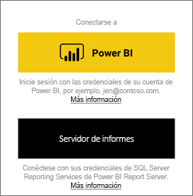
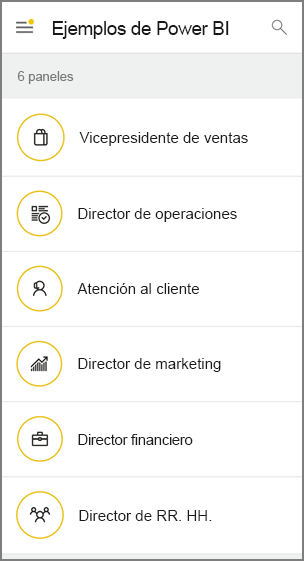

# Introducción a la aplicación móvil de Power BI en dispositivos Android
La aplicación móvil de Microsoft Power BI para Android ofrece la experiencia de BI móvil para Power BI, el servidor de informes de Power BI y Reporting Services. Con el acceso móvil directo y táctil a la información importante local y en la nube de la empresa, puede ver los paneles de la empresa e interactuar con ellos fácilmente y desde cualquier lugar. Explore los datos de los paneles y compártalos con sus compañeros en mensajes de texto o correo electrónico. 

Podrá crear informes de Power BI en Power BI Desktop y publicarlos:

* [Publíquelos en el servicio Power BI](../../fundamentals/power-bi-overview.md) y cree paneles.
* [Publíquelos en Power BI Report Server](../../report-server/quickstart-create-powerbi-report.md).

A continuación, en la aplicación de Power BI para Android, podrá interactuar con los paneles y los informes locales o en la nube.

Descubra las [novedades de las aplicaciones móviles de Power BI](../../mobile-whats-new-in-the-mobile-apps.md).

## Requisitos previos

### Obtener la aplicación

[Descargue la aplicación Power BI para Android](https://go.microsoft.com/fwlink/?LinkID=544867) de Google Play.
  
Power BI funciona en diferentes dispositivos Android que ejecutan el sistema operativo Android 5.0 o posterior. Para comprobar un dispositivo, vaya a **Ajustes** > **Acerca del dispositivo** > **Versión de Android**. 

**Comenzar al abrir la aplicación**    
Incluso sin registrarse o iniciar sesión, después de abrir la aplicación, puede desplazarse por las páginas de inicio de sesión para obtener una introducción rápida de lo que puede hacer con la aplicación Power BI en su dispositivo Android. Pulse **Omitir** para ver y explorar los ejemplos, así como obtener experiencia práctica con la aplicación. Puede [volver a los ejemplos](mobile-android-app-get-started.md#try-the-power-bi-and-reporting-services-samples) siempre que quiera desde la página principal de paneles.

Descubra las [novedades de las aplicaciones móviles de Power BI](../../mobile-whats-new-in-the-mobile-apps.md).

## Suscribirse al servicio Power BI en la Web
Si aún no se ha registrado, vaya al [servicio Power BI](https://powerbi.com/) para registrarse para tener su propia cuenta para crear y almacenar paneles e informes, así como para reunir todos sus datos. A continuación, inicie sesión en Power BI desde su dispositivo Android para ver sus paneles desde cualquier lugar.

1. En el servicio de Power BI, pulse [Registrarse](https://go.microsoft.com/fwlink/?LinkID=513879) para crear una cuenta de Power BI.
2. Empiece a [crear sus propios informes y paneles](../../service-get-started.md).

## Introducción a la aplicación de Power BI en su dispositivo
1. En la pantalla de inicio de su dispositivo Android, abra la aplicación Power BI para Android.
   
   
2. Para iniciar sesión en Power BI, pulse la pestaña **Power BI** y rellene los detalles de inicio de sesión.

    Si recibe un mensaje que le indica que Power BI no puede iniciar su sesión, consulte ["No se pudo realizar la autenticación porque este dispositivo considera que su certificado SSL corporativo no es de confianza"](mobile-android-app-error-corporate-ssl-account-is-untrusted.md) para más información sobre cómo resolver el problema.

   Para iniciar sesión en los informes y KPI para dispositivos móviles de Reporting Services, pulse la pestaña **Servidor de informes** y rellene los detalles de inicio de sesión.
   
   

## Pruebe los ejemplos de Power BI y Reporting Services
Incluso sin registrarse, puede ver e interactuar con los ejemplos de Power BI y Reporting Services.

Para acceder a los ejemplos, pulse **Más opciones** (...) en la barra de navegación y elija **Ejemplos**.

Una serie de ejemplos de Power BI van seguidos de varios ejemplos del servidor de informes.
   
   

   
   > [!NOTE]
   > No todas las características están disponibles en los ejemplos. Por ejemplo, no podrá ver los informes de ejemplo que subyacen a los paneles, no podrá compartir los ejemplos con otros usuarios y no podrá convertirlos en favoritos. 
   > 
   >

## Buscar contenido en las aplicaciones móviles de Power BI

Pulse en la lupa del encabezado para empezar a buscar el contenido de Power BI.

## Visualización de informes y paneles favoritos
Pulse **Favoritos** () en la barra de navegación para ver la página Favoritos. 

Obtenga más información sobre los [favoritos en las aplicaciones móviles Power BI](mobile-apps-favorites.md).

## Soporte técnico empresarial para las aplicaciones móviles de Power BI
Las organizaciones pueden usar Microsoft Intune para administrar dispositivos y aplicaciones, incluidas las aplicaciones móviles de Power BI para iOS y Android.

Microsoft Intune permite a las organizaciones controlar elementos como requerir un PIN de acceso, controlar la manera en que la aplicación gestiona los datos o incluso cifrar los datos de la aplicación cuando esta no está en uso.

> [!NOTE]
> Si usa la aplicación móvil de Power BI en un dispositivo Android y su organización ha configurado Microsoft Intune MAM, la actualización de datos en segundo plano estará desactivada. La próxima vez que entre en la aplicación, Power BI actualizará los datos desde el servicio de Power BI en la web.
> 
> 

Obtenga más información sobre cómo [configurar la aplicación móvil Power BI con Microsoft Intune](../../service-admin-mobile-intune.md). 

## Pasos siguientes
Estas son algunas de las cosas que puede hacer en la aplicación de Power BI para dispositivos Android con los paneles e informes de Power BI, y con los informes los KPI del portal web de Power BI Report Server o Reporting Services.

### Paneles e informes de Power BI
* Ver [sus aplicaciones](../../service-create-distribute-apps.md).
* Ver sus [paneles](../../mobile-apps-view-dashboard.md).
* Explorar los [iconos de sus paneles](../../mobile-tiles-in-the-mobile-apps.md).
* Abrir [informes de Power BI](../../mobile-reports-in-the-mobile-apps.md).
* Ver [sus aplicaciones](../../service-create-distribute-apps.md).
* [Anotar y compartir iconos](mobile-annotate-and-share-a-tile-from-the-mobile-apps.md).
* Compartir [paneles](../../mobile-share-dashboard-from-the-mobile-apps.md).
* [Escanear un código QR de Power BI](../../mobile-apps-qr-code.md) con su teléfono Android para abrir un icono o informe relacionado con el panel. 
* Vea las [notificaciones sobre las actualizaciones en su cuenta de Power BI](../../mobile-apps-notification-center.md), como los paneles que comparten otros compañeros con usted.

### Informes y KPI en los portales web del servidor de informes de Power BI y Reporting Services
* [Ver informes y KPI en el portal web](mobile-app-ssrs-kpis-mobile-on-premises-reports.md) de la aplicación móvil de Power BI para dispositivos Android.
* Crear [KPI en el portal web](https://docs.microsoft.com/sql/reporting-services/working-with-kpis-in-reporting-services).
* Crear [informes en Power BI Desktop y publicarlos en el portal web del servidor de informes de Power BI](../../report-server/quickstart-create-powerbi-report.md).

### Vea también
* [Descarga de la aplicación Android](https://go.microsoft.com/fwlink/?LinkID=544867) desde la tienda de aplicaciones Android.
* [¿Qué es Power BI?](../../fundamentals/power-bi-overview.md)
* ¿Tiene alguna pregunta? [Pruebe a preguntar a la comunidad de Power BI](https://community.powerbi.com/)

