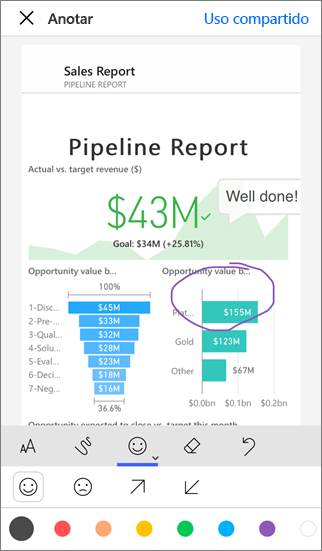
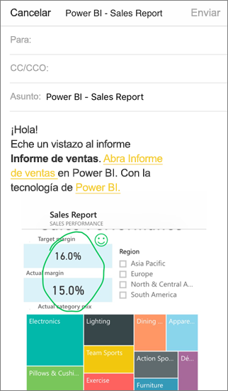

# Anotación y uso compartido de un icono, informe u objeto visual en las aplicaciones móviles de Power BI
Se aplica a:

|  |  |  |  |
|:--- |:--- |:--- |:--- |
| iPhone |iPad |Teléfonos Android |Tabletas Android |

Puede anotar y compartir una instantánea de un icono, un informe o un objeto visual desde la aplicación móvil de Power BI para dispositivos iOS y Android. Los destinatarios la verán exactamente igual que como era cuando envió el correo, más un vínculo. Puede enviar instantáneas de iconos a cualquier persona, no solo a compañeros en el mismo dominio de correo electrónico. Puede agregarle anotaciones (líneas, texto o marcas) antes de compartirla.

*Informe con anotaciones*

El correo con la instantánea del icono, el informe o el objeto visual también incluye un vínculo al objeto real en el servicio Power BI ([https://powerbi.com](https://powerbi.com)). Los destinatarios pueden hacer clic en el vínculo e ir directamente a ese icono, informe u objeto visual si usted y ellos tienen licencias de Power BI Pro, o el contenido está en una [capacidad premium](../../service-premium-what-is.md), y ya ha compartido el elemento con ellos. 

También puede [compartir un icono desde la aplicación móvil de Power BI para dispositivos Windows 10](mobile-windows-10-phone-app-get-started.md), pero no puede anotarlo.

## Abrir un icono para anotar
1. Pulse el icono para abrirlo en modo de enfoque.
2. Pulse el icono de anotación  en la esquina superior derecha.
3. Ya puede [anotar y compartir el icono](mobile-annotate-and-share-a-tile-from-the-mobile-apps.md#annotate-and-share-the-tile-report-or-visual).

## Abrir un informe para anotar
1. Abra un informe. 
2. Pulse el icono de anotación  en la esquina superior derecha del informe.
3. Ya puede [anotar y compartir el informe](mobile-annotate-and-share-a-tile-from-the-mobile-apps.md#annotate-and-share-the-tile-report-or-visual).

## Abrir un objeto visual para anotarlo
1. En un informe, pulse un objeto visual y luego el icono de expandir para abrirla en modo de enfoque. 
   
    
2. Pulse el icono de anotación  en la esquina superior derecha del objeto visual.
3. Ya puede [anotar y compartir el objeto visual](mobile-annotate-and-share-a-tile-from-the-mobile-apps.md#annotate-and-share-the-tile-report-or-visual).

## Anotar y compartir el icono, el informe o el objeto visual
1. A continuación le indicamos cómo anotar:  
   
   
   
   *Barra de anotación en iPhone e iPad*
   
   
   
   *Barra de anotación en dispositivos Android*
   
   * Para dibujar líneas de colores y grosores diferentes, pulse el icono de la línea ondulada, elija un ancho y un color, y dibuje.  
   * Para escribir comentarios, pulse **AA**, elija el tamaño y el color de texto, y escriba.  
   * Para pegar marcas (por ejemplo, emoticonos) en el icono, pulse la cara sonriente, elija un color y pulse donde quiera ponerlas.   
2. Después de anotar, pulse **Compartir** en la esquina superior derecha.
3. En la aplicación de correo, escriba los nombres de los destinatarios y modifique el mensaje, si lo desea.  
   
   
   
   El correo electrónico tiene una imagen y un vínculo al icono, informe u objeto visual concretos. 
4. Pulse **Enviar**.

## Pasos siguientes
* [Compartir un panel desde las aplicaciones móviles de Power BI](mobile-share-dashboard-from-the-mobile-apps.md)
* ¿Tiene alguna pregunta? [Pruebe a preguntar a la comunidad de Power BI](http://community.powerbi.com/)

