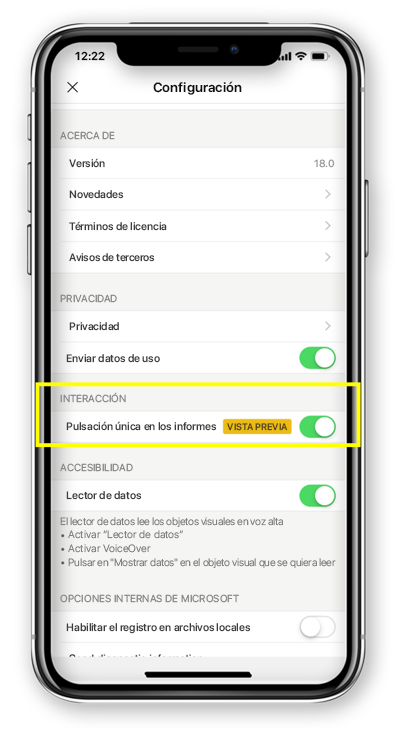

# Configuración de la interacción del informe de una sola pulsación o de dos pulsaciones
Se aplica a:

|  |  | 
|:--- |:--- |
| iPhone |Teléfonos Android |

Un informe de Power BI es una vista interactiva de los datos, con objetos visuales que describen distintas conclusiones e información a partir de esos datos.

Puede configurar cómo interactuar con los datos. Puede decidir si quiere tener una interacción de una sola pulsación o de dos pulsaciones.

* Con la interacción de dos pulsaciones, la primera vez que pulsa un objeto visual se selecciona y la segunda vez que lo pulsa realiza la acción (por ejemplo, seleccionar elementos de segmentación, el resaltado cruzado o hacer clic en un vínculo, un botón, etc.).

* Con la interacción de una sola pulsación, al pulsar se selecciona el objeto visual y se ejecuta la acción.

A partir de la versión de la aplicación de Power BI 18.0 para iOS y 112540 para Android, todas las nuevas instalaciones se configurarán con la opción de una sola pulsación como configuración predeterminada.
Los usuarios que ya tengan instalado Power BI en el teléfono y actualicen a estas nuevas versiones, tendrán la posibilidad de cambiar a la opción de una sola pulsación.

## Cambio del comportamiento de la interacción

Para cambiar el comportamiento de la interacción, puede ir a la configuración de la aplicación y activar o desactivar la interacción de una sola pulsación.

Este artículo se aplica a los informes horizontales y del teléfono.

## Pasos siguientes
* [Ver e interactuar con informes de Power BI optimizados para el teléfono](mobile-apps-view-phone-report.md)
* ¿Tiene alguna pregunta? [Pruebe a preguntar a la comunidad de Power BI](http://community.powerbi.com/)

