# Visualización de informes y KPI locales del servidor de informes en la aplicaciones móviles de Power BI

Las aplicaciones móviles de Power BI proporcionan acceso móvil directo y táctil a la información local más importante de su empresa en el servidor de informes de Power BI y SQL Server 2016 Reporting Services (SSRS).

Se aplica a:

|  |  |  |  |
|:--- |:--- |:--- |:--- |
| iPhone |iPad |Teléfonos Android |Tabletas Android |

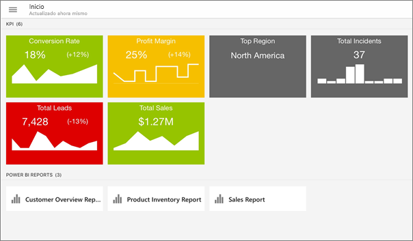

## Lo primero es lo primero
**Las aplicaciones móviles se encuentran donde visualiza el contenido de Power BI, donde no lo haya creado.**

* Usted y otros creadores de informes de su organización podrán [crear informes de Power BI con Power BI Desktop y publicarlos en el portal web del servidor de informes de Power BI](../../report-server/quickstart-create-powerbi-report.md). 
* Puede crear [KPI desde el mismo portal web](https://docs.microsoft.com/sql/reporting-services/working-with-kpis-in-reporting-services), organizarlos en carpetas y marcar sus favoritos para encontrarlos fácilmente. 
* [Cree informes móviles de Reporting Services](https://docs.microsoft.com/sql/reporting-services/mobile-reports/create-mobile-reports-with-sql-server-mobile-report-publisher) con el Publicador de informes móviles de SQL Server 2016 Enterprise Edition y publíquelos en el [portal web de Reporting Services](https://docs.microsoft.com/sql/reporting-services/web-portal-ssrs-native-mode).  

Luego, en las aplicaciones móviles de Power BI, podrá conectarse a cinco servidores de informes como máximo para ver los informes y los KPI de Power BI, organizados en carpetas o recopilados como favoritos. 

## Explorar ejemplos de las aplicaciones móviles sin conexión con el servidor
Aunque no tenga acceso a un portal web de Reporting Services, puede explorar las características de los informes móviles y los KPI de Reporting Services. 

1. Pulse el botón de navegación global  en la esquina superior izquierda y, después, el icono del engranaje de la parte superior derecha .
2. Pulse **Ejemplos de Reporting Services** y examine los ejemplos para interactuar con los informes móviles y los KPI.
   
   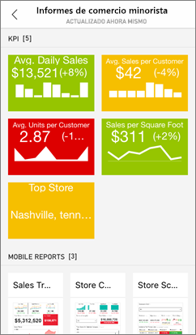

## Conectarse a un servidor de informes local
En las aplicaciones móviles de Power BI podrá ver los informes locales de Power BI, y los informes móviles y los KPI de Reporting Services. 

1. En su dispositivo móvil, abra la aplicación de Power BI.
2. Si todavía no ha iniciado sesión en Power BI, pulse **Servidor de informes**.
   
   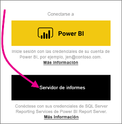
   
   Si ya ha iniciado sesión en la aplicación Power BI, pulse el botón de navegación global y, después, pulse el icono de engranaje  en la parte superior derecha.
3. Pulse **Conectarse al servidor**.
   
    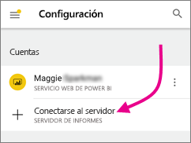

     La aplicación móvil debe tener acceso al servidor de alguna manera. Hay varias maneras de hacerlo:

    - Estar en la misma red o mediante VPN es la manera más fácil.
    - Es posible usar un proxy de aplicación web para conectarse desde fuera de la organización. Consulte [Uso de OAuth para conectarse a Reporting Services](mobile-oauth-ssrs.md) para más información. 
    - Abra una conexión (puerto) en el firewall.

1. Rellene la dirección del servidor y su nombre de usuario y contraseña. Use este formato para la dirección del servidor:
   
     `http://<servername>/reports`
   
     OR
   
     `https://<servername>/reports`
   
   Incluya **http** o **https** delante de la cadena de conexión.
   
    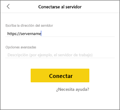
5. (Opcional) Si lo prefiere, en **Opciones avanzadas**, puede asignarle un nombre intuitivo al servidor.
6. Ahora verá el servidor en la barra de navegación izquierda, en este ejemplo se llama "power bi report server".
   
   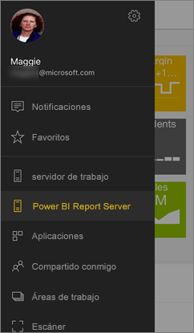

## Conectarse a un servidor de informes local en iOS

Si está visualizando Power BI en la aplicación móvil de iOS, puede que el administrador de TI haya definido una directiva de configuración de aplicación. Si es así, se habrá simplificado la experiencia de conexión al servidor de informes y no tendrá que proporcionar tanta información cuando se conecte a un servidor de informes. 

1. Verá un mensaje que indica que su aplicación móvil está configurada con un servidor de informes. Pulse en **Iniciar sesión**.

    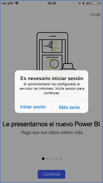

2.  En la página **Conectar al servidor**, los detalles del servidor de informes ya están rellenados. Pulse **Conectar**.

    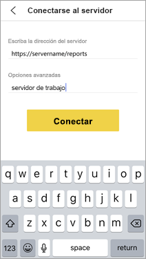

3. Escriba una contraseña para autenticar y luego pulse en **Iniciar sesión**. 

    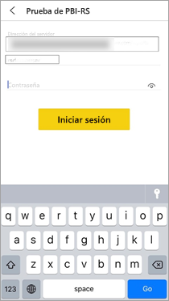

Ahora puede ver e interactuar con los KPI y los informes de Power BI almacenados en el servidor de informes.

## Ver los informes y los KPI de Power BI en la aplicación de Power BI
Los informes de Power BI, y los informes móviles y KPI de Reporting Services se muestran en las mismas carpetas en las que están en el portal web de Reporting Services. 

* Pulse un informe de Power BI . Se abre en modo horizontal y puede interactuar con él en la aplicación de Power BI.

    > [!NOTE]
  > El rastreo agrupando y desagrupando datos actualmente no está habilitado en los informes de Power BI de Power BI Report Server.
  
    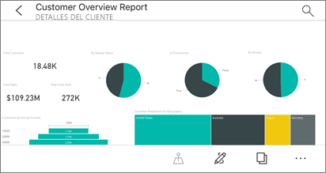
* En Power BI Desktop, los propietarios de informes pueden [optimizar un informe](../../desktop-create-phone-report.md) para las aplicaciones móviles de Power BI. En el teléfono móvil, los informes optimizados tienen un icono, , y un diseño especiales.
  
    
* Puntee un KPI para verlo en el modo de enfoque.
  
    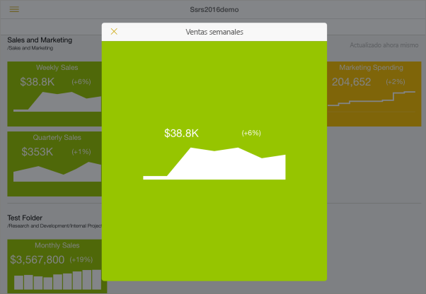

## Ver los informes y KPI favoritos
Puede marcar KPI e informes como favoritos en el portal web y verlos después en una práctica carpeta en su dispositivo móvil, junto con sus paneles favoritos de Power BI.

* Pulse **Favoritos**.
  
   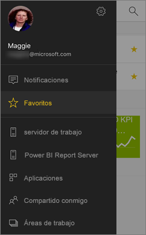
  
   Los KPI e informes favoritos del portal web se encuentran en esta página, junto con los paneles de Power BI del servicio Power BI:
  
   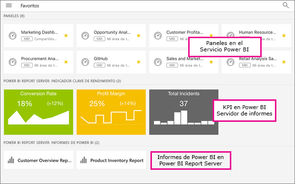

## Quitar una conexión a un servidor de informes
1. En la parte inferior de la barra de navegación izquierda, puntee **Configuración**.
2. Puntee el nombre del servidor al que no quiere estar conectado.
3. Pulse **Quitar servidor**.

## Pasos siguientes
* [¿Qué es Power BI?](../../fundamentals/power-bi-overview.md)  
* ¿Tiene alguna pregunta? [Pruebe a preguntar a la comunidad de Power BI](http://community.powerbi.com/)

