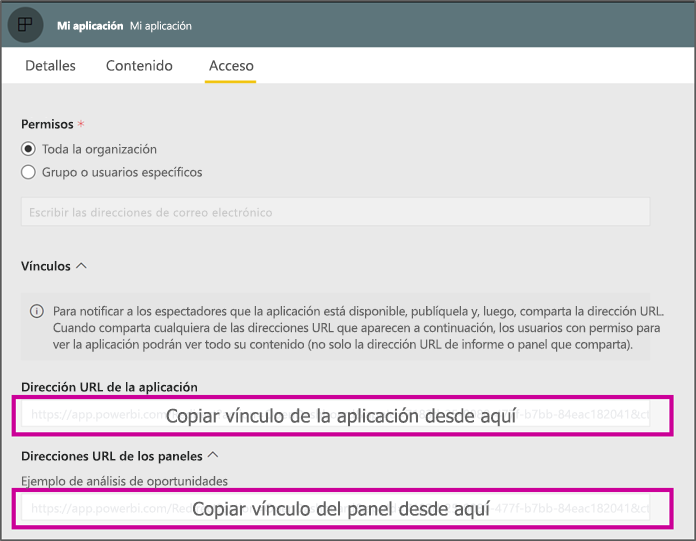

# <a name="create-a-link-to-a-specific-location-in-the-power-bi-mobile-apps"></a>Creación de un vínculo a una ubicación específica en las aplicaciones móviles de Power BI
Puede usar vínculos para acceder directamente a elementos específicos de Power BI: informe, panel e icono.

Existen principalmente dos escenarios para el uso de vínculos en Power BI Mobile: 

* Para abrir Power BI desde **fuera de la aplicación** y aterrizar en contenido específico (informe, panel o aplicación). Este es normalmente un escenario de integración, cuando se quiere abrir Power BI Mobile desde otra aplicación. 
* Para **navegar** dentro de Power BI. Esto sucede normalmente cuando se quiere crear una navegación personalizada en Power BI.


## <a name="use-links-from-outside-of-power-bi"></a>Empleo de vínculos desde fuera de Power BI
Si usa un vínculo desde fuera de la aplicación Power BI, quiere estar seguro de que la aplicación lo va a abrir y, si la aplicación no está instalada en el dispositivo, de que se va a ofrecer al usuario su instalación. Se ha creado un formato de vínculo especial para permitir exactamente eso. Este formato de vínculo garantiza que el dispositivo use la aplicación para abrir el vínculo y, si la aplicación no está instalada en el dispositivo, ofrezca al usuario ir a la tienda para obtenerla.

El vínculo debe comenzar con lo siguiente  
```html
https://app.powerbi.com/Redirect?[**QUERYPARAMS**]
```

> [!IMPORTANT]
> Si el contenido está hospedado en un centro de datos especial como Gobierno, China, etc. El vínculo debe comenzar con la dirección de Power BI correcta, como `app.powerbigov.us` o `app.powerbi.cn`.   
>


Los elementos **QUERY PARAMS** son:
* **action** (obligatorio) = OpenApp / OpenDashboard / OpenTile / OpenReport.
* **appId** = si quiere abrir un informe o un panel que forme parte de una aplicación. 
* **groupObjectId** = si quiere abrir un informe o un panel que forme parte del área de trabajo (pero no de Mi área de trabajo).
* **dashboardObjectId** = identificador de objeto de panel (si action es OpenDashboard u OpenTile).
* **reportObjectId** = identificador de objeto de informe (si action es OpenReport).
* **tileObjectId** = identificador de objeto de icono (si action es OpenTile).
* **reportPage** = si quiere abrir una sección de informe específica (si action es OpenReport).
* **ctid** = identificador de organización del elemento (relevante para un escenario B2B. Se puede omitir si el elemento pertenece a la organización del usuario).

**Ejemplos:**

* Abrir vínculo de aplicación 
  ```html
  https://app.powerbi.com/Redirect?action=OpenApp&appId=appidguid&ctid=organizationid
  ```

* Abrir panel que forma parte de una aplicación 
  ```html
  https://app.powerbi.com/Redirect?action=OpenDashboard&appId=**appidguid**&dashboardObjectId=**dashboardidguid**&ctid=**organizationid**
  ```

* Abrir informe que forma parte de un área de trabajo
  ```html
  https://app.powerbi.com/Redirect?Action=OpenReport&reportObjectId=**reportidguid**&groupObjectId=**groupidguid**&reportPage=**ReportSectionName**
  ```

### <a name="how-to-get-the-right-link-format"></a>Cómo obtener el formato de vínculo correcto

#### <a name="links-of-apps-and-items-in-app"></a>Vínculos de aplicaciones y elementos en aplicación

En el caso de **aplicaciones, informes y paneles que forman parte de una aplicación**, la forma más sencilla de obtener el vínculo es ir al área de trabajo y seleccionar "Actualizar aplicación". Así se abre la experiencia "Publicar aplicación" y, en la pestaña Acceso, se encuentra una sección **Vínculos**. Al expandir esa sección, se ve la lista de la aplicación y todos sus vínculos de contenido que pueden usarse para acceder directamente.



#### <a name="links-of-items-not-in-app"></a>Vínculos de elementos que no están en la aplicación 

En el caso de los informes y paneles que no forman parte de una aplicación, es necesario extraer los identificadores de la dirección URL del elemento.

Por ejemplo, para buscar el identificador del objeto **panel** de 36 caracteres, vaya al panel específico en el servicio Power BI: 

```html
https://app.powerbi.com/groups/me/dashboards/**dashboard guid comes here**?ctid=**organization id comes here**`
```

Para buscar el identificador del objeto **informe** de 36 caracteres, vaya al informe específico en el servicio Power BI.
Este es un ejemplo de informe de "Mi área de trabajo":

```html
https://app.powerbi.com/groups/me/reports/**report guid comes here**/ReportSection3?ctid=**organization id comes here**`
```
La dirección URL anterior contiene también la página de informe específica **"ReportSection3"** .

Este es un ejemplo de un informe de un área de trabajo (no de Mi área de trabajo):

```html
https://app.powerbi.com/groups/**groupid comes here**/reports/**reportid comes here**/ReportSection1?ctid=**organizationid comes here**
```

## <a name="use-links-inside-power-bi"></a>Empleo de vínculos dentro de Power BI

Los vínculos dentro de Power BI funcionan en las aplicaciones móviles exactamente como en el servicio Power BI.

Si quiere agregar un vínculo al informe que apunte a otro elemento de Power BI, solo tiene que copiar la dirección URL de ese elemento desde la barra de direcciones del explorador. Obtenga más información sobre cómo [Agregar un hipervínculo a un cuadro de texto de un informe](https://docs.microsoft.com/power-bi/service-add-hyperlink-to-text-box).

## <a name="use-report-url-with-filter"></a>Empleo de dirección URL de informe con filtro
Al igual que el servicio Power BI, las aplicaciones de Power BI Mobile también admiten la dirección URL de informe que contiene un parámetro de consulta de filtro. Puede abrir un informe en la aplicación Power BI Mobile y filtrarlo por un estado específico. Por ejemplo, esta dirección URL abre el informe Ventas y lo filtra por Territorio

```html
https://app.powerbi.com/groups/me/reports/**report guid comes here**/ReportSection3?ctid=**organization id comes here**&filter=Store/Territory eq 'NC'
```

Obtenga más información sobre el [Filtro de un informe con parámetros de cadena de consulta en la URL](https://docs.microsoft.com/power-bi/service-url-filters).

## <a name="next-steps"></a>Pasos siguientes
Sus comentarios nos ayudan a decidir qué implementaremos en el futuro; no olvide votar por otras características que le gustaría ver en aplicaciones móviles de Power BI. 

* [Aplicaciones de Power BI para dispositivos móviles](mobile-apps-for-mobile-devices.md)
* Siga @MSPowerBI en Twitter
* Únase a la conversación en la [comunidad de Power BI](https://community.powerbi.com/)
* [¿Qué es Power BI?](../../fundamentals/power-bi-overview.md)

